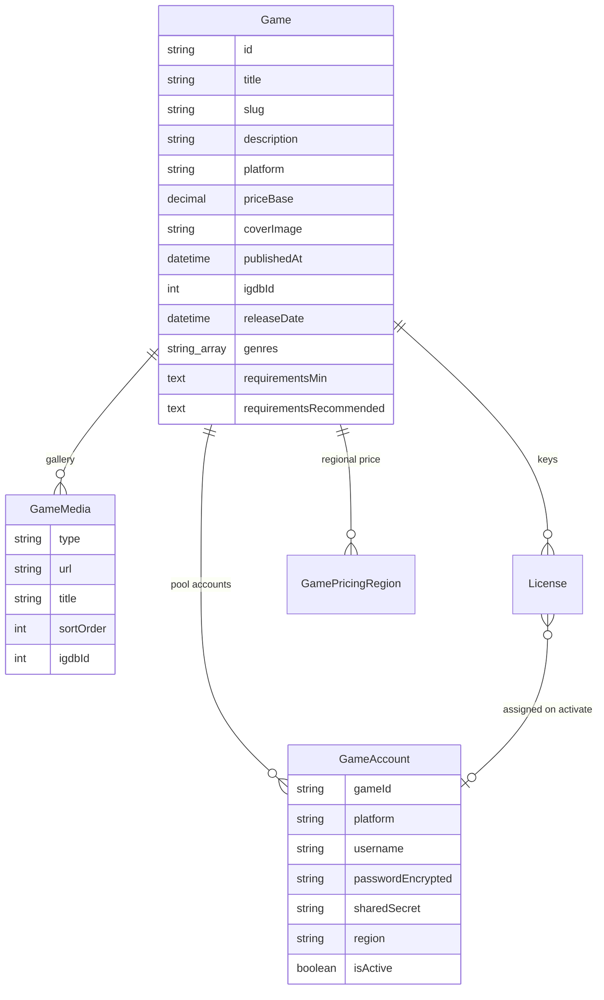
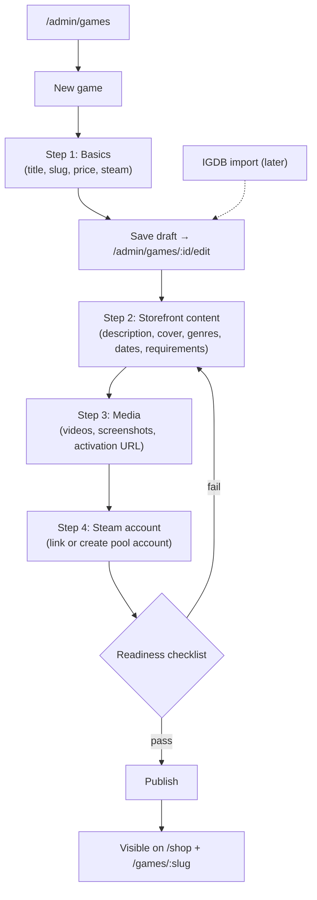
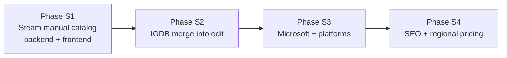

# Admin Manual Games & Steam Account Linking Implementation Plan

**Status:** Planning (post UI readability + game detail work)  
**Scope:** Manual game catalog management in `/admin/games`, linked **platform pool accounts** (Steam first), storefront-ready content matching the **live `Game` schema and 3 demo seeds**. **IGDB deferred** same flows will absorb import later.  
**Parent:** [ADMIN_PLAN.md](./ADMIN_PLAN.md) (AD.6 games CRUD ✅ partial, AD.7 accounts ❌ setup stub)  
**Prerequisite:** Security S.1–S.9, AD.6 backend list/create/update/delete/publish

---

## 1. Goals

| Goal | Why |
|------|-----|
| **Phase S1:** complete **Steam** manual catalog (backend + frontend) | One shippable vertical before IGDB / other platforms |
| Staff can **add a sellable Steam game** end-to-end | No IGDB dependency for launch catalog |
| Every published Steam game links to **pool account(s)** | Licenses → `accountId`; My Games credentials |
| **One mental model**: Game → content → Steam account → publish | Fixes split between games form, IGDB page, accounts stub |
| Fix **gaps** between schema, API, and admin UI | Demos have full data; form has 6 fields |

**Non-goals (this plan):**

- IGDB import implementation (hook points only fields `igdbId`, `igdbSyncedAt`, `igdbCoverUrl` stay import-managed)
- Real AES encryption / live Steam Guard (AD.7 stub acceptable in phase 1 with `ENCRYPTED_PLACEHOLDER` pattern from seed)
- Stripe checkout wiring
- Regional pricing UI (`GamePricingRegion` only `demo-game-1` has US/EG rows today)
- SEO admin UI (`metaTitle`, `metaDescription`, `ogImage`) schema fields exist; optional slice after MG.1

---

## 2. Current state audit

### 2.1 What works today

| Layer | State |
|-------|--------|
| `GET/POST/PUT/DELETE /api/admin/games` | ✅ Real Prisma + audit |
| Admin games list | ✅ Publish toggle, table, delete on edit page |
| Storefront `GET /api/games/:slug` | ✅ Published-only, media, requirements, genres |
| `POST /api/game-accounts` (Phase 6) | ✅ Real CRUD at **`/api/game-accounts`** (not `/api/admin/accounts`) |
| Schema relations | ✅ `Game` → `GameAccount[]`, `GameMedia[]`, `License[]` |
| Seed | ✅ 3 demo games full shape documented in **§3** (`libs/api/prisma/prisma/seed.ts`) |

### 2.2 What is broken or incomplete

| Issue | Impact |
|-------|--------|
| Admin form: title, slug, platform (free text), description (**single-line Input**), price, publish only | Cannot edit cover, genres, release date, requirements, media all present on demos |
| `AdminGamesService.create/update` ignores `genres`, `releaseDate`, `requirements*`, `media` | DB fields only populated by seed / IGDB; demos have full data |
| `AdminGameDto` missing `requirements*`, `media`, **account summary** | Edit page cannot mirror demo-game shape |
| `/api/admin/accounts` returns **setup JSON** | Accounts UI disabled; real API is `/api/game-accounts` |
| `CreateGameAccountDto` expects **`passwordEncrypted`** | Admin must not send pre-encrypted secrets; needs plaintext + server encrypt (AD.7) |
| No **publish guardrails** | Game can publish with no cover, no account, empty description |
| No **account linkage step** in create flow | Staff must know to open separate Accounts page (non-functional) |
| Platform not constrained | Any string; storefront assumes Steam copy in game detail tabs |
| IGDB page separate from game form | Future import should land on same edit screen |

### 2.3 Route duplication (consolidation target)

```
/api/admin/games          ← admin UI uses this ✅
/api/games                ← Phase 6 public/admin duplicate (deprecate admin use)

/api/admin/accounts       ← setup stub ❌
/api/game-accounts        ← real CRUD ✅ (admin-only, @Roles)
```

**Decision:** Implement real logic under **`/api/admin/accounts`** as thin wrapper over shared `GameAccountsService`, keep `/api/game-accounts` as alias until AD.9 cleanup.

---

## 3. Canonical schema & demo reference (source of truth)

**Prisma:** `libs/api/prisma/prisma/schema.prisma`  
**Seed:** `libs/api/prisma/prisma/seed.ts`  
**Admin select (already includes all game + media fields):** `libs/api/data-access/src/lib/games.repository.ts` → `adminGameSelect`

> **Rule for this plan:** Every admin field, API DTO, and form section must map to a **real column or relation** below. Manual entry should be able to reproduce any column the 3 demos populate (except IGDB-only columns until import).

### 3.1 `Game` model full field map

| Field | Type | Admin manual? | In demos? | Notes |
|-------|------|---------------|-----------|-------|
| `id` | cuid | auto | ✅ | |
| `title` | string | ✅ required | ✅ all 3 | |
| `slug` | string unique | ✅ required | `demo-game-1` … `demo-game-3` | |
| `description` | text? | ✅ textarea | ✅ multi-paragraph (`\n\n`) | |
| `platform` | string | ✅ select | `steam` ×2, `microsoft` ×1 | See §3.3 |
| `priceBase` | Decimal | ✅ | 9.99 / 14.99 / 19.99 | |
| `coverImage` | string? | ✅ URL | `/og/default.png` all | Storefront hero + buy panel |
| `metaTitle` | string? | optional later | ❌ null | SEO not in seed |
| `metaDescription` | string? | optional later | ❌ null | SEO |
| `ogImage` | string? | optional later | ❌ null | SEO |
| `publishedAt` | DateTime? | ✅ publish toggle | ✅ all published | `null` = draft |
| `igdbId` | Int? unique | read-only (import) | ✅ game1 only (`100001`) | games 2–3 null |
| `releaseDate` | DateTime? | ✅ date | ✅ all 3 | ISO dates in seed |
| `genres` | String[] | ✅ tags | ✅ per game | See §3.4 table |
| `igdbSyncedAt` | DateTime? | import only | ❌ | |
| `igdbCoverUrl` | String? | import only | ❌ | |
| `requirementsMin` | Text? | ✅ textarea | ✅ multiline `Key: value` | |
| `requirementsRecommended` | Text? | ✅ textarea | ✅ multiline | |
| `createdAt` / `updatedAt` | DateTime | read-only | ✅ | |

**Relations (not columns on `Game`):**

| Relation | Model | Demo data |
|----------|-------|-----------|
| `media` | `GameMedia[]` | 5 / 3 / 3 rows see §3.2 |
| `accounts` | `GameAccount[]` | 1 pool account per game see §3.5 |
| `licenses` | `License[]` | game1 + game2 only (`DEMO-KEY-0001/2`) |
| `pricingRegions` | `GamePricingRegion[]` | game1 only: US 9.99, EG 4.99 |

### 3.2 `GameMedia` model types used by demos

| Field | Type | Admin? | Notes |
|-------|------|--------|-------|
| `id` | cuid | auto | |
| `gameId` | FK | implicit | |
| `type` | string | ✅ select | **`video`**, **`screenshot`**, **`activation`** all 3 used in seed (schema comment omits `activation`; keep all three) |
| `url` | string | ✅ | YouTube embed URLs for video/activation; `/og/default.png` for screenshots |
| `title` | string? | ✅ | e.g. `Launch Trailer`, `Steam activation walkthrough` |
| `igdbId` | Int? | optional | Set in seed; manual can leave `null` |
| `sortOrder` | Int | ✅ | Ordering within type; storefront sorts by this |
| `createdAt` | DateTime | read-only | |

**Per-demo media (must be reproducible in admin media UI):**

| Game | `video` | `activation` | `screenshot` |
|------|---------|--------------|--------------|
| **demo-game-1** Stellar Odyssey | 2 (Launch Trailer, Gameplay Overview) | 1 (Steam activation walkthrough) | 2 |
| **demo-game-2** Neon Drift Rally | 2 (Announcement, Drift Gameplay) | 1 (Neon Drift activation guide) | **0** screenshots optional |
| **demo-game-3** Void Protocol | 2 (Reveal, Stealth gameplay) | 1 (Microsoft Store activation) | **0** |

Storefront `GET /api/games/:slug` returns `media` filtered to `screenshot | video | activation` same shapes admin must manage.

### 3.3 Platform rules (`steam` vs `microsoft`)

| Context | Allowed `platform` |
|---------|-------------------|
| **Existing demos** | `steam` (game 1–2), `microsoft` (game 3) **do not break** |
| **New manual games (phase 1)** | **`steam` only** in create form + API validation |
| **Edit existing** | Platform **immutable** after create (matches demo `game.platform` on accounts) |
| **Game detail tabs** | Copy already branches on `platform` (`steam` / `epic` / `microsoft`) |

`GameAccount.platform` must always equal parent `Game.platform` (seed sets `platform: game.platform`).

### 3.4 Demo games field-by-field

| Field | demo-game-1 | demo-game-2 | demo-game-3 |
|-------|-------------|-------------|-------------|
| **title** | Stellar Odyssey | Neon Drift Rally | Void Protocol |
| **slug** | `demo-game-1` | `demo-game-2` | `demo-game-3` |
| **platform** | `steam` | `steam` | `microsoft` |
| **priceBase** | 9.99 | 14.99 | 19.99 |
| **coverImage** | `/og/default.png` | same | same |
| **publishedAt** | set | set | set |
| **igdbId** | `100001` | null | null |
| **releaseDate** | 2024-03-15 | 2023-08-01 | 2025-01-10 |
| **genres** | Adventure, Sci-Fi | Racing, Arcade | Stealth, Action |
| **description** | 2 paragraphs (space adventure) | 2 paragraphs (racing) | 2 paragraphs (stealth) |
| **requirements** | Win min/rec GPU specs | Win min/rec | Win min/rec + “SSD required” note |
| **pricingRegions** | US, EG | | |
| **licenses** | DEMO-KEY-0001 | DEMO-KEY-0002 | |

### 3.5 `GameAccount` pool (per demo)

Each demo game gets **one** active pool row:

| Field | Value pattern |
|-------|----------------|
| `gameId` | parent game id |
| `platform` | same as `Game.platform` |
| `username` | `pool-{slug}` e.g. `pool-demo-game-1` |
| `passwordEncrypted` | `ENCRYPTED_PLACEHOLDER` (until AD.7) |
| `sharedSecret` | `SHARED_SECRET_PLACEHOLDER` |
| `region` | `global` |
| `isActive` | `true` (default) |
| `activeUsersCount` | `0` |

Admin manual flow must allow creating the same shape for new Steam games.

### 3.6 Description & requirements format (match seed)

**Description:** plain text with blank line between paragraphs (`\n\n`). Admin textarea must preserve newlines.

**Requirements:** multiline `@db.Text`, one spec per line. Lines with `:` split into label/value on storefront; first line may be a note without colon (e.g. `Requires a 64-bit processor…`). Examples live in `REQUIREMENTS_*` constants in `seed.ts`.

---

## 4. Domain model & relationships



### 4.1 Cardinality rules

| Rule | Enforcement |
|------|-------------|
| `GameAccount.gameId` → `Game.id` | FK, `onDelete: Cascade` |
| `GameAccount.platform` must equal `Game.platform` | API validation on create |
| A **published** Steam game should have **≥ 1 active** `GameAccount` | Soft block on publish (warning override optional) |
| `License.gameId` required; `accountId` set on activation | Existing license flow |
| `GameMedia.gameId` required; types: **`video`**, **`screenshot`**, **`activation`** | Admin media API same as seed + storefront filter |
| `GameMedia.sortOrder` unique per game within display order | Match seed `sortOrder` 0,1,2… |
| At least one **`activation`** media row | All 3 demos have one **recommended** in readiness (game detail Activation tab) |

### 4.2 Steam-first manual entry (phase 1)

- **Create:** `platform` must be `steam` (validates against §3.3).
- **Edit:** platform read-only; existing `microsoft` demo (game 3) unchanged.
- `GameAccount.platform` auto-set from parent game (read-only in UI).
- Epic / Microsoft: schema + demos support it; **new** manual UI hides until platform expansion.

---

## 5. Target admin UX (manual flow)



### 5.1 Edit page layout (single page, tabbed sections)

| Section | Maps to schema | Demo reference |
|---------|----------------|----------------|
| **Basics** | `title`, `slug`, `priceBase`, `platform` | All §3.4 columns |
| **Storefront** | `description`, `coverImage`, `releaseDate`, `genres` | Paragraph + tags like Neon Drift |
| **Requirements** | `requirementsMin`, `requirementsRecommended` | Multiline text like `REQUIREMENTS_NEON_*` |
| **Media** | `GameMedia` rows | video + activation required; screenshots optional (game 2) |
| **Pool account** | `GameAccount` via `gameId` | `pool-{slug}` pattern §3.5 |
| **Publish** | `publishedAt` | Checklist §5.2 |
| **SEO** (later) | `metaTitle`, `metaDescription`, `ogImage` | Not in demos defer |
| **IGDB** (later) | `igdbId`, `igdbSyncedAt`, `igdbCoverUrl` | game1 only today |

### 5.2 Readiness checklist (before publish)

Aligned with what demos actually have:

| Check | Required | Demo |
|-------|----------|------|
| `title`, `slug`, `priceBase` | ✅ | all |
| `description` ≥ 50 chars (multi-paragraph OK) | ✅ | all |
| `coverImage` URL | ✅ | all use `/og/default.png` |
| `genres.length` ≥ 1 | ✅ | all |
| `releaseDate` set | ⚠️ recommended | all |
| `requirementsMin` + `requirementsRecommended` | ⚠️ recommended | all |
| ≥ 1 `GameMedia` `type=video` | ⚠️ recommended | all have 2 |
| ≥ 1 `GameMedia` `type=activation` | ⚠️ recommended | all have 1 |
| `GameMedia` `screenshot` | optional | game 1 only |
| ≥ 1 active `GameAccount` for `gameId` | ✅ | all |
| `platform` valid | ✅ | steam or legacy microsoft |

Return checklist from API so UI can show green/red rows without duplicating logic.

---

## 6. Phased delivery (Steam first)



| Phase | Scope | Backend | Frontend | When |
|-------|--------|---------|----------|------|
| **S1 Steam** | Full manual Steam game lifecycle | §6.1 | §6.2 | **Do this first** |
| **S2 IGDB** | Import → same edit screen | MG.6 | Merge `/admin/igdb` into edit | After S1 |
| **S3 Platforms** | Microsoft / Epic admin | Platform validation expand | Platform select on create | After S1 |
| **S4 Extras** | SEO, pricing regions, route aliases | meta fields, pricing API | SEO tab, pricing UI | Later |

**Rule:** Do not start S2–S4 until **Phase S1 exit criteria** (§13) are met and committed.

---

## 6.1 Phase S1 Steam backend (all in one phase)

Complete **all** Steam-related API work before moving on. Internal order:

### S1-B1 Extended admin game DTO & mutations

**Files:** `admin-games.service.ts`, `games.repository.ts`, `CreateGameDto` / `AdminUpdateGameDto`

| Task | Detail |
|------|--------|
| S1-B1.1 | Extend `AdminGameDto` with §3.1 demo fields: `requirementsMin`, `requirementsRecommended`, `media[]`, `accountSummary` |
| S1-B1.2 | `media[]`: `{ id, type, url, title, sortOrder, igdbId }` same as `adminGameSelect.media` |
| S1-B1.3 | `accountSummary`: `{ total, active, hasActivePool }` |
| S1-B1.4 | `buildUpdateInput`: `genres`, `releaseDate`, `requirements*`, `coverImage` |
| S1-B1.5 | **Create:** `platform = 'steam'` only; **update:** platform immutable |
| S1-B1.6 | Slug: lowercase, hyphenated; auto-slug from title |
| S1-B1.7 | `GET /api/admin/games/:id/readiness` (§5.2, Steam checks) |

**Tests:** unit + api-e2e genres/requirements round-trip.

---

### S1-B2 Admin game media API

**Route:** `/api/admin/games/:gameId/media`

| Method | Behavior |
|--------|----------|
| `GET` | List media (ordered) |
| `POST` | `{ type, url, title?, sortOrder? }` `video` \| `screenshot` \| `activation` |
| `PUT /:mediaId` | Update row |
| `DELETE /:mediaId` | Remove row |

Audit: `admin.game.media.*`. **Test:** activation row → storefront Activation tab.

---

### S1-B3 Real admin Steam accounts API

**Replace** `AdminAccountsController` setup. Wire `/api/admin/accounts` (alias `/api/game-accounts`).

| Method | Route | Behavior |
|--------|-------|----------|
| GET | `/api/admin/accounts?gameId=` | List pool no secrets |
| GET | `/api/admin/accounts/:id` | Single account |
| POST | `/api/admin/accounts` | Create for **Steam** game only in S1 |
| POST | `/api/admin/accounts/:id/deactivate` | `isActive: false` |

```typescript
type CreateAdminAccountDto = {
  gameId: string;
  username: string;
  password: string;       // → passwordEncrypted (placeholder until AD.7 encrypt)
  sharedSecret: string;   // Steam Guard
  region?: string;        // default 'global'
};
```

Validation: game exists; `game.platform === 'steam'`; `account.platform = 'steam'`.

Audit: `admin.account.create`, `admin.account.deactivate`.

---

### S1-B4 Publish guardrails (Steam)

On `published: true`:

1. Load game + media + accounts
2. Run §5.2 checklist (Steam game)
3. Fail with `400 GAME_NOT_READY` + checklist if hard rules fail

**Test:** no account → fail; full demo-game-2 shape → publish → `GET /api/games/:slug`.

---

### S1-B5 Route wiring (minimal, still S1)

| Action | Detail |
|--------|--------|
| `admin-accounts.api.ts` → `/api/admin/accounts` | Replace setup JSON |
| Keep `/api/game-accounts` | Alias to same service |

---

## 6.2 Phase S1 Steam frontend (all in one phase)

Complete **all** Steam admin UI in the same phase as §6.1. Pair each backend slice with its UI before moving to the next slice.

### S1-F1 Game form (Steam manual entry)

**Files:** `admin-games.types.ts`, `admin-game-form.tsx`, `admin-game-edit-page.tsx`, `admin-games.api.ts`

| Task | Detail |
|------|--------|
| S1-F1.1 | Tabbed sections: Basics, Storefront, Requirements, Media, Steam account, Publish |
| S1-F1.2 | Description → **textarea** (`\n\n` paragraphs) |
| S1-F1.3 | Platform: **`steam` fixed** on create; read-only on edit |
| S1-F1.4 | Fields: `coverImage`, `releaseDate`, `genres`, `requirementsMin`, `requirementsRecommended` |
| S1-F1.5 | Sync types with `AdminGameDto` (§8) |
| S1-F1.6 | New-game copy: “Manual Steam catalog entry” (no IGDB CTA) |

**Pair with:** S1-B1.

---

### S1-F2 Media manager

**New:** `admin-game-media-section.tsx` + `admin-games-media.api.ts`

- Types: `video`, `screenshot`, `activation`
- Per-type counts; sort order; delete confirm

**Pair with:** S1-B2.

---

### S1-F3 Steam account section + accounts pages

**New:** `admin-game-accounts-section.tsx` on game edit  
**Wire:** `feature-admin/accounts/*` real API, game dropdown, `?gameId=` filter, enabled submit

| Surface | Behavior |
|---------|----------|
| Game edit inline | Table + create pool account (username, password, shared secret) |
| `/admin/accounts` | Full list; filter by Steam game |

**Pair with:** S1-B3 + S1-B5.

---

### S1-F4 Readiness & publish UX

**New:** `admin-game-readiness-panel.tsx`

- Checklist from `GET .../readiness`
- Publish toggle blocked until ready
- Games list badges: Draft / Ready / Published / Missing account

**Pair with:** S1-B4.

---

### S1-F5 Games list polish

- Account status column
- Content completeness from readiness
- Keep row publish toggle

**Pair with:** S1-B4 (after S1-F4).

---

## 6.3 Phase S1 Recommended slice order (backend + frontend together)

Work **one slice at a time**; each slice ships **both** API and UI before the next.

| Slice | Backend | Frontend | Verify (Steam) |
|-------|---------|----------|----------------|
| **S1.1** | S1-B1 | S1-F1 | Create/edit Steam game with full §3.1 fields (like demo-game-2) |
| **S1.2** | S1-B2 | S1-F2 | Add videos + activation (+ optional screenshots like demo-game-1) |
| **S1.3** | S1-B3 + S1-B5 | S1-F3 | Attach `pool-{slug}` account; `/admin/accounts` live |
| **S1.4** | S1-B4 | S1-F4 + S1-F5 | Readiness gate; publish → storefront `/games/:slug` |

**Phase S1 commits (one per slice or one at end your choice):**

1. `feat(admin): S1.1 steam game form and extended admin game API`
2. `feat(admin): S1.2 steam game media CRUD admin and storefront`
3. `feat(admin): S1.3 steam pool accounts API and admin UI`
4. `feat(admin): S1.4 steam publish readiness and games list status`

---

## 6.4 Later phases (after S1 complete)

### Phase S2 IGDB merge

- `POST /api/admin/igdb/import` → upsert game + media → redirect to edit
- Read-only `igdbId`, `igdbSyncedAt`, `igdbCoverUrl` on form
- Staff still adds Steam account manually after import
- Remove standalone IGDB page or make it a tab on edit

### Phase S3 Microsoft & other platforms

- Allow `microsoft` / `epic` on create (not just Steam)
- Platform-specific activation copy (demo-game-3 pattern)
- Account validation per platform
- Edit demo-game-3 without breaking S1 Steam flow

### Phase S4 SEO, pricing, cleanup

- Admin fields: `metaTitle`, `metaDescription`, `ogImage`
- `GamePricingRegion` CRUD (demo-game-1 US/EG)
- Deprecate duplicate routes fully
- Real credential encryption (AD.7) if not done in S1

---

## 7. API contract summary (Phase S1 target)

Must mirror `adminGameSelect` + account counts **no invented fields**.

### `AdminGameMediaDto`

```typescript
type AdminGameMediaDto = {
  id: string;
  type: 'video' | 'screenshot' | 'activation';
  url: string;
  title: string | null;
  sortOrder: number;
  igdbId: number | null;
};
```

### `AdminGameDto` (extended)

```typescript
type AdminGameDto = {
  id: string;
  title: string;
  slug: string;
  platform: string;              // 'steam' | 'microsoft' | … per schema
  priceBase: string;
  description: string | null;
  coverImage: string | null;
  publishedAt: string | null;
  published: boolean;
  releaseDate: string | null;    // ISO date
  genres: string[];
  requirementsMin: string | null;
  requirementsRecommended: string | null;
  igdbId: number | null;         // read-only from import (game1 demo: 100001)
  igdbSyncedAt: string | null;   // read-only
  igdbCoverUrl: string | null;   // read-only
  media: AdminGameMediaDto[];
  accountSummary: {
    total: number;
    active: number;
    hasActivePool: boolean;
  };
  // Later: metaTitle, metaDescription, ogImage
};
```

### `AdminGameReadinessDto`

```typescript
type ReadinessItem = {
  id: string;
  label: string;
  passed: boolean;
  required: boolean;
  message?: string;
};

type AdminGameReadinessDto = {
  gameId: string;
  canPublish: boolean;
  items: ReadinessItem[];
};
```

---

## 8. Test plan (Phase S1)

| Area | Tests |
|------|--------|
| Backend unit | `buildUpdateInput`, readiness evaluator, platform rules §3.3 |
| api-e2e | `admin-games-manual.e2e-spec.ts`: create steam game matching demo-game-2 shape → media → account → publish → `GET /api/games/:slug` |
| api-e2e | Regression: existing `demo-game-1/2/3` seed shape still loads in admin + storefront |
| api-e2e | `admin-accounts.e2e-spec.ts`: replace setup expectations with real CRUD |
| Vitest | Form sections, media list, account section, readiness panel |
| Manual | End-to-end Steam: create → media → account → publish → buy on storefront |

**Phase S2+ tests:** added when those phases start.

---

## 9. Security notes

- **Never** return `passwordEncrypted` or `sharedSecret` in list/detail APIs.
- Admin-only routes stay `@Roles('admin')`.
- Audit all create/update/delete/publish/account mutations.
- Deactivate account does not delete preserves license history.
- Delete game cascades accounts UI must warn strongly (already has confirm).

---

## 10. Open decisions (defaults chosen)

| Question | Default |
|----------|---------|
| Force publish without account? | Block by default; `?force=true` later if needed |
| Encrypt passwords in MG.3? | Passthrough/dev placeholder until AD.7 encryption lands |
| Keep `/api/game-accounts`? | Yes as alias; UI uses `/api/admin/accounts` |
| IGDB on create page? | Remove CTA from new game; keep `/admin/igdb` until merged into edit |
| New game platform | **`steam` only**; `microsoft` remains for demo-game-3 + future expansion |
| Multi-account per game? | Yes (pool); UI shows all, license picks least-loaded later |
| Match demo schema exactly? | **Yes** §3 is checklist; no parallel “simplified” game model |

---

## 11. Definition of done

### Phase S1 Steam (must complete first)

- [ ] **S1.1** Steam game create/edit with full manual fields (demo-game-2 minimum)
- [ ] **S1.2** Media CRUD videos + activation (+ screenshots optional)
- [ ] **S1.3** Steam pool account on game edit + `/admin/accounts` wired (no setup JSON)
- [ ] **S1.4** Readiness blocks publish without account; published game on `/shop` + `/games/:slug`
- [ ] Regression: demo-game-1 and demo-game-2 unchanged; demo-game-3 still loads (not edited via S1 create flow)
- [ ] All S1 tests green; 4 commits pushed (or 1 squashed team choice)

### Phase S2+ (after S1)

- [ ] IGDB import merges into edit flow
- [ ] Microsoft / multi-platform create
- [ ] SEO + regional pricing admin
- [ ] Real credential encryption (AD.7)

---

*Next step: **Slice S1.1** Steam extended game API (S1-B1) + tabbed admin form (S1-F1).*
