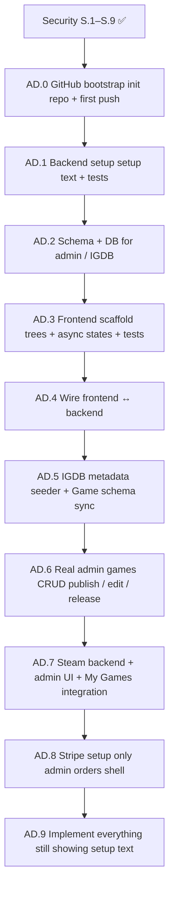

# Admin Panel Implementation Plan (Scaffold-First)

This document is the **execution blueprint for the GameStore admin panel** (`/admin/*`). It mirrors the **scaffold-first** approach in [implementation_plan.md](./implementation_plan.md): structure → setup text → tests → wire → **real implementation last**.

**Prerequisite:** [SECURITY_PLAN.md](./SECURITY_PLAN.md) S.1–S.9 ✅ (Clerk, roles, audit, throttling).

**Parent plans:**

| File | Role |
|------|------|
| [implementation_plan.md](./implementation_plan.md) | Monorepo scaffold-first pattern |
| [PHASE_6_PLAN.md](./PHASE_6_PLAN.md) | Storefront CRUD (games/licenses/accounts) partial overlap |
| [NEXT_PHASES_PLAN.md](./NEXT_PHASES_PLAN.md) | Phase 7 Stripe (referenced in AD.8) |
| [CLERK_NEON_SYNC.md](./CLERK_NEON_SYNC.md) | Admin bootstrap |

**Status today**

| Area | State |
|------|--------|
| `/admin` shell, sign-in, middleware, `@Roles('admin')` | ✅ Done (security) |
| Admin page placeholders (`games`, `licenses`, `accounts`, `orders`) | ✅ Static text only |
| `POST/PUT/DELETE /api/games`, licenses, game-accounts CRUD | ✅ Real Prisma (Phase 6) |
| `GET /api/orders` | Setup JSON only |
| `libs/web/feature-admin` | ❌ Not created |
| IGDB integration | ❌ Not started |
| Admin UI wired to API | ❌ Not started |

**Goal:** Staff manage catalog (IGDB import → publish), licenses, Steam pool, orders, and audit built in **nine phases**, one slice at a time, with tests at every step. **Each phase ends with a Git commit and push to GitHub.**

---

## Phase overview (AD.0 → AD.9)



| Phase | Focus | Real logic? | Tests | Git |
|-------|--------|-------------|-------|-----|
| **AD.0** | Initialize local git + new GitHub repo + baseline push | | `git status` clean | ✅ **First commit** |
| **AD.1** | Admin Nest modules + routes return **setup JSON** | ❌ Setup text only | Unit + api-e2e per slice | ✅ Commit + push |
| **AD.2** | Prisma fields for admin + IGDB; migrate + seed | Schema only | Repository spec + migrate | ✅ Commit + push |
| **AD.3** | `feature-admin` + page component trees; **visible setup text**; loading/error/success/empty | ❌ No API calls yet | Vitest per page | ✅ Commit + push |
| **AD.4** | BFF + `admin-*.api.ts`; pages call API; still setup responses OK | Wire only | api-e2e + web unit | ✅ Commit + push |
| **AD.5** | IGDB lib shell → real Twitch API → upsert `Game` rows | ✅ Seeder | Unit mock IGDB; integration optional | ✅ Commit + push |
| **AD.6** | Real admin games CRUD UI + admin list API + storefront publish | ✅ Full CRUD | e2e create → publish → `/shop` | ✅ Commit + push |
| **AD.7** | Steam: real TOTP, encryption, admin accounts UI, My Games | ✅ Full Steam path | api-e2e + web-e2e | ✅ Commit + push |
| **AD.8** | Stripe **setup only** for admin orders (defer capture) | ❌ Setup text | Assert setup JSON | ✅ Commit + push |
| **AD.9** | Replace **all** remaining setup stubs with real code | ✅ Licenses, orders, dashboard, audit | Full regression | ✅ Commit + push |

### Slice workflow

Work **one slice at a time** inside a phase:

1. Implement the slice
2. Run that slice’s verify commands (tests must pass)
3. User reviews → say **continue** for the next slice

**At the end of each phase (AD.0–AD.9):**

1. Run the phase verify commands (full test suite for that phase)
2. **Commit** all changes with the phase message (see table below)
3. **Push** to GitHub (`git push`)
4. Confirm on GitHub the commit is visible before starting the next phase

Do **not** start the next phase until the current phase is committed and pushed.

---

## Phase AD.0 GitHub bootstrap (do this first)

**Goal:** Create a new GitHub repository on your account, initialize git locally, push the **current baseline** (Phases 0–6 + Security S.1–S.9 + this plan), then begin AD.1.

**Repo is not initialized yet** run these steps once before Slice AD.1.1.

### Prerequisites

| Requirement | Notes |
|-------------|--------|
| [Git](https://git-scm.com/) installed | `git --version` |
| [GitHub CLI](https://cli.github.com/) (`gh`) | `gh auth status` logged into your account |
| `.gitignore` exists | Already ignores `.env`, `node_modules`, `.next`, `dist` |

### AD.0.1 Safety check (never commit secrets)

```powershell
cd C:\Projects\GameStore
git check-ignore -v .env
# Must show .env is ignored

# If anything sensitive is staged, unstage it:
# git reset HEAD .env
```

**Never commit:** `.env`, `.env.local`, API keys, Clerk secrets, Neon URLs with passwords, Stripe keys.

`.env.example` **is** safe to commit (empty placeholders only).

### AD.0.2 Initialize local git

```powershell
cd C:\Projects\GameStore
git init
git branch -M main
git add .
git status
# Review: .env must NOT appear in "Changes to be committed"
```

### AD.0.3 Create new GitHub repo and push

Replace `YOUR_GITHUB_USERNAME` and choose a repo name (default: `GameStore`).

**Option A GitHub CLI (recommended):**

```powershell
gh repo create GameStore --private --source=. --remote=origin --description "GameStore Nx monorepo storefront + admin"
git commit -m "chore: initial commit baseline before admin plan (phases 0–6, security, plans)"
git push -u origin main
```

**Option B GitHub website, then link remote:**

1. On [github.com/new](https://github.com/new): create **GameStore** (empty no README, no .gitignore).
2. Then:

```powershell
git remote add origin https://github.com/YOUR_GITHUB_USERNAME/GameStore.git
git commit -m "chore: initial commit baseline before admin plan (phases 0–6, security, plans)"
git push -u origin main
```

### AD.0.4 Verify remote

```powershell
git remote -v
git log -1 --oneline
gh repo view --web
```

**Phase AD.0 exit criteria:**

- [ ] `origin` points to your new GitHub repo
- [ ] `main` branch pushed; baseline visible on GitHub
- [ ] `.env` not in the repository (`git ls-files | Select-String "\.env$"` returns nothing except `.env.example`)

**Suggested commit message:** `chore: initial commit baseline before admin plan (phases 0–6, security, plans)`

---

## Git workflow commit after every phase

After **each** phase AD.1–AD.9 completes (all slices done, tests green):

```powershell
cd C:\Projects\GameStore
git status
git add -A
git status
# Confirm no .env staged
git commit -m "YOUR_PHASE_MESSAGE"
git push
```

### Suggested commit messages

| Phase | When to commit | Suggested message |
|-------|----------------|-------------------|
| **AD.0** | After first push | `chore: initial commit baseline before admin plan (phases 0–6, security, plans)` |
| **AD.1** | All admin setup routes + e2e pass | `feat(admin): AD.1 backend setup routes with setup JSON and tests` |
| **AD.2** | Migration applied + repository tests pass | `feat(admin): AD.2 schema and IGDB fields on Game model` |
| **AD.3** | feature-admin trees + Vitest + scaffold e2e | `feat(admin): AD.3 frontend scaffold with async state component trees` |
| **AD.4** | Admin pages wired to BFF + setup banners | `feat(admin): AD.4 wire admin frontend to backend API` |
| **AD.5** | IGDB search/import + seeder script | `feat(admin): AD.5 IGDB metadata seeder and import UI` |
| **AD.6** | Real games CRUD + publish on storefront | `feat(admin): AD.6 admin games CRUD publish and edit` |
| **AD.7** | Steam encryption, guard codes, accounts UI | `feat(admin): AD.7 steam integration admin and my-games` |
| **AD.8** | Admin orders setup shell only | `feat(admin): AD.8 stripe orders setup shell for admin` |
| **AD.9** | All remaining setup stubs replaced | `feat(admin): AD.9 complete admin licenses dashboard audit orders` |

Use [Conventional Commits](https://www.conventionalcommits.org/) style; adjust wording if the phase scope shifts slightly.

### Git rules during admin work

| Rule | Why |
|------|-----|
| One commit per **phase**, not per slice | Clean history; slices are reviewed incrementally but shipped as a phase unit |
| Push after every phase commit | GitHub is the backup and progress checkpoint |
| Never `git push --force` to `main` | Avoid overwriting shared history |
| Never commit `.env` | Secrets stay local only |
| Run tests before commit | Same bar as slice verify don’t push broken phases |

Optional: create a GitHub branch per phase (`git checkout -b admin/ad-1`) and open a PR into `main` instead of committing directly to `main`. Default in this plan is **commit + push to `main`** unless you prefer PRs.

---

## Setup-only response pattern

All AD.1 (and AD.8) admin routes return this until their implementation phase:

```json
{
  "status": "setup",
  "integration": "admin-games",
  "message": "Admin games not implemented yet"
}
```

Frontend components **render `message` as visible text** no fake rows, no MSW in app code.

| `integration` value | Resource |
|---------------------|----------|
| `admin-dashboard` | Stats / overview |
| `admin-games` | Games list / CRUD |
| `admin-licenses` | License management |
| `admin-accounts` | Steam account pool |
| `admin-orders` | Orders (until Phase 7 + AD.9) |
| `admin-audit` | Audit log viewer |
| `admin-igdb` | IGDB search / import |
| `orders` | Existing orders stub (unchanged until AD.8/AD.9) |

---

## Global rules

### No-mock policy (admin)

| Allowed | Not allowed |
|---------|-------------|
| Setup JSON from Nest until implementation phase | Hardcoded game/license arrays in React |
| Empty states when API returns `[]` | MSW in non-test files |
| `vi.mock` in `*.spec.ts` only | Fake success without HTTP round-trip |
| Real Prisma after AD.2 migrate | Calling IGDB/Stripe before AD.5/AD.8 |

### Security (do not regress)

- `@Roles('admin')` on all `/api/admin/*` and existing admin mutators.
- Never list decrypted passwords or full license keys in tables.
- BFF forwards `Authorization` (S.3).

### Frontend async-state pattern (every admin page)

Every page feature lib uses the same state machine:

```typescript
type AdminAsyncState<T> =
  | { status: 'idle' }
  | { status: 'loading' }
  | { status: 'setup'; message: string }   // AD.3–AD.4
  | { status: 'success'; data: T }
  | { status: 'empty' }
  | { status: 'error'; message: string };
```

Shared UI: `AdminPageShell`, `AdminLoading`, `AdminError`, `AdminSetupBanner`, `AdminEmptyState`.

### Conventions

| Item | Value |
|------|--------|
| API | `http://localhost:3333/api` |
| Web dev | `http://localhost:3000` |
| Admin routes | `/admin/*` |
| New Nest prefix | `@Controller('admin/...')` → `/api/admin/...` |
| Feature lib | `@gamestore/web/feature-admin` |
| Data access | `@gamestore/web/data-access` → `admin-*.api.ts` |

---

## Target layout (end state)

```
libs/
├── api/
│   ├── igdb/                          # AD.1 shell → AD.5 real
│   └── data-access/                   # admin repos
└── web/
    ├── data-access/src/lib/
    │   ├── admin-dashboard.api.ts
    │   ├── admin-games.api.ts
    │   ├── admin-licenses.api.ts
    │   ├── admin-accounts.api.ts
    │   ├── admin-orders.api.ts
    │   ├── admin-audit.api.ts
    │   └── admin-igdb.api.ts
    └── feature-admin/src/lib/
        ├── components/                # shared async shell
        ├── dashboard/
        ├── games/
        ├── licenses/
        ├── accounts/
        ├── orders/
        ├── audit/
        └── igdb/

apps/api/src/app/admin/
├── admin.module.ts
├── dashboard/
├── games/
├── licenses/
├── accounts/
├── orders/
├── audit/
└── igdb/

apps/web/src/app/admin/
├── page.tsx
├── games/          → list, new, [id]/edit
├── licenses/
├── accounts/
├── orders/
├── audit/
└── igdb/           # search + import (AD.5+)
```

---

# Phase AD.1 Backend setup (setup text + tests)

**Goal:** Admin Nest namespace exists. Every route returns setup JSON. **No Prisma business logic** in this phase.

**Depends on:** Security S.1–S.9 ✅

**Note:** Phase 6 already has real `GamesController` mutators. AD.1 adds a **parallel admin namespace** (`/api/admin/*`) so the scaffold-first path is explicit. AD.6 consolidates or replaces stubs with real implementations.

---

### Slice AD.1.1 `AdminModule` + dashboard setup

**Create:**

- `apps/api/src/app/admin/admin.module.ts`
- `AdminDashboardController` → `GET /api/admin/stats` returns setup JSON (`integration: admin-dashboard`)

**Tests:**

- `admin-dashboard.controller.spec.ts` returns `{ status: 'setup' }`
- `apps/api-e2e/src/admin/admin-setup.e2e-spec.ts` admin JWT → 200 + setup body; user JWT → 403

**Verify:**

```bash
pnpm nx test api
pnpm nx e2e api-e2e -- src/admin/admin-setup.e2e-spec.ts
```

**Exit criteria:**

- [ ] `GET /api/admin/stats` returns setup JSON
- [ ] `@Roles('admin')` enforced

---

### Slice AD.1.2 Admin games setup routes

**Create:**

- `AdminGamesController`:
  - `GET /api/admin/games` → setup
  - `GET /api/admin/games/:id` → setup
  - `POST /api/admin/games` → setup
  - `PUT /api/admin/games/:id` → setup
  - `DELETE /api/admin/games/:id` → setup

**Tests:** controller spec + e2e extend `admin-setup.e2e-spec.ts`

**Exit criteria:**

- [ ] All five routes return setup JSON (not 501)
- [ ] Public `GET /api/games` unchanged

---

### Slice AD.1.3 Admin licenses setup routes

**Create:** `AdminLicensesController`

| Method | Path |
|--------|------|
| GET | `/api/admin/licenses` |
| GET | `/api/admin/licenses/:id` |
| POST | `/api/admin/licenses` |
| POST | `/api/admin/licenses/:id/revoke` |
| POST | `/api/admin/licenses/generate-key` |

Setup JSON only. Existing `/api/licenses` CRUD stays until AD.9 migration.

---

### Slice AD.1.4 Admin accounts setup routes

**Create:** `AdminAccountsController`

| Method | Path |
|--------|------|
| GET | `/api/admin/accounts` |
| GET | `/api/admin/accounts/:id` |
| POST | `/api/admin/accounts` |
| POST | `/api/admin/accounts/:id/deactivate` |

---

### Slice AD.1.5 Admin audit + IGDB setup routes

**Create:**

- `AdminAuditController` → `GET /api/admin/audit-logs` setup (distinct from real `GET /api/audit-logs` until AD.9)
- `AdminIgdbController`:
  - `GET /api/admin/igdb/search?q=` → setup
  - `POST /api/admin/igdb/import` → setup

**Generate lib shell:**

```bash
pnpm nx g @gamestore/workspace:integration-lib --name=igdb
```

Service methods return setup text (no Twitch API calls).

**Phase AD.1 exit criteria:**

- [ ] All admin controllers registered in `AppModule`
- [ ] api-e2e covers every admin setup route (200 + setup body)
- [ ] No new Prisma queries in admin services
- [ ] **Git:** commit `feat(admin): AD.1 backend setup routes with setup JSON and tests` and push

---

# Phase AD.2 Schema & database (admin + IGDB fields)

**Goal:** Extend `Game` (and optional admin tables) for IGDB sync and admin workflows. Migrate + seed + repository tests.

**Depends on:** AD.1

---

### Slice AD.2.1 `Game` schema extensions (+ IGDB media gallery)

**Add to `libs/api/prisma/prisma/schema.prisma`:**

```prisma
model Game {
  // existing fields …
  igdbId          Int?      @unique
  releaseDate     DateTime?
  genres          String[]  @default([])
  igdbSyncedAt    DateTime?
  igdbCoverUrl    String?
  media           GameMedia[]
}

/// Screenshots + trailer videos synced from IGDB (Game Pass–style detail page).
model GameMedia {
  id        String   @id @default(cuid())
  gameId    String
  type      String   // screenshot | video
  url       String   // IGDB image URL or YouTube embed URL
  igdbId    Int?
  title     String?  // video title from IGDB
  sortOrder Int      @default(0)
  game      Game     @relation(...)
}
```

**IGDB import targets (AD.5):** every imported game gets **2 screenshots** + **2 videos** by default (`IGDB_IMPORT_SCREENSHOT_LIMIT`, `IGDB_IMPORT_VIDEO_LIMIT` in `@gamestore/api/igdb`) same pattern as [gamepass.offline-game.com](https://gamepass.offline-game.com) detail galleries.

| Media | IGDB source | Stored as |
|-------|-------------|-----------|
| Cover | `cover` | `Game.coverImage` + `igdbCoverUrl` |
| Screenshots (×2) | `screenshots` endpoint | `GameMedia` `type: screenshot` |
| Videos (×2) | `game_videos` (YouTube) | `GameMedia` `type: video` |

**Migration:** `pnpm nx run api-prisma:prisma-migrate-deploy` (create migration SQL manually if `migrate dev` is non-interactive).

**Update seed:** `demo-game-1` gets `igdbId` + 2 screenshots + 2 videos.

---

### Slice AD.2.2 Admin repository methods (read-only)

**Extend `GamesRepository`:**

- `findAllAdmin()` all games, include `publishedAt`, `igdbId`, `releaseDate`
- `findByIdAdmin(id)` same projection

**Tests:** `games.repository.spec.ts` mock Prisma, assert `where` / `select`.

**No HTTP changes** this slice.

---

### Slice AD.2.3 License list enrichment

**Extend `LicensesRepository.findAll()`** `include: { game: { select: { title, slug } }, owner: { select: { email } } }`.

**Tests:** repository spec.

**Phase AD.2 exit criteria:**

- [ ] Migration applied; `pnpm db:seed` succeeds
- [ ] `findAllAdmin()` returns draft + published games
- [ ] Repository unit tests pass
- [ ] **Git:** commit `feat(admin): AD.2 schema and IGDB fields on Game model` and push

---

# Phase AD.3 Frontend scaffold (text + component trees + async states)

**Goal:** `feature-admin` lib with full component trees per page. Pages show **static labels + setup banner**. Every slice includes Vitest for loading / error / success / empty / setup states.

**Depends on:** AD.1 (for route names), AD.2 optional

**No real API calls** pass mock `AdminAsyncState` in tests.

---

### Slice AD.3.1 Generate `feature-admin` + shared shell

```bash
pnpm nx g @gamestore/workspace:web-feature --name=admin --route=/admin
```

**Create:**

- `AdminPageShell`, `AdminAsyncView` (renders loading/error/setup/empty/children)
- `AdminPageHeader`, `AdminTable` (structure only, no data yet)

**Test:** `admin-async-view.spec.tsx` all five states render correct text.

---

### Slice AD.3.2 Dashboard component tree

**Route:** `apps/web/src/app/admin/page.tsx` → `<AdminDashboardPage />`

**Tree:**

```
AdminDashboardPage
├── AdminDashboardHeader
├── AdminDashboardStatsGrid      # placeholder "—"
├── AdminDashboardQuickActions
└── AdminDashboardRecentActivity # "Setup: admin dashboard not implemented yet"
```

**Test:** renders setup banner text.

---

### Slice AD.3.3 Games pages component trees

**Routes:**

| Route | Component tree |
|-------|----------------|
| `/admin/games` | `AdminGamesPage` → `AdminGamesHeader`, `AdminGamesToolbar`, `AdminGamesTable`, `AdminGamesEmpty` |
| `/admin/games/new` | `AdminGameFormPage` → `AdminGameForm`, `AdminGameFormActions` |
| `/admin/games/[id]/edit` | `AdminGameEditPage` → same form + `AdminGameDeleteSection` |

**Test each:** loading spinner, error message, setup banner, empty table.

---

### Slice AD.3.4 Licenses component trees

**Routes:** `/admin/licenses`, `/admin/licenses/new`

**Tree:** `AdminLicensesPage` → header, Filters, table, revoke button (disabled), `AdminLicenseForm`.

---

### Slice AD.3.5 Accounts component trees

**Routes:** `/admin/accounts`, `/admin/accounts/new`

**Tree:** `AdminAccountsPage` → header, game filter, table (no password columns), `AdminAccountForm`.

---

### Slice AD.3.6 Orders + audit + IGDB component trees

**Routes:**

- `/admin/orders` setup text from orders integration
- `/admin/audit` table shell + pagination placeholders
- `/admin/igdb` search input + results grid shell

**Nav:** Add **Audit** and **IGDB** links to `admin/layout.tsx`.

**E2E:**

```bash
pnpm nx g @gamestore/workspace:e2e-spec --app=web --name=admin-scaffold
pnpm nx e2e web-e2e -- src/admin-scaffold.spec.ts
```

Assert each `/admin/*` route shows expected setup/section headings (no auth flake: use admin test user or skip protected routes with middleware mock).

**Phase AD.3 exit criteria:**

- [ ] Every admin route has a component tree (not a single `<Card>` stub)
- [ ] Vitest covers async states per major page
- [ ] web-e2e `admin-scaffold` passes
- [ ] **Git:** commit `feat(admin): AD.3 frontend scaffold with async state component trees` and push

---

# Phase AD.4 Wire frontend ↔ backend

**Goal:** `admin-*.api.ts` + `apiPut`/`apiPatch`/`apiDelete`. Pages fetch real endpoints; **setup JSON is valid success** UI shows `AdminSetupBanner` with API `message`.

**Depends on:** AD.1 + AD.3

---

### Slice AD.4.1 Data-access layer

**Extend `api-client.ts`:**

- `apiPut`, `apiPatch`, `apiDelete` attach Clerk bearer in browser.

**Add:** `admin-dashboard.api.ts`, `admin-games.api.ts`, … (one file per resource).

**Type:**

```typescript
export type SetupResponse = {
  status: 'setup';
  integration: string;
  message: string;
};
```

**Test:** `api-client.spec.ts` mock fetch, assert Authorization header.

---

### Slice AD.4.2 Wire dashboard + games pages

- `AdminDashboardPage` `useEffect` → `getAdminStats()` → if `status === 'setup'` show banner.
- `AdminGamesPage` same pattern for `getAdminGames()`.

**Test:** mock API returns setup → banner visible; mock error → error state.

---

### Slice AD.4.3 Wire licenses, accounts, orders, audit, igdb

Same pattern for remaining pages.

**E2E (api):** admin JWT hits all `/api/admin/*` still setup bodies.

**E2E (web):** signed-in admin sees setup messages from real BFF (optional; may need Clerk test user).

**Phase AD.4 exit criteria:**

- [ ] All admin pages call real API via BFF
- [ ] Setup responses render as visible text
- [ ] Error state on 401/403/500
- [ ] **Git:** commit `feat(admin): AD.4 wire admin frontend to backend API` and push

---

# Phase AD.5 IGDB metadata seeder (setup → real sync)

**Goal:** Twitch IGDB API integration. Admin searches IGDB, imports metadata into `Game` rows. Schema from AD.2 is source of truth.

**Depends on:** AD.2 + AD.4

**Env (`.env.example`):**

```env
IGDB_CLIENT_ID=
IGDB_CLIENT_SECRET=
```

---

### Slice AD.5.1 Real IGDB client

**`libs/api/igdb`:**

- `IgdbService.searchGames(query)` OAuth client credentials → `POST https://api.igdb.com/v4/games`
- `IgdbService.getGameDetails(igdbId)` cover, summary, release date, genres
- `IgdbService.getScreenshots(igdbId, limit=2)` IGDB `screenshots` → `GameMedia` rows
- `IgdbService.getVideos(igdbId, limit=2)` IGDB `game_videos` → YouTube embed URLs

**Tests:** unit with mocked `fetch` (no live API in CI).

---

### Slice AD.5.2 Import endpoint (real)

Replace setup on:

- `GET /api/admin/igdb/search?q=` proxy IGDB search (admin-only)
- `POST /api/admin/igdb/import` body `{ igdbId, priceBase, platform, slug? }` → upsert `Game` (draft) + **2 screenshots + 2 videos** in `game_media`

**Audit:** `admin.igdb.import`

---

### Slice AD.5.3 CLI seeder script

**`tools/scripts/igdb-seed.ts`** (or nx target `igdb-seed`):

```bash
pnpm nx run api-prisma:igdb-seed -- --igdb-id=12345 --slug=my-game
```

For bulk dev seeding without UI.

---

### Slice AD.5.4 Admin IGDB UI (real)

**`/admin/igdb`:**

- Search → results cards (cover, title, release date)
- **Import** → creates draft game → link to `/admin/games/[id]/edit`

**Test:** unit with mocked API; manual with real Twitch credentials.

**Phase AD.5 exit criteria:**

- [ ] Import creates `Game` with `igdbId`, `description`, `coverImage`, `releaseDate`, **2 screenshots, 2 videos**
- [ ] Draft game **not** on public `/shop` until published (AD.6)
- [ ] No IGDB calls from storefront admin only
- [ ] **Git:** commit `feat(admin): AD.5 IGDB metadata seeder and import UI` and push

---

# Phase AD.6 Real admin games CRUD (publish / edit / release)

**Goal:** Replace admin games setup stubs with real Prisma. Admin can create, edit, publish, unpublish, delete. Storefront reflects published games.

**Depends on:** AD.2 + AD.4 + AD.5 (import → edit flow)

---

### Slice AD.6.1 Backend: real admin games service

**Replace setup** in `AdminGamesController`:

| Method | Behavior |
|--------|----------|
| GET `/api/admin/games` | `findAllAdmin()` |
| GET `/api/admin/games/:id` | `findByIdAdmin()` |
| POST | create (draft default) |
| PUT | update incl. `publishedAt` |
| DELETE | delete + audit |

Reuse validation from `GamesService` where possible. Keep public `GET /api/games` published-only.

**Tests:** api-e2e admin list includes `publishedAt: null` rows.

---

### Slice AD.6.2 Frontend: games list + forms (real data)

- Table: title, slug, platform, price, status badge (Draft / Published), IGDB id
- **Publish** toggle → `PUT` sets `publishedAt`
- **Delete** with confirm dialog
- Success toasts; redirect after create

---

### Slice AD.6.3 Storefront sync verification

- Publish game → appears on `/shop`
- Unpublish → removed from catalog (still in admin list)

**E2E:** `admin-games.e2e-spec.ts` create → publish → `GET /api/games` includes slug.

**Phase AD.6 exit criteria:**

- [ ] Full games lifecycle without curl
- [ ] IGDB import → edit price → publish → buy panel shows game
- [ ] Audit rows for create/update/delete/publish
- [ ] **Git:** commit `feat(admin): AD.6 admin games CRUD publish and edit` and push

---

# Phase AD.7 Steam (backend + admin UI + My Games integration)

**Goal:** Everything Steam-related real `steam-totp`, AES-256 credential encryption, admin account pool UI, My Games activation wired end-to-end.

**Depends on:** AD.6 (games exist to attach accounts)

**Aligns with:** [NEXT_PHASES_PLAN.md](./NEXT_PHASES_PLAN.md) Phase 8 (storefront activation); AD.7 delivers **admin + integrated** Steam path.

---

### Slice AD.7.1 Encryption service

**`libs/api/steam`:**

- `encryptCredential(plain)` / `decryptCredential(cipher)` AES-256-GCM, `STEAM_ENCRYPTION_KEY`
- `POST /api/game-accounts` accepts plaintext password → encrypt server-side (admin only)

**Tests:** round-trip unit test.

---

### Slice AD.7.2 Real Steam Guard codes

Replace setup in `libs/api/steam`:

- `POST /api/steam/guard/code` real `generateAuthCode(sharedSecret)` after ownership check
- Cooldown / `lockedUntil` stub or basic 15-min lock (expand in post-MVP)

**Wire `feature-my-games`:** `SteamGuardPanel` shows live code or setup/error.

---

### Slice AD.7.3 Admin accounts UI (real)

Replace `AdminAccountsController` setup:

- List pool (no secrets)
- Create account form (plaintext password → API encrypts)
- Deactivate with confirm
- Filter by `gameId`

---

### Slice AD.7.4 Account assignment on license validate (optional in AD.7)

When `POST /licenses/validate` succeeds and `accountId` null → assign least-loaded active account under cap (50).

**Admin UI:** show `activeUsersCount` / `lockedUntil` in accounts table.

---

### Slice AD.7.5 Integration E2E

- Admin adds account → user validates license → credentials panel → guard code
- api-e2e + web-e2e steam specs (real TOTP in test env)

**Phase AD.7 exit criteria:**

- [ ] No setup text on steam guard or admin accounts routes
- [ ] Passwords never returned in list APIs
- [ ] My Games full activation path works
- [ ] **Git:** commit `feat(admin): AD.7 steam integration admin and my-games` and push

---

# Phase AD.8 Stripe setup (later admin orders shell)

**Goal:** Admin orders area wired to **setup-only** Stripe/orders integration. **No real Checkout or webhooks** in this phase that stays [NEXT_PHASES_PLAN.md](./NEXT_PHASES_PLAN.md) Phase 7.

**Depends on:** AD.4 (orders page wired)

---

### Slice AD.8.1 Admin orders setup controller

- `GET /api/admin/orders` → setup JSON (`integration: admin-orders`)
- `GET /api/admin/orders/:id` → setup JSON

Keep existing `GET /api/orders` setup until Phase 7 migrates to `Order` model.

---

### Slice AD.8.2 Admin orders UI shows setup text

`AdminOrdersPage` displays API `message` + link doc to Phase 7.

**Tests:** e2e asserts setup body; UI shows message.

**Phase AD.8 exit criteria:**

- [ ] Admin orders page intentionally shows "not implemented yet"
- [ ] No Stripe SDK calls from admin code
- [ ] Documented handoff to NEXT_PHASES Phase 7
- [ ] **Git:** commit `feat(admin): AD.8 stripe orders setup shell for admin` and push

---

# Phase AD.9 Implement everything still showing setup text

**Goal:** Replace **all** remaining `{ status: 'setup' }` responses and setup banners with real implementations.

**Depends on:** AD.6–AD.8; Phase 7 Stripe for real orders

---

### Slice AD.9.1 Admin licenses (real)

- Wire `AdminLicensesController` to real `LicensesService`
- UI: list, create, revoke, masked keys, generate-key helper
- Deprecate duplicate paths on `/api/licenses` if consolidated

---

### Slice AD.9.2 Dashboard stats (real)

- `GET /api/admin/stats` → Prisma counts: games, published, licenses, active licenses, accounts, orders today
- Dashboard stat cards live

---

### Slice AD.9.3 Audit log viewer (real)

- Wire `AdminAuditController` to `AuditLogsService` (or alias existing `GET /api/audit-logs`)
- Paginated table, action filter
- Nav link active

---

### Slice AD.9.4 Orders admin (real after Phase 7)

**Blocked until** `Order` model + Stripe webhook from Phase 7.

- Replace setup with `GET /api/admin/orders`, detail view
- Status badges, link to license

---

### Slice AD.9.5 Licenses + storefront admin link polish

- Header **Admin** link for `role === admin`
- Breadcrumbs, confirm dialogs, keyboard a11y
- Full regression:

```bash
pnpm nx test api-auth
pnpm nx test api-data-access
pnpm nx test feature-admin
pnpm nx e2e api-e2e
pnpm nx e2e web-e2e
```

**Phase AD.9 exit criteria:**

- [ ] Zero `status: 'setup'` on implemented admin routes (except explicitly deferred features)
- [ ] Manual happy path: sign-in → IGDB import → publish → create license → add account → audit trail
- [ ] Orders real after Phase 7 merge
- [ ] **Git:** commit `feat(admin): AD.9 complete admin licenses dashboard audit orders` and push

---

## API reference (progressive)

| Phase | Method | Path | Response |
|-------|--------|------|----------|
| AD.1 | ALL | `/api/admin/*` | setup JSON |
| AD.5 | GET | `/api/admin/igdb/search` | real IGDB |
| AD.5 | POST | `/api/admin/igdb/import` | real Game |
| AD.6 | CRUD | `/api/admin/games` | real Game |
| AD.7 | CRUD | `/api/admin/accounts` + `/api/steam/*` | real |
| AD.8 | GET | `/api/admin/orders` | setup JSON |
| AD.9 | * | remaining admin routes | real |

**Existing Phase 6 routes** (`POST /api/games`, `/api/licenses`, `/api/game-accounts`) remain until AD.6/AD.9 consolidate under `/api/admin/*` or keep as aliases.

---

## Verify commands (cheat sheet)

```bash
# Per-phase
pnpm nx test api
pnpm nx test feature-admin
pnpm nx test web-data-access
pnpm nx e2e api-e2e
pnpm nx e2e web-e2e

# Database (stop api serve on Windows first)
pnpm nx run api-prisma:prisma-migrate
pnpm nx run api-prisma:db-seed

# Dev
pnpm nx serve api
pnpm nx dev web
```

---

## Full exit criteria (entire admin plan)

- [ ] **AD.0** GitHub repo created; baseline pushed; `.env` not tracked
- [ ] **AD.1** All admin API routes exist; setup JSON + e2e
- [ ] **AD.2** IGDB fields on `Game`; admin repository queries
- [ ] **AD.3** Component trees + async states + unit tests
- [ ] **AD.4** Frontend calls backend; setup text from API
- [ ] **AD.5** IGDB search/import + CLI seeder
- [ ] **AD.6** Real games CRUD + publish → storefront
- [ ] **AD.7** Steam encryption, guard codes, admin accounts, My Games
- [ ] **AD.8** Orders admin shows setup; Stripe deferred
- [ ] **AD.9** Licenses, dashboard, audit, orders (post–Phase 7) all real
- [ ] **Security** Admin-only; no secret leakage
- [ ] **Git** Ten phase commits on GitHub (AD.0–AD.9), each pushed before the next phase starts

---

## Known issues

| Issue | Mitigation |
|-------|------------|
| Phase 6 CRUD overlaps AD.1 admin namespace | AD.6 consolidates; keep both during scaffold |
| `prisma generate` EPERM Windows | Stop `nx serve api` before migrate |
| Orders need Phase 7 | AD.8 setup only; AD.9.4 after Stripe |
| IGDB rate limits | Cache search results; throttle admin routes (S.7) |
| `nx build web` prerender | Dev + e2e primary; fix prerender separately |

---

## Document map

| File | Role |
|------|------|
| **ADMIN_PLAN.md** | **This file** admin scaffold-first phases AD.1–AD.9 |
| [implementation_plan.md](./implementation_plan.md) | Parent scaffold pattern |
| [SECURITY_PLAN.md](./SECURITY_PLAN.md) | Prerequisite auth |
| [NEXT_PHASES_PLAN.md](./NEXT_PHASES_PLAN.md) | Phase 7 Stripe → feeds AD.9.4 |
| [mvp_structure_and_roadmap.md](./mvp_structure_and_roadmap.md) | IGDB + admin panel vision |

---

*Start with **Phase AD.0** (GitHub bootstrap), then **Slice AD.1.1**. Review after each slice; **commit and push after each phase** before continuing.*
