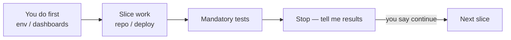
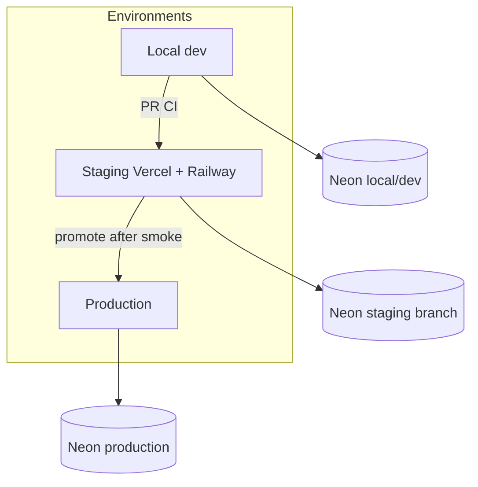
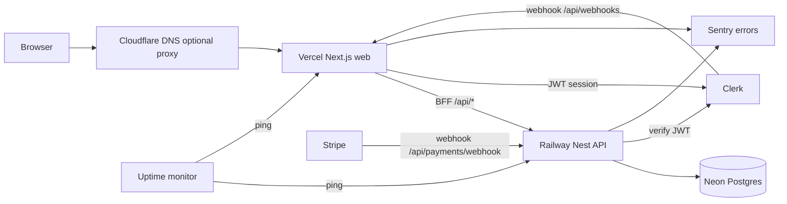

# Deployment & Search Visibility Plan

**Goal:** Launch GameStore to production with DevOps best practices — staging first (no custom domain), then domain/DNS/email cutover, hardening, CI/CD, observability, backups/rollback, and Search Console so the site can appear in Google.

**Status:** In progress — D1 slice work started (env matrix + `pnpm deploy:verify-env`)  
**Prerequisite:** MVP features working locally (storefront, Clerk, Stripe, Steam Guard, admin, SEO code)  
**Aligns with:** [NEXT_PHASES_PLAN.md](./NEXT_PHASES_PLAN.md) Phase 10

**Related plans:**

| Document | Relationship |
|----------|----------------|
| [NEXT_PHASES_PLAN.md](./NEXT_PHASES_PLAN.md) Phase 10 | Original deploy exit criteria |
| [SEO_PLAN.md](./SEO_PLAN.md) | Technical SEO (code done); GSC ops live here |
| [SECURITY_PLAN.md](./SECURITY_PLAN.md) | HTTPS, CORS, secrets, throttling, audit logs |
| [CLERK_NEON_SYNC.md](./CLERK_NEON_SYNC.md) | Clerk webhooks → Neon users |
| [STRIPE_PHASE_PLAN.md](./STRIPE_PHASE_PLAN.md) | Stripe webhook must hit Nest directly |
| [implementation_plan.md](./implementation_plan.md) | CI sketch |
| [`.env.example`](../.env.example) | Env key source of truth |

**Defaults chosen:** Vercel (`web`) + Railway (`api`) + Neon (Postgres) + GitHub Actions (CI) + Cloudflare DNS (domain).

**Explicitly out of scope for MVP launch:** Kubernetes, multi-region active-active, full IaC (Terraform), on-call paging rotations, AI content / guides blog, full legal page copywriting (called out as recommended follow-up).

---

## How we work this plan (read first)

Work **one slice at a time** (D1 → D11). Every slice follows the same rhythm:



1. **You do first** — Before any slice starts, complete the checklist under that slice (Clerk, Stripe, Steam, Neon, domain, env values, dashboard clicks). Do not ask the engineer to “just deploy” until those items are done or explicitly deferred.
2. **Slice work** — Engineer / agent implements or configures what that slice owns.
3. **Mandatory tests** — Run the slice’s test / smoke commands. Create or update automated tests when the slice adds repo config (CI, middleware, health, etc.).
4. **Stop before next slice** — Report results. **Do not start the next slice until you say continue.**

**Rule:** Never skip “You do first.” Secrets and provider accounts are on you; code and host wiring are on the engineer.

---

## 0. DevOps principles (apply everywhere)

1. **Environments are isolated** — local ≠ staging ≠ production (separate Neon branches, Clerk instances, Stripe modes, webhook secrets).
2. **Secrets never live in git** — only host secret stores + GitHub Actions secrets; rotate when leaked.
3. **Deploy is reversible** — prefer forward-fix DB migrations; keep previous deploy one click away.
4. **Migrate carefully** — `prisma migrate deploy` only in staging/prod; take a Neon snapshot/PITR window before risky schema changes.
5. **Observe before you scale** — health checks + error tracking + uptime alerts before launch traffic.
6. **Least privilege** — admin-only surfaces stay locked; `/dev` blocked in production; API never exposed without CORS allowlist.
7. **Automate the boring path** — CI gates merges; deploys on green `main`; manual only for Live Stripe cutover and key rotations.



---

## 1. Architecture (production)



**Why this split (already in the codebase):**

- Clerk webhook must hit Next: `apps/web/src/app/api/webhooks/route.ts`
- Stripe webhook must hit Nest **directly** (raw body): `https://<api>/api/payments/webhook` — **not** the Next BFF
- Browser calls `NEXT_PUBLIC_API_URL=/api` → BFF `apps/web/src/app/api/[...path]/route.ts` → `API_URL` (Railway Nest)

---

## 2. Phase A — Pre-domain staging (slices D1–D5)

Goal: live HTTPS demo before buying a domain (e.g. `*.vercel.app` + `*.up.railway.app`).

---

### Slice D1 — Provision isolated services (Neon / Clerk / Stripe / IGDB / Steam)

**Goal:** Staging (and prod-ready) accounts exist with **separate** secrets. No deploy yet.

#### You do first (before this slice starts)

Do these in dashboards / password manager. Paste values into a private note (1Password / Bitwarden) — **never commit them**.

| Provider | What you create / collect |
|----------|---------------------------|
| **Neon** | Project with **`staging`** and **`production`** branches (or separate DBs). Enable **PITR / history retention** on the plan used for production. Copy **both** `DATABASE_URL` (pooled) and `DIRECT_URL` (direct) for staging. |
| **Clerk** | Prefer a **dedicated staging** instance (or separate Production app) so staging signups never pollute prod. Keep Development for local. Configure session JWT: `{ "metadata": "{{user.public_metadata}}" }`. Create one admin: `public_metadata.role = "admin"`. Copy publishable + secret keys for staging. |
| **Stripe** | Stay in **Test mode** for staging. Note Test publishable + secret keys. You will create the webhook endpoint in **D2** after the API URL exists — do not invent a webhook secret yet. |
| **IGDB / Twitch** | Twitch app with IGDB access; copy `IGDB_CLIENT_ID` + `IGDB_CLIENT_SECRET` ([libs/api/igdb/README.md](../libs/api/igdb/README.md)). |
| **Steam** | Generate a **new** staging `STEAM_ENCRYPTION_KEY` (64-char hex). **Do not** reuse local or future prod keys. Rotating later requires re-encrypting the credential pool. |
| **Accounts** | Confirm you can log into Neon, Clerk, Stripe, Twitch, and (later) Railway / Vercel / GitHub with **2FA** where available. |

**Env values to have ready for later slices** (from [`.env.example`](../.env.example)):

- Neon: `DATABASE_URL`, `DIRECT_URL`
- Clerk: `NEXT_PUBLIC_CLERK_PUBLISHABLE_KEY`, `CLERK_SECRET_KEY` (webhook secret comes in D3)
- Stripe Test: `STRIPE_SECRET_KEY`, `NEXT_PUBLIC_STRIPE_PUBLISHABLE_KEY` (webhook secret comes in D2)
- `IGDB_CLIENT_ID`, `IGDB_CLIENT_SECRET`
- `STEAM_ENCRYPTION_KEY` (staging-unique), optional `STEAM_GUARD_COOLDOWN_MINUTES`

#### Slice work

1. Document staging vs production secret names in your vault (still no git).
2. Confirm `.env.example` lists every key you will need; add placeholders only if a key is missing (no real values).
3. Mark which keys are web-only vs API-only (see §7 Env matrix).

#### Mandatory tests (D1 exit)

| Check | How |
|-------|-----|
| Neon staging reachable | From a throwaway shell: `psql "$DATABASE_URL" -c 'select 1'` (or Neon SQL editor) returns 1 |
| Clerk staging keys present | Publishable key starts with `pk_`; secret with `sk_` (Test/Dev as appropriate) |
| Stripe Test keys present | `sk_test_…` / `pk_test_…` — **not** live |
| Steam key format | Staging key is 64 hex (or documented 32+ char secret); **≠** local `.env` value |
| IGDB credentials | Twitch console shows the app; both ID + secret stored |

No repo automated test required for D1 (account provisioning only).

#### Stop — before D2

Report: Neon staging URL ready? Clerk staging admin user created? Stripe still Test-only? Steam key unique?  
**Do not start D2 until you say continue.**

---

### Slice D2 — Deploy Nest API to Railway (staging) + Stripe webhook

**Goal:** Staging API live on HTTPS with migrations, health, and Stripe Test webhook.

#### You do first (before this slice starts)

| Item | Action |
|------|--------|
| **D1 complete** | Staging Neon + Clerk + Stripe Test + IGDB + Steam key in vault |
| **Railway** | Create account / project; connect GitHub repo; prefer a **`staging`** environment |
| **Neon snapshot** | Confirm PITR window or take a named branch/snapshot before first `migrate deploy` |
| **Stripe Dashboard** | Stay in **Test mode**. After the Railway URL exists (during slice), you will add webhook → `https://<api>/api/payments/webhook` and copy `whsec_…` into Railway as `STRIPE_WEBHOOK_SECRET` |
| **CORS placeholder** | You may not have the Vercel URL yet — use a temporary `CORS_ORIGINS` (update in D3). Or create the Vercel project first and note the `*.vercel.app` origin |

**API env you must supply on Railway** (values from D1 + Stripe webhook after URL exists):

| Variable | Notes |
|----------|--------|
| `NODE_ENV` | `production` |
| `DATABASE_URL` / `DIRECT_URL` | Staging Neon only |
| `CORS_ORIGINS` | Exact Vercel HTTPS origin(s) — finalize in D3 |
| `PORT` | Railway injects; do not hardcode |
| Clerk JWT verify keys | As coded for Nest (`CLERK_SECRET_KEY` / publishable per app) |
| `STRIPE_SECRET_KEY` | Test |
| `STRIPE_WEBHOOK_SECRET` | From staging webhook endpoint |
| `STEAM_ENCRYPTION_KEY` | Staging-unique |
| `IGDB_*` | Admin import |
| `THROTTLE_*` | Optional; defaults OK |

#### Slice work

1. Connect repo; Root Directory = monorepo root.
2. Build command:

```bash
pnpm install --frozen-lockfile && pnpm nx build api && pnpm nx run api-prisma:prisma-migrate-deploy
```

3. Start command: `node dist/apps/api/main.js` (confirm webpack output path after first build). Optional Railway healthcheck: `/api/health/db`.
4. Set Railway env from the table above.
5. **Safe deploy order:** Neon snapshot → migrate deploy → start Nest → smoke health → then Stripe webhook URL.
6. Stripe Dashboard → Webhook (Test): `https://<api-host>/api/payments/webhook` (events matching Nest handler). Store signing secret in Railway only.

#### Mandatory tests (D2 exit)

| Check | How |
|-------|-----|
| Health | `GET https://<api>/api/health/db` → 200 |
| Catalog | `GET https://<api>/api/games` → 200 + JSON |
| Stripe webhook registered | Dashboard shows endpoint; signing secret set on Railway |
| Migrations | Railway deploy logs show `prisma migrate deploy` succeeded |

**Automated / scripted smoke (create or keep as deploy checklist script if useful):**

```bash
curl -sf "https://<api-host>/api/health/db"
curl -sf "https://<api-host>/api/games" | head -c 200
```

Optional later: add a small `scripts/smoke-api-staging.sh` (or doc-only) — not required to block D2 if curls pass.

#### Stop — before D3

Report: API host URL, health 200, Stripe Test webhook created, `CORS_ORIGINS` still temporary or ready.  
**Do not start D3 until you say continue.**

---

### Slice D3 — Deploy Next web to Vercel (staging) + Clerk webhook

**Goal:** Staging storefront on `*.vercel.app` talking to Railway via BFF; Clerk webhook syncing users.

#### You do first (before this slice starts)

| Item | Action |
|------|--------|
| **D2 complete** | Railway staging API URL + health green |
| **Vercel** | Import monorepo; create project; note Preview vs Production env separation |
| **Clerk Dashboard** | Add staging hostname to allowed origins / redirect URLs. After web URL exists: Webhook → `https://<web>/api/webhooks` (user events). Copy signing secret → Vercel as `CLERK_WEBHOOK_SECRET` (or `CLERK_WEBHOOK_SIGNING_SECRET`) |
| **Stripe** | Publishable Test key for Vercel only (`NEXT_PUBLIC_STRIPE_PUBLISHABLE_KEY`) — secret stays on Railway |
| **Site URL** | Decide temporary `NEXT_PUBLIC_SITE_URL=https://<project>.vercel.app` |

**Web env you must supply on Vercel** (Preview/staging — **not** Live Stripe or prod Clerk secrets):

| Variable | Notes |
|----------|--------|
| `NEXT_PUBLIC_SITE_URL` | `https://<vercel-app>.vercel.app` |
| `NEXT_PUBLIC_SITE_NAME` | e.g. GameStore |
| `NEXT_PUBLIC_DEFAULT_OG_IMAGE` | `/og/default.png` |
| `NEXT_PUBLIC_API_URL` | `/api` |
| `API_URL` | `https://<railway-api-host>` |
| Clerk publishable + secret + webhook | Staging instance |
| `NEXT_PUBLIC_STRIPE_PUBLISHABLE_KEY` | Test |
| `DATABASE_URL` / `DIRECT_URL` | If Prisma used on web for Clerk sync — **staging branch only** |

#### Slice work

1. Install: `pnpm install --frozen-lockfile`; Build: `pnpm nx build web`.
2. Prefer repo root with Nx; map Preview + Production carefully.
3. Set Vercel env; deploy staging.
4. Update Railway `CORS_ORIGINS` to the exact Vercel HTTPS origin(s); redeploy API if needed.
5. Confirm Clerk webhook deliveries after a test sign-up.

#### Mandatory tests (D3 exit)

| Check | How |
|-------|-----|
| Home | `GET https://<web>/` → 200 |
| Robots / sitemap | `/robots.txt`, `/sitemap.xml` → 200 |
| BFF → API | Shop or `/api/games` via site loads catalog |
| Clerk webhook | Sign up / sign in → Neon `User` row appears; Clerk Dashboard delivery green |
| CORS | Browser console clean calling API through BFF; Railway allows Vercel origin |

```bash
curl -sf "https://<web-host>/" -o /dev/null
curl -sf "https://<web-host>/robots.txt"
curl -sf "https://<web-host>/sitemap.xml" | head -c 200
```

#### Stop — before D4

Report: Vercel URL, Clerk webhook green, Railway `CORS_ORIGINS` updated.  
**Do not start D4 until you say continue.**

---

### Slice D4 — Staging smoke (shop → pay → license → Steam Guard → admin)

**Goal:** Prove the full buyer + admin path on staging before hardening / domain.

#### You do first (before this slice starts)

| Item | Action |
|------|--------|
| **D2 + D3 complete** | API + web + both webhooks |
| **Clerk admin** | Staging user with `public_metadata.role = "admin"` |
| **Stripe Test** | Card `4242…` ready; webhook deliveries enabled in Dashboard |
| **Catalog** | At least one **published** game with price + pool account (or seed on staging Neon) |
| **Steam pool** | Staging DB has encrypted credentials under the **staging** `STEAM_ENCRYPTION_KEY` (re-seed if key differs from local) |
| **IGDB** | Twitch credentials already on Railway if you will test import |

#### Slice work

Run the smoke checklist end-to-end on staging (no new features unless a blocker is found).

#### Mandatory tests (D4 exit) — staging smoke checklist

- [ ] `/` and `/shop` load; game detail has unique `<title>`, canonical, OG, JSON-LD
- [ ] `/robots.txt` and `/sitemap.xml` return 200
- [ ] Sign-in → shop → Stripe **test** checkout → license in My Games
- [ ] Steam Guard works for an entitled license
- [ ] Admin: IGDB import (optional), publish, SEO save; refresh within ~60s
- [ ] Webhooks: Clerk user sync row in Neon; Stripe webhook delivery green
- [ ] `/dev/*` OK on staging only (will be blocked in D5 for prod)

**Automated where possible:**

```bash
# Prefer existing e2e against staging only if secrets + BASE_URL are set for CI/staging
# Otherwise manual checklist above is the D4 gate
pnpm nx e2e web-e2e --configuration=...   # only if staging config exists
```

If no staging e2e config yet: **manual checklist is the exit gate**; note gaps for D8 CI.

#### Stop — before D5

Report: which smoke items passed/failed; Stripe + Clerk webhook status.  
**Do not start D5 until you say continue.**

---

### Slice D5 — Harden before go-live

**Goal:** Block `/dev` in production, lock CORS/logging/dashboards, no localhost in public SEO URLs.

#### You do first (before this slice starts)

| Item | Action |
|------|--------|
| **D4 smoke passed** (or accepted failures documented) |
| **2FA** | Enable on Neon, Railway, Vercel, Clerk, Stripe, GitHub |
| **Confirm** | Admin sign-up stays closed (`/admin/sign-up` already 404) |
| **Decide** | Staging may keep `/dev`; production must block it |

#### Slice work

- Block `/dev(.*)` when `NODE_ENV === 'production'` (middleware or route guard)
- Ensure no localhost in `NEXT_PUBLIC_SITE_URL` / sitemap / canonicals on staging/prod builds
- Confirm Nest helmet / CORS / throttling ([SECURITY_PLAN.md](./SECURITY_PLAN.md))
- Confirm logs never print `STEAM_ENCRYPTION_KEY`, Stripe secrets, passwords, TOTP secrets
- Lock dashboards behind 2FA (you)

#### Mandatory tests (D5 exit)

| Check | How |
|-------|-----|
| `/dev` blocked in prod mode | Unit/e2e or middleware test: production config → `/dev` → 404/redirect |
| No localhost SEO | Staging `NEXT_PUBLIC_SITE_URL` is HTTPS `*.vercel.app` (or domain); view-source canonicals match |
| Secret redaction | Existing log-redaction tests still green |

```bash
pnpm nx test web --testPathPattern=middleware   # or project-appropriate middleware/security specs
pnpm nx test api-auth --testPathPattern=log-redaction
```

Add/update a focused test if none exists for `/dev` production block (preferred D5 deliverable).

#### Stop — before D6

Report: `/dev` guard merged + tested; 2FA confirmed on dashboards.  
**Do not start D6 (domain) until you say continue.**

---

## 3. Phase B — Buy domain + email (slice D6)

---

### Slice D6 — Custom domain DNS + support email + SITE_URL / CORS

**Goal:** Public brand domain + `support@` + env cutover.

#### You do first (before this slice starts)

| Item | Action |
|------|--------|
| **Buy domain** | Namecheap / Cloudflare Registrar / Porkbun. Prefer **Cloudflare DNS** |
| **DNS plan** | Apex + `www` → Vercel; optional `api` → Railway; optional `staging` → Vercel staging |
| **Email** | Create **`support@yourdomain.com`** (Google Workspace / M365 / Zoho / Cloudflare Email Routing) |
| **DNSSEC** | Enable if registrar supports it |
| **Proxy** | Prefer understanding orange-cloud rules before proxying API (API subdomain often DNS-only) |

DNS records to create:

| Record | Purpose |
|--------|---------|
| Apex `A` / `CNAME` → Vercel | Primary site |
| `www` CNAME → Vercel | Redirect www ↔ apex |
| Optional `api` CNAME → Railway | `api.yourdomain.com` |
| Optional `staging` CNAME → Vercel staging | Keep staging after launch |

#### Slice work

After DNS propagates:

1. Vercel: attach domain; set `NEXT_PUBLIC_SITE_URL=https://yourdomain.com`
2. Railway: `CORS_ORIGINS=https://yourdomain.com,https://www.yourdomain.com`
3. Redeploy **both** so sitemap/canonicals/JSON-LD rebuild
4. Clerk Production domains + redirects for the new host
5. Stripe: update return URLs; prepare Live webhook URL (Live keys only after smoke — often with D4-style retest)
6. Show `support@` on Contact / FAQ
7. SPF + DKIM + DMARC (`p=none` → later `quarantine`)

#### Mandatory tests (D6 exit)

| Check | How |
|-------|-----|
| Domain HTTPS | `https://yourdomain.com/` → 200 |
| www redirect | `https://www.yourdomain.com/` → expected redirect/canonical |
| Canonicals | View-source home/game: canonical uses `yourdomain.com` (no vercel.app / localhost) |
| CORS | Checkout/API still works from custom domain |
| Email | Send test to `support@`; inbox receives |
| Clerk | Sign-in redirects work on custom domain |
| Stripe | Test checkout return URLs hit custom domain |

```bash
curl -sI "https://yourdomain.com/" | head -n 5
curl -sf "https://yourdomain.com/sitemap.xml" | head -c 300
```

#### Stop — before D7

Report: domain live, `SITE_URL` / CORS updated, support mail received.  
**Do not start D7 until you say continue.**

---

## 4. Phase C — Show up in search engines (slice D7)

SEO **code is done** ([SEO_PLAN.md](./SEO_PLAN.md)). Indexing is ops.

---

### Slice D7 — Search Console / Bing + sitemap + indexing requests

**Goal:** Google/Bing can discover the live site.

#### You do first (before this slice starts)

| Item | Action |
|------|--------|
| **D6 complete** | Custom domain HTTPS; sitemap shows real domain |
| **Google account** | Access to [Google Search Console](https://search.google.com/search-console) |
| **Bing account** | Access to [Bing Webmaster Tools](https://www.bing.com/webmasters) |
| **DNS TXT** | Ready to add GSC domain-property verification record at Cloudflare/registrar |

#### Slice work

1. Verify live robots / sitemap / game view-source (HTTPS canonical + JSON-LD)
2. GSC — Domain property + DNS TXT; submit `https://yourdomain.com/sitemap.xml`
3. Bing — import from GSC or submit same sitemap
4. Request indexing for home + 2–3 key game URLs
5. Optional follow-up (not blocking): `/privacy`, `/terms`, `/refund` for Stripe trust

#### Mandatory tests (D7 exit)

| Check | How |
|-------|-----|
| robots | Live `/robots.txt` allows public routes; disallows private as coded |
| sitemap | Live `/sitemap.xml` lists home + published games on **custom domain** |
| GSC | Property verified; sitemap submitted (status not “Couldn’t fetch”) |
| Bing | Property added; sitemap submitted |
| Spot-check | Request indexing queued for home + sample game |

```bash
curl -sf "https://yourdomain.com/robots.txt"
curl -sf "https://yourdomain.com/sitemap.xml" | head -c 500
```

**Expectations:** Days–weeks for first indexing; rankings come later. Keep publishing games with filled meta.

#### Stop — before D8

Report: GSC/Bing verified; sitemap submission status.  
**Do not start D8 until you say continue.**

---

## 5. Phase D — CI/CD & release engineering (slice D8)

No `.github/workflows` exist yet. This phase is **required DevOps**, not optional polish.

---

### Slice D8 — GitHub Actions CI + branch protection + Dependabot

**Goal:** PRs cannot merge to `main` without green CI; deploys stay migrate-safe.

#### You do first (before this slice starts)

| Item | Action |
|------|--------|
| **GitHub repo admin** | Rights to add Actions secrets + branch protection |
| **Neon CI branch** | Optional dedicated Neon branch for e2e; copy `DATABASE_URL` / `DIRECT_URL` for Actions |
| **Test keys for CI** | Clerk/Stripe **test** keys only if e2e needs them — **never** Live / prod webhook secrets in CI |
| **Decide checks** | Required status names: `lint`, `test`, `typecheck` / build (and e2e when stable) |

#### Slice work

1. **Branch protection** on `main`: require PR reviews; require status checks; disallow force-push; optional linear history.
2. **CI workflow** on PR / push to `main`:

| Job | What |
|-----|------|
| Install | `pnpm install --frozen-lockfile` |
| Lint | affected or `pnpm nx run-many -t lint` |
| Unit tests | `shared-seo`, `api`, feature libs as appropriate |
| Typecheck / build | `pnpm nx build api` + `pnpm nx build web` |
| E2E (nightly or on main) | `api-e2e` + targeted `web-e2e` against Neon **CI** branch |

3. **CD rules:** Preview = Stripe Test + staging Clerk; Production only from green `main`; `prisma migrate deploy` on API deploy; prefer UI rollback; fix-forward migrations.
4. **Dependabot / Renovate** for lockfile + Actions; `pnpm audit` policy; pin Actions versions.
5. Secrets lifecycle: staging ≠ production; rotate Stripe/Clerk; Steam key rotation = downtime plan.

#### Mandatory tests (D8 exit)

| Check | How |
|-------|-----|
| Workflow exists | `.github/workflows/ci.yml` (or equivalent) in repo |
| PR CI green | Open a no-op PR or push branch; lint/test/build pass |
| Branch protection | `main` requires the new checks |
| No prod secrets in CI | Actions secrets list reviewed — Test/CI only |
| Frozen lockfile | CI uses `pnpm install --frozen-lockfile` |

```bash
# Local parity before relying on Actions
pnpm install --frozen-lockfile
pnpm nx run-many -t lint,test --projects=api,web,shared-seo
pnpm nx build api
pnpm nx build web
```

**Create** the workflow + at least one CI-green run before calling D8 done.

#### Stop — before D9

Report: workflow URL, required checks on `main`, CI secrets scoped to test.  
**Do not start D9 until you say continue.**

---

## 6. Phase E — Observability, backups, incidents (slices D9–D11)

Missing from many “just deploy” runbooks — **required for real money + Steam credentials**.

### Recommended monitoring stack (MVP)

| Layer | Service | URL | Use for GameStore |
|-------|---------|-----|-------------------|
| **Uptime** | UptimeRobot | [uptimerobot.com](https://uptimerobot.com) | Free HTTP checks every 5 min; email alerts |
| **Uptime (upgrade path)** | Better Stack | [betterstack.com](https://betterstack.com) | Uptime + optional public status page + on-call |
| **Synthetic checks** | Checkly | [checklyhq.com](https://www.checklyhq.com) | Playwright smoke (shop → game page) on a schedule |
| **Errors** | Sentry | [sentry.io](https://sentry.io) | Next.js + Nest exceptions; release = git SHA |
| **Hosting logs** | Vercel / Railway dashboards | — | Deploy logs, metrics, healthcheck |
| **Database** | Neon console | [console.neon.tech](https://console.neon.tech) | Connections, PITR, branch restore |
| **Payments / Auth / Search** | Stripe / Clerk / GSC | — | Webhook + indexing health |

**Post-MVP:** Datadog / New Relic only if Sentry + host dashboards are not enough.

---

### Slice D9 — Sentry + UptimeRobot/Better Stack + webhook alerts

**Goal:** Know when the site/API is down or throwing before customers tell you.

#### You do first (before this slice starts)

| Item | Action |
|------|--------|
| **Sentry** | Create org + projects `gamestore-web`, `gamestore-api`; copy DSNs |
| **UptimeRobot or Better Stack** | Account + alert email (Discord/Slack later) |
| **Stripe** | Developers → Webhooks → enable **failure email** notifications |
| **Clerk** | Confirm you can view webhook delivery logs |
| **Billing alerts** | Set thresholds on Neon / Railway / Vercel |
| **Env** | Ready to add `SENTRY_DSN` (and public DSN if needed) on Vercel + Railway — extend [`.env.example`](../.env.example) with placeholders when implementing |

Monitors to create (URLs):

| Check | URL | Expected |
|-------|-----|----------|
| Web up | `https://yourdomain.com/` (or staging host pre-domain) | 200 |
| API + DB | `https://<api>/api/health/db` | 200 |

Do **not** GET-monitor the Stripe webhook URL — use Stripe Dashboard.

#### Slice work

1. Wire Sentry into Nest + Next (release = git SHA).
2. Add `SENTRY_DSN` to Railway + Vercel; placeholders in `.env.example`.
3. Configure uptime monitors + email alerts.
4. Trigger one **test error** in staging; confirm Sentry event.
5. Confirm Stripe failure emails + Clerk delivery UI.

#### Mandatory tests (D9 exit)

| Check | How |
|-------|-----|
| Sentry test event | Staging intentional error appears in project |
| Uptime | Both monitors green; test alert email received (or acknowledged) |
| Stripe alerts | Failure notification setting enabled |
| `.env.example` | Sentry placeholders present (no real DSN) |

```bash
# After code wiring — unit/smoke as applicable
pnpm nx test api --testPathPattern=sentry   # if added
pnpm nx test web --testPathPattern=sentry   # if added
```

If Sentry is config-only initially: staging test-error + screenshot/event ID is the gate.

#### Stop — before D10

Report: Sentry event ID, uptime monitor URLs, Stripe alert enabled.  
**Do not start D10 until you say continue.**

---

### Slice D10 — Neon PITR/snapshot + restore drill + migration/rollback runbook

**Goal:** Prove you can recover data and survive a bad migration.

#### You do first (before this slice starts)

| Item | Action |
|------|--------|
| **Neon production** | PITR / history retention confirmed on paid plan |
| **Named snapshot/branch** | Create before the drill |
| **Accept downtime window** | Restore drill may point staging API at a restore branch temporarily |
| **Secrets** | Staging Railway can temporarily use restore-branch `DATABASE_URL` / `DIRECT_URL` |

#### Slice work

1. Document restore steps: create restore branch → point staging API → verify → cut back carefully.
2. Run **one restore drill**: prove you can read game + license rows from a restore branch.
3. Write migration safety rules into this plan (expand/contract; no drop+read same release; never `migrate dev` in cloud; seed never wipes prod).
4. Confirm rollback path: previous Vercel/Railway deployment one click away; migrations fix-forward.

#### Mandatory tests (D10 exit)

| Check | How |
|-------|-----|
| Restore drill | From restore branch: `SELECT` a known game + license (or admin UI read) |
| PITR window | Neon UI shows retention; noted in vault/runbook |
| Rollback | Redeploy previous staging web **or** API deployment once; health still 200 |
| Runbook | Steps written in §E6 / this slice notes |

No unit test required — **documented drill evidence** (timestamp + what you verified) is the exit gate.

#### Stop — before D11

Report: restore drill date, what rows verified, rollback exercised yes/no.  
**Do not start D11 until you say continue.**

---

### Slice D11 — Release checklist + incident cheat-sheet

**Goal:** Repeatable launch and first-response without tribal knowledge.

#### You do first (before this slice starts)

| Item | Action |
|------|--------|
| **D9 + D10 done** | Monitoring + restore path exist |
| **Owners** | Who gets uptime/Sentry/Stripe emails |
| **Live Stripe decision** | Only after staging smoke + domain + monitoring — cut over Live keys + Live webhook deliberately |

#### Slice work

Finalize the copy-paste **release checklist** and **incident table** below; keep them updated when hosts change.

**Release checklist (copy per launch):**

1. CI green on release commit  
2. Neon PITR / snapshot confirmed  
3. Staging smoke passed on same commit  
4. Migrations reviewed (additive preferred)  
5. Deploy API → health OK → deploy web  
6. Prod smoke (buy path in Test or careful Live)  
7. Webhooks deliveries succeeding  
8. Monitor Sentry / uptime 30–60 min  

**Incident cheat-sheet:**

| Symptom | First actions |
|---------|----------------|
| Site 5xx | Check Vercel/Railway status + Sentry; rollback last web/API deploy |
| DB errors | Neon dashboard; confirm `DATABASE_URL`; check migration state |
| Payments succeed but no license | Stripe webhook logs → Nest payment webhook → fulfill errors; replay webhook |
| Clerk users not syncing | Clerk webhook logs → Next `/api/webhooks` → Neon `User` rows |
| Steam Guard failing | Railway logs; verify `STEAM_ENCRYPTION_KEY` unchanged; check account pool / cooldown |

Also note capacity defaults: one Railway API instance; Neon pooled `DATABASE_URL` + `DIRECT_URL` for migrations; never proxy Stripe webhooks through BFF; tune `THROTTLE_*` if abused.

#### Mandatory tests (D11 exit)

| Check | How |
|-------|-----|
| Dry-run | Walk release checklist against **staging** once without skipping steps |
| Incident table | Team (or you) can find this doc in &lt;60s during a drill |
| Success criteria | Tick §9 items that are already true; list remaining |

#### Stop — phase complete

Report: staging dry-run done; remaining §9 boxes.  
**Phase 10 deploy plan complete when §9 success criteria are checked.** Further Live Stripe cutover is a deliberate release using D11 checklist — not a new silent slice.

---

## 7. Env matrix (final production)

| Variable | Vercel (web) | Railway (api) |
|----------|:---:|:---:|
| `NEXT_PUBLIC_SITE_URL` | HTTPS domain | — |
| `NEXT_PUBLIC_API_URL` | `/api` | — |
| `API_URL` | Railway HTTPS | — |
| `CORS_ORIGINS` | — | web HTTPS origin(s) |
| `DATABASE_URL` / `DIRECT_URL` | if Clerk sync on web | required |
| Clerk keys + webhook | required | JWT verify as coded |
| Stripe publishable | yes | — |
| Stripe secret + webhook | — | yes (env-specific secret) |
| `STEAM_ENCRYPTION_KEY` | — | yes (prod-unique) |
| `IGDB_*` | — | admin |
| `SENTRY_DSN` / public DSN | recommended | recommended |
| `NODE_ENV` | production | production |

Full key list: [`.env.example`](../.env.example). Extend `.env.example` with Sentry placeholders when implementing D9.

**Env duplication rule:** maintain a private 1Password/Bitwarden note mirroring staging vs production — still never commit values to git.

---

## 8. Ordered checklist (summary)

### You (business / accounts) — usually inside “You do first”

1. Neon project + PITR; Clerk staging/prod; Stripe Test then Live; Twitch/IGDB; domain; support email  
2. DNS records; dashboard 2FA everywhere  
3. Billing alerts; support mailbox SPF/DKIM  
4. Search Console + sitemap  
5. Assign Clerk admin (`public_metadata.role = "admin"`)

### Engineer (repo / deploy) — only after that slice’s “You do first”

1. Staging Railway + Vercel + isolated secrets  
2. GitHub Actions CI + branch protection  
3. Sentry + UptimeRobot/Better Stack; Stripe + Clerk webhook alerts  
4. Migrate + publish catalog; webhooks green  
5. Staging smoke → harden → domain cutover → block `/dev` in prod  
6. Backup restore drill once  
7. Privacy / Terms / Refund pages (follow-up)

---

## 9. Success criteria

- [ ] Public HTTPS on domain; `/api/health/db` healthy; CORS correct
- [ ] Staging and production secrets isolated (Clerk / Stripe / Neon / Steam key)
- [ ] CI green required to merge `main`; frozen lockfile builds
- [ ] Purchase + Steam activation works (Test, then Live)
- [ ] Stripe + Clerk webhooks delivering; fulfill path recoverable via replay
- [ ] Sentry receives a test error; uptime alerts configured
- [ ] Neon PITR/snapshot proven; restore path documented
- [ ] Rollback path tested once (redeploy previous Vercel/Railway deployment)
- [ ] Sitemap submitted; no localhost in canonicals; `/dev` blocked in prod
- [ ] `support@` receives mail

---

## 10. Slice tracking

| ID | Work | You do first (summary) | Status |
|----|------|------------------------|--------|
| D1 | Provision isolated Neon / Clerk / Stripe / IGDB / Steam keys | Create accounts; collect env values; unique Steam key | Done (fix Steam key if verify fails) |
| D2 | Deploy Nest API to Railway + migrate + Stripe webhook | Railway project; Neon snapshot; Stripe Test webhook after URL | In progress |
| D3 | Deploy Next web to Vercel + Clerk webhook | Vercel project; Clerk origins + webhook secret; site URL | Pending |
| D4 | Staging smoke (shop → pay → license → Steam Guard → admin) | Admin user; published game; staging Steam pool; Test card | Pending |
| D5 | Harden: block `/dev`; CORS; no secret logging; dashboard 2FA | 2FA on all dashboards; D4 passed | Pending |
| D6 | Custom domain DNS + `support@` + `SITE_URL` / CORS | Buy domain; DNS; mailbox; SPF/DKIM | Pending |
| D7 | GSC / Bing verify + submit sitemap + request indexing | Domain live; GSC/Bing accounts; DNS TXT | Pending |
| D8 | GitHub Actions CI + branch protection + Dependabot | Repo admin; CI Neon/test secrets only | Pending |
| D9 | Sentry + UptimeRobot/Better Stack + webhook alerts | Sentry org; uptime account; Stripe failure emails | Pending |
| D10 | Neon PITR + restore drill + migration/rollback runbook | PITR on; snapshot; staging env for drill | Pending |
| D11 | Release checklist + incident cheat-sheet dry-run | Monitoring + restore done; alert owners named | Pending |

**Next action:** Finish **D2 You do first** (Railway project + env + Stripe webhook after URL), run `pnpm deploy:smoke-api`, then say **continue** for D3.
