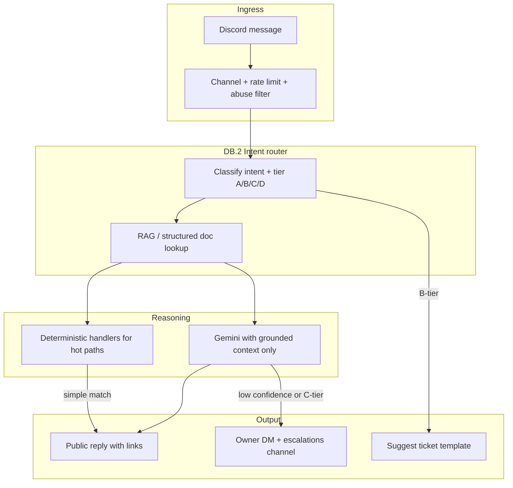

# Discord Bot AI — Smart Support Plan

**Goal:** Evolve `apps/discord-bot` from a thin FAQ + Gemini wrapper into a **grounded, safe support agent** that handles most common GameStore cases without staff, and escalates only when it should.

**Status:** D.2 MVP running (Gemini + keyword fallback + owner escalation)  
**Prerequisite:** [DISCORD_PLAN.md](./DISCORD_PLAN.md) D.0–D.2 complete (server, publish webhook, bot online)  
**Does not include:** `/activate` + `/code` with real credentials (needs Clerk ↔ Discord — roadmap P3.1)

**Related code today:**

| Path | Role |
|------|------|
| [apps/discord-bot/src/main.ts](../apps/discord-bot/src/main.ts) | Listens in `general-help` + ticket threads; 15s rate limit |
| [apps/discord-bot/src/ai/support-agent.ts](../apps/discord-bot/src/ai/support-agent.ts) | Gemini JSON reply + keyword fallback |
| [apps/discord-bot/src/knowledge/faq-pack.ts](../apps/discord-bot/src/knowledge/faq-pack.ts) | 7 static docs (subset of site FAQ) |
| [apps/discord-bot/src/safety.ts](../apps/discord-bot/src/safety.ts) | Escalation + credential regex + sanitize |
| [libs/web/feature-faq/src/lib/faq.constants.ts](../libs/web/feature-faq/src/lib/faq.constants.ts) | Canonical FAQ copy (richer than bot pack) |
| [libs/web/feature-my-games/](../libs/web/feature-my-games/) | Activation, credentials, sign-in, 2FA UX |
| [apps/api/src/app/steam/steam-guard-app.service.ts](../apps/api/src/app/steam/steam-guard-app.service.ts) | Guard cooldown (15+ min per pool account) |

---

## 1. Problem statement (what “smart” means here)

Today the bot:

- Answers **one message** with **no thread memory**
- Uses **7 short knowledge snippets** while the site FAQ + guides are richer
- Falls back to **keyword matching** that misfires (e.g. `"order"` → lost license)
- Only reacts in `general-help` if the message looks like a question (`?`, `how`, `why`…) — misses `"cant login"`, `"not working"`
- Cannot explain **Steam Guard cooldown**, **sign-in required**, **sold out**, **subscriptions**, or **checkout success** flows
- Has no **confidence score**, **logging**, or **test cases** for regression

**Smart** for this store means: resolve ~80% of repeat questions with correct links and steps; never leak secrets; escalate refunds/account-specific issues fast.

---

## 2. Support case catalog (from app analysis)

These are the cases the bot **must** handle well (grounded, no invention).

### Tier A — Self-serve (bot answers, no escalation)

| Case | User says (examples) | Correct bot behavior |
|------|----------------------|----------------------|
| **A1 Activation flow** | how do I play / activate / get credentials | Point to `/my-games` → enter license → pick game → credentials + 2FA on site |
| **A2 Steam offline** | steam offline, go offline, play without internet | Steam → Go Offline; disable cloud saves; link `🎮 \| steam-offline` |
| **A3 Ubisoft offline** | ubisoft offline, uplay block | Firewall / Offline Locker; link `🔵 \| ubisoft-offline` + `/faq` |
| **A4 Personal saves** | saves, cloud sync, overwrite | Local saves OK; **disable cloud sync** (callout from FAQ) |
| **A5 Lost license** | forgot key, lost license | `/contact?topic=license-recovery` or account email recovery — **never paste keys** |
| **A6 Where to buy** | price, shop, buy game | `/shop`, `🌐 \| website` |
| **A7 Games to replace** | account not working, to replace badge | Explain auto-restore; patience; no user action |
| **A8 Steam Guard location** | where is 2fa / guard code | **Only on website My Games** after sign-in — never in Discord |
| **A9 Steam Guard cooldown** | code not working, wait, cooldown, try again in X seconds | Explain shared pool cooldown (~15 min); same license can refresh; others must wait |
| **A10 Sign in required** | cant see password, need to sign in | Must sign in (Clerk) on site to view credentials |
| **A11 Subscriptions** | subscription, my subscription games | `/subscriptions` + My Games panel — high level only |
| **A12 Sold out** | game sold out, cant checkout | Game unavailable; check back / announcements channel |

### Tier B — Redirect to ticket (bot explains + opens guidance)

| Case | Trigger | Bot behavior |
|------|---------|--------------|
| **B1 Wrong game / wrong account** | got wrong game, credentials dont work | Open `🎫 \| tickets` with order email + game name — **no passwords in thread** |
| **B2 Payment succeeded, no license** | paid but no key | Ticket + order email / Stripe session; escalate if user insists |
| **B3 Technical edge** | antivirus, firewall broke game, EAC | General tips + ticket if account-specific |

### Tier C — Escalate immediately (owner DM + `#owner-escalations`)

| Case | Trigger keywords / intent |
|------|---------------------------|
| **C1 Refund / chargeback** | refund, chargeback, dispute, stripe failed |
| **C2 Fraud / legal** | scam, hack, lawyer, lawsuit |
| **C3 Ban / stolen** | banned, stolen account (when user claims store fault) |
| **C4 Bot unsure** | low confidence after retrieval + LLM |
| **C5 User asks for human** | speak to admin, real person |

### Tier D — Hard refuse (no LLM creativity)

| Case | Bot behavior |
|------|--------------|
| **D1 Paste password / key in chat** | Delete/warn pattern; redirect to My Games |
| **D2 Bot asked to generate 2FA in Discord** | Fixed `CREDENTIAL_REDIRECT` message |
| **D3 @everyone abuse** | Ignore |

---

## 3. Architecture (target)



**Principles:**

1. **Rules before LLM** for hot paths (credentials redirect, cooldown, lost license) — faster and safer.
2. **Retrieve then generate** — don’t dump the whole FAQ into every prompt forever.
3. **Thread memory** — last 3–5 turns in ticket threads and when user replies to bot.
4. **Structured output** — extend JSON: `{ reply, escalate, confidence, intent, links[] }`.
5. **Never call Nest with user secrets** in v1 — no license lookup from Discord until Clerk link exists.

---

## 4. Slice plan

### DB.1 — Expand knowledge base (sync with app)

**Goal:** Single source of truth aligned with site copy.

| Task | Details |
|------|---------|
| KB.1.1 | Import full text from `faq.constants.ts` + Ubisoft FAQ component summaries into `knowledge/` |
| KB.1.2 | Add docs for: guard cooldown, sign-in required, sold out, subscriptions, checkout success |
| KB.1.3 | Add `links.ts` map: intent → `{ siteUrl, discordChannel, faqAnchor }` |
| KB.1.4 | Optional: build script `scripts/sync-discord-knowledge.ts` that reads FAQ TS and regenerates pack |

**Deliverable:** ~15–20 structured `KnowledgeDoc` entries with `tags`, `tier`, `siteLinks`.

---

### DB.2 — Intent router + deterministic handlers

**Goal:** Handle Tier A/D without LLM when possible.

| Task | Details |
|------|---------|
| IR.2.1 | `classifyIntent(message): IntentId \| null` — regex + light keyword scoring (not single first-match) |
| IR.2.2 | `handleIntent(intent, message): SupportDecision \| null` — canned replies for A8, A9, A10, D1, D2 |
| IR.2.3 | Fix keyword collisions (`order` ≠ lost license unless context matches) |
| IR.2.4 | Broaden `main.ts` triggers: include `cant`, `cannot`, `doesnt`, `not working`, `error`, `help me` |

**Deliverable:** ≥70% of Tier A cases answered without Gemini call.

---

### DB.3 — Retrieval (lightweight RAG)

**Goal:** Send only relevant docs to Gemini (cheaper, more accurate).

| Task | Details |
|------|---------|
| RAG.3.1 | Score docs by tag overlap + keyword hits → top 3 chunks |
| RAG.3.2 | Pass retrieved chunks + user message to Gemini (not full KB) |
| RAG.3.3 | Add `confidence` 0–1 in JSON; escalate if `< 0.55` |
| RAG.3.4 | Later optional: Gemini embeddings or local hash embeddings — **not required for v1** |

**Deliverable:** `retrieveKnowledge(question): KnowledgeDoc[]` used by `support-agent.ts`.

---

### DB.4 — Conversation memory

**Goal:** Follow-ups work in tickets and reply chains.

| Task | Details |
|------|---------|
| MEM.4.1 | In-memory `Map<threadId, Turn[]>` (max 5 turns, TTL 30 min) |
| MEM.4.2 | Include conversation summary in Gemini user payload |
| MEM.4.3 | Clear memory on escalate |
| MEM.4.4 | Later: Redis if bot runs multi-instance |

**Deliverable:** User can say “that didn’t work” after Ubisoft answer and bot keeps context.

---

### DB.5 — UX: slash commands + help channel stickies

| Command | Behavior |
|---------|----------|
| `/help` | Short menu: My Games, FAQ, tickets, announcements |
| `/faq <topic>` | Deterministic answer for offline / license / saves |
| `/ticket` | Template: what to include (email, game, **no passwords**) |

| Task | Details |
|------|---------|
| UX.5.1 | Register slash commands on `clientReady` |
| UX.5.2 | Bot posts (or admin pins) sticky in `general-help` with rules + @mention bot |
| UX.5.3 | In ticket forum: bot auto-reply on new thread with template |

---

### DB.6 — Escalation + ticket polish

| Task | Details |
|------|---------|
| ESC.6.1 | Escalation payload: intent, confidence, retrieved doc ids, suggested staff action |
| ESC.6.2 | Dedupe escalations: same user + same topic within 10 min → one DM |
| ESC.6.3 | Auto-reply when escalating: “Staff notified — open ticket if you haven’t” |
| ESC.6.4 | Staff role ping optional (`@Staff`) on C-tier only — env flag |

---

### DB.7 — Safety hardening

| Task | Details |
|------|---------|
| SAF.7.1 | Expand `sanitizeReply`: emails partial mask, steam username patterns |
| SAF.7.2 | Block bot from replying if user posts likely license key (educate + escalate) |
| SAF.7.3 | Max message length; ignore embed-only spam |
| SAF.7.4 | Audit log file or structured JSON logs (no PII in production logs) |

---

### DB.8 — Observability + eval suite

| Task | Details |
|------|---------|
| OBS.8.1 | `support-cases.json` — 40+ labeled user messages → expected tier/intent |
| OBS.8.2 | Vitest: `classifyIntent`, `retrieveKnowledge`, `handleIntent`, no credential in replies |
| OBS.8.3 | Optional nightly script: run cases against Gemini with `GEMINI_API_KEY` (manual CI) |
| OBS.8.4 | Metrics: `answered`, `escalated`, `gemini_errors`, `avg_confidence` (console or later Datadog) |

---

### DB.9 — Deploy + always-on (ops)

| Task | Details |
|------|---------|
| OPS.9.1 | Document Railway/Fly systemd unit in README |
| OPS.9.2 | Health: bot posts heartbeat in `#staff-alerts` daily (optional) |
| OPS.9.3 | Restart policy; env via platform secrets |
| OPS.9.4 | Separate dev bot app vs prod bot (recommended) |

---

## 5. Gemini best practices (for this app)

| Practice | Implementation |
|----------|----------------|
| Low temperature | Keep `0.1–0.2` |
| JSON schema output | `responseMimeType: application/json` + validate fields |
| Grounding only | System prompt: “If not in CONTEXT, escalate” |
| Short replies | Max 180 words; link out to site for long guides |
| No tool use yet | Don’t give Gemini API keys or DB access in v1 |
| Model choice | Default `gemini-2.0-flash`; use Pro model only for ambiguous B-tier (env flag) |
| Fallback chain | Rules → RAG + Gemini → keyword → escalate |

**Prompt shape (target):**

```text
SYSTEM: role + safety rules + output JSON schema
CONTEXT: [retrieved doc 1-3]
HISTORY: [last 3 turns]
USER: <message>
```

---

## 6. What we explicitly will NOT do in this plan

| Item | Why |
|------|-----|
| Post license keys / passwords / 2FA in Discord | Security + roadmap |
| Clerk ↔ Discord account linking | Separate P3.1 slice |
| Auto-refund / change DB from bot | Staff + Nest admin only |
| Read user order by email in Discord | PII + verification problem |
| Multi-language | Phase 13 in roadmap |
| Replace human staff entirely | Escalation always available |

---

## 7. Success metrics

| Metric | Target (30 days after DB.1–DB.4) |
|--------|-----------------------------------|
| Tier A cases resolved without escalation | ≥ 75% |
| False escalations (staff says “bot could’ve answered”) | < 15% |
| Credential leaks in bot replies | 0 |
| Owner escalations per day (steady state) | < 10 for small catalog |
| Eval suite pass rate | ≥ 90% on deterministic tests |

---

## 8. Implementation order (recommended)

```text
Week 1   DB.1 knowledge expansion + DB.2 intent router
Week 2   DB.3 retrieval + DB.4 thread memory
Week 3   DB.5 slash commands + DB.6 escalation polish
Week 4   DB.7 safety + DB.8 eval suite + DB.9 deploy
```

**Start with DB.1 + DB.2** — biggest quality jump for least risk.

---

## 9. Slice checklist

### DB.1 — Knowledge

- [x] Sync FAQ constants + activation/cooldown/sold-out docs
- [x] `links.ts` for site + Discord channel URLs
- [x] Tags + tier on each `KnowledgeDoc`

### DB.2 — Intent router

- [x] `classifyIntent` + deterministic handlers
- [x] Broader message triggers in `main.ts`
- [x] Fix keyword collision bugs

### DB.3 — Retrieval

- [x] `retrieveKnowledge` top-k
- [x] Gemini uses retrieved context only
- [x] `confidence` in `SupportDecision`

### DB.4 — Memory

- [x] Thread-scoped turn history
- [x] Include in Gemini payload

### DB.5 — UX

- [x] `/help`, `/faq`, `/ticket` slash commands
- [x] Ticket thread welcome message

### DB.6 — Escalation

- [x] Richer escalation payload + dedupe

### DB.7 — Safety

- [x] Expanded sanitize + license-key-in-chat detection

### DB.8 — Eval

- [x] `support-cases.json` + vitest coverage

### DB.9 — Deploy

- [x] Production runbook in README

---

## 10. Manual steps for you (unchanged)

- Keep **Message Content Intent** enabled
- `GEMINI_API_KEY`, `DISCORD_OWNER_USER_ID` in `.env`
- Run `pnpm discord:bot` on a always-on host for production
- Review `#owner-escalations` daily when volume grows

---

## 11. Relation to [DISCORD_PLAN.md](./DISCORD_PLAN.md)

| DISCORD_PLAN slice | This plan |
|--------------------|-----------|
| D.0 Server | Done |
| D.1 Publish webhook | Done |
| D.2 AI bot MVP | Done — **this document is D.2+ / “smart bot”** |
| D.3 Staff alerts | Separate (Nest webhooks, not bot AI) |
| P3.1 `/activate` `/code` | Future — after Clerk ↔ Discord |

When DB.1–DB.4 are complete, update DISCORD_PLAN §8 success criteria checkboxes and mark D.2 as **smart v1 complete**.
