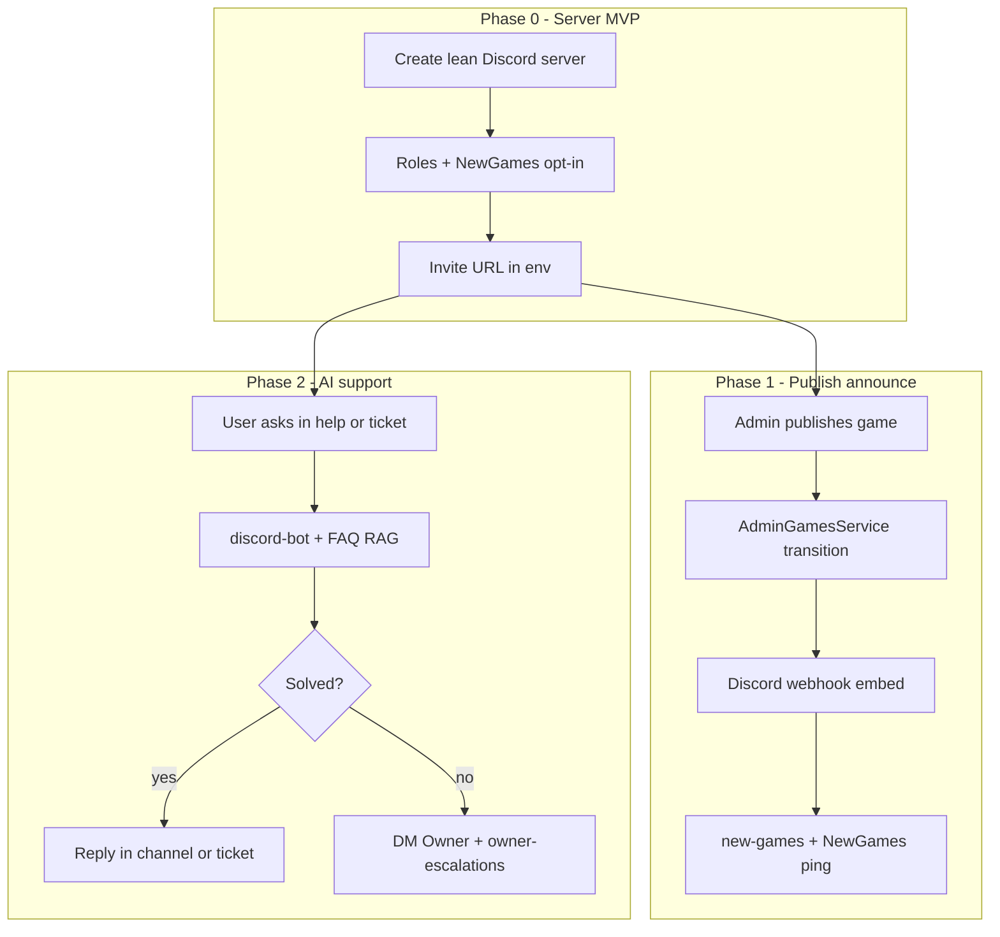
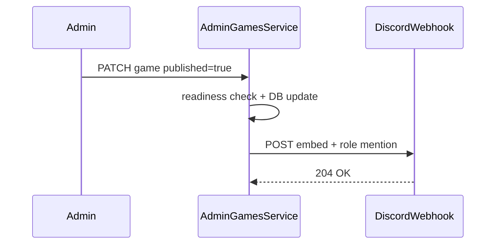
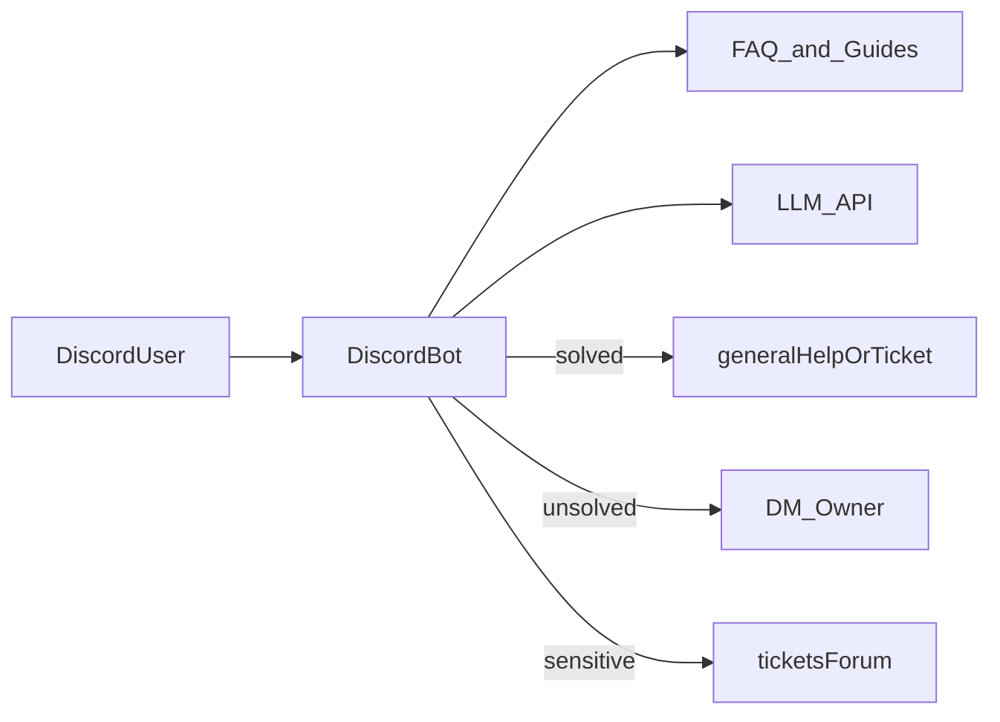

# Discord Phase End-to-End Plan

**Goal:** Stand up a lean Rkgame Discord for community + support, auto-announce newly published games from the Nest admin publish path, then add an AI support bot that answers common issues and DMs the owner when it cannot.

**Status:** D.0 ✅ · D.1 ✅ · D.2 scaffolded (Gemini) — needs Message Content Intent + `DISCORD_OWNER_USER_ID` (+ optional `GEMINI_API_KEY`) before `pnpm discord:bot`  
**Prerequisite:** Storefront live enough that FAQ / game detail / footer Discord CTAs matter; admin can publish games  
**Aligns with:** [mvp_structure_and_roadmap.md](./mvp_structure_and_roadmap.md) P1.3 (admin alerts) + P3.1 (support bot); [NEXT_PHASES_PLAN.md](./NEXT_PHASES_PLAN.md) post-MVP backlog

**Related plans / code:**

| Document / path | Relationship |
|-----------------|--------------|
| [DISCORD_SERVER_SETUP.md](./DISCORD_SERVER_SETUP.md) | Short checklist mirroring §1 (roles, channels, invite, webhook IDs) |
| [DISCORD_BOT_AI_PLAN.md](./DISCORD_BOT_AI_PLAN.md) | D.2+ smart support bot: intents, RAG, cases, eval |
| [mvp_structure_and_roadmap.md](./mvp_structure_and_roadmap.md) | P1.3 Discord alerts; P3.1 `/activate` + `/code` bot (later) |
| [NEXT_PHASES_PLAN.md](./NEXT_PHASES_PLAN.md) | P1.3 Discord admin webhooks on account failures |
| [faq.constants.ts](../libs/web/feature-faq/src/lib/faq.constants.ts) | Real user problems the AI bot should answer first |
| [admin-games.service.ts](../apps/api/src/app/admin/games/admin-games.service.ts) | Publish transition hook for Phase 1 |
| [faq-contact-cta.tsx](../libs/web/feature-faq/src/lib/components/faq-contact-cta.tsx) | Already reads `NEXT_PUBLIC_DISCORD_INVITE_URL` |
| [.env.example](../.env.example) | Document Discord env vars here when implementing |

**Explicitly out of scope for this phase:** Full `/activate` + `/code` Discord commands (needs Clerk ↔ Discord identity), account health monitor alerts (separate P1.3 ops work), member-count vanity channels, and a large duplicate channel tree.

---

## Verdict

- Keep the Rkgame-style naming (`emoji | name`, `{ CATEGORY }`) but **lean the channel count** — the screenshot had too many overlapping info channels for MVP.
- **Auto-post on game publish + ping** is **easy** (Incoming Webhook + one fire-and-forget call on publish).
- **AI chatbot that solves most problems and DMs you when stuck** is **not easy** — doable in ~1–2 weeks after the announce webhook, but it is a real product (hosting, LLM, knowledge, escalation, safety).
- **You cannot skip Discord account steps** (create app/bot, invite bot, paste token). After that, a setup script can create all channels/roles via API so you do not click each channel by hand.

---

## 1. Canonical server layout (channels)

This is the **source of truth** for Phase 0. Create exactly these categories and channels (order top → bottom).

### Roles

| Role | Color hint | Purpose |
|------|------------|---------|
| `Owner` | Red | You; receives AI escalations |
| `Staff` | Blue | Support moderators |
| `NewGames` | Green | Opt-in ping for new catalog games (**not `@everyone`**) |
| `Subscriber` | Gold | Optional; paid subscribers |
| `Customer` | Teal | Optional; verified buyers |
| *(APP role)* | — | Discord auto-creates this for the bot (e.g. Offline Gamenia) — do not create a separate `Bot` role |

### Channel tree

```text
Rkgame
├── rules                          (Rules channel — staff edit only)
│
├── { INFO }
│   ├── 📢 | announcements         (Announcement — staff + bot)
│   ├── 🎮 | new-games             (Text — staff + webhook/bot; Phase 1 posts here)
│   ├── ♻️ | restored-games        (Text — staff + bot)
│   └── 🌐 | website               (Text — staff; pin store URL)
│
├── { GUIDES }
│   ├── 🔑 | how-to-activate       (Text — staff; sticky activation steps)
│   ├── 🔵 | ubisoft-offline       (Text — staff; mirror site FAQ)
│   └── 🎮 | steam-offline         (Text — staff; offline + cloud-save warning)
│
├── { HELP }
│   ├── ❓ | general-help          (Text — everyone can chat; AI can reply)
│   ├── 📞 | contact               (Text — staff; pin email + /contact)
│   └── 🎫 | tickets               (Forum or ticket panel — private threads)
│
└── { STAFF }                      (private — Owner + Staff + Bot only)
    ├── 🚨 | staff-alerts          (ops / account health later)
    └── 📬 | owner-escalations     (AI posts when it cannot solve)
```

### Channel reference table

| Category | Channel name | Type | Who can post | Used by |
|----------|--------------|------|--------------|---------|
| (top) | `rules` | Rules | Staff | Onboarding |
| `{ INFO }` | `📢 \| announcements` | Announcement | Staff + Bot | Manual news |
| `{ INFO }` | `🎮 \| new-games` | Text | Staff + Webhook/Bot | **Phase 1 publish posts** |
| `{ INFO }` | `♻️ \| restored-games` | Text | Staff + Bot | Account restored notices |
| `{ INFO }` | `🌐 \| website` | Text | Staff | Pin `NEXT_PUBLIC_SITE_URL` |
| `{ GUIDES }` | `🔑 \| how-to-activate` | Text | Staff | Sticky `/my-games` guide |
| `{ GUIDES }` | `🔵 \| ubisoft-offline` | Text | Staff | Site FAQ Ubisoft guide |
| `{ GUIDES }` | `🎮 \| steam-offline` | Text | Staff | Steam offline + cloud saves |
| `{ HELP }` | `❓ \| general-help` | Text | Everyone | Public Q&A + AI v1 |
| `{ HELP }` | `📞 \| contact` | Text | Staff | Pin email + `/contact` |
| `{ HELP }` | `🎫 \| tickets` | Forum / ticket bot | User opens private thread | Human + AI triage |
| `{ STAFF }` | `🚨 \| staff-alerts` | Text | Bot + Staff | Future P1.3 health alerts |
| `{ STAFF }` | `📬 \| owner-escalations` | Text | Bot | **Phase 2** unsolved → owner |

### Not in MVP (skip)

| Screenshot-style channel | Why skip |
|--------------------------|----------|
| Member count (`Members: N`) | Vanity; Discord shows member count already |
| `website-features` | Merge into `announcements` |
| Separate generic `Info` | Covered by guides + website |
| `game-request` | Add later when catalog is stable |
| Duplicate `web-site` | Use single `🌐 \| website` |

### Permissions (all channels)

- `@everyone`: view + read history on public categories; **send** only in `❓ | general-help` and when opening `🎫 | tickets`
- `announcements`, `new-games`, `restored-games`, all `{ GUIDES }`, `contact`: `@everyone` view only; Staff + Bot send
- `{ STAFF }`: hide from `@everyone`; Owner + Staff + Bot only
- Never allow license keys, passwords, or Steam Guard codes in public channels

---

## 2. End-to-end journey (what “done” looks like)



---

## 3. Phase 0 — Discord server MVP

Create the layout in [§1 Canonical server layout](#1-canonical-server-layout-channels). Prefer a **bot setup script** after you paste `DISCORD_BOT_TOKEN` so channels/roles are created via API (see [DISCORD_SERVER_SETUP.md](./DISCORD_SERVER_SETUP.md)).

### 3.1 Minimum human steps (cannot be skipped)

1. Create Discord Application + Bot at [discord.com/developers](https://discord.com/developers/applications) → copy bot token
2. Create (or pick) a server → invite the bot with Manage Channels / Manage Roles / Manage Webhooks
3. Paste `DISCORD_BOT_TOKEN` (+ later webhook/role IDs) into `.env`

### 3.2 After bot is in the server

- Script (or manual checklist) creates every category/channel/role from §1
- Enable Onboarding or a reaction-role so members self-assign `NewGames` (Discord suppresses `@everyone`)
- Create invite → set `NEXT_PUBLIC_DISCORD_INVITE_URL`
- Point footer Discord link to the same invite (footer may still use `#`)
- Restart Next.js

Used by FAQ CTA, game detail CTA, contact copy, and footer.

**Phase 0 deliverable:** live server matching §1 + invite on site.

---

## 4. Phase 1 — Publish → Discord post (easy, ~half day)

When admin sets `published: true` and the game was previously unpublished, post an embed to `🎮 | new-games` and ping `@NewGames`.



### 4.1 Implementation

1. Create a Discord **Incoming Webhook** on `🎮 | new-games` (or let the setup script create it).
2. Add env (Nest / API only — never `NEXT_PUBLIC_`):

```env
DISCORD_NEW_GAMES_WEBHOOK_URL=https://discord.com/api/webhooks/...
DISCORD_NEW_GAMES_ROLE_ID=123456789012345678
```

3. Add a small Nest helper, e.g. `apps/api/src/app/discord/discord-notify.service.ts` or `libs/api/discord`:
   - `notifyGamePublished({ title, slug, coverUrl, platform, price })`
   - Fire-and-forget after successful publish
   - Log failures; **do not fail the publish API** if Discord is down
   - If webhook URL unset, skip notify (no-op)
4. Call only on **transition** unpublished → published (not every update while already published).
5. Optional later: second webhook for `♻️ | restored-games` and/or `🚨 | staff-alerts` (ops / P1.3).

### 4.2 Hook point

[`AdminGamesService.update`](../apps/api/src/app/admin/games/admin-games.service.ts) — after successful DB update when `dto.published === true` and `existing.publishedAt` was null.

### 4.3 Embed content

- Title + cover image
- Platform + price
- Link: `{NEXT_PUBLIC_SITE_URL}/games/{slug}`
- Mention: `<@&DISCORD_NEW_GAMES_ROLE_ID>`

**Difficulty:** Easy. Stateless HTTP POST. No Discord bot token required for the Nest notify path (webhook URL is enough).

**Phase 1 deliverable:** publishing a game creates one clean `🎮 | new-games` post with `@NewGames` ping.

---

## 5. Phase 2 — AI support chatbot (medium–hard, after Phase 1)

### 5.1 Difficulty reality check

| Feature | Difficulty | Why |
|---------|------------|-----|
| Phase 1 webhook announce | Easy | Stateless HTTP POST |
| Ticket button + human staff | Easy–medium | Ticket Tool / Discord threads |
| FAQ auto-replies (canned) | Medium | Keyword / slash commands, no LLM |
| AI that solves most issues + DMs you | Hard | Hosting, LLM cost, prompt/RAG, abuse, escalation |

Creating *a* Discord bot is easy. Creating a *reliable AI support agent for a game-account store* is not. Budget ~1–2 weeks for a solid v1.

### 5.2 Recommended v1 scope (not “anything”)

Ground answers in [faq.constants.ts](../libs/web/feature-faq/src/lib/faq.constants.ts):

1. How to go offline (Steam / Ubisoft) → point to `{ GUIDES }` channels
2. Cloud saves / personal saves
3. Lost license → point to site recovery / account flow (never invent keys)
4. “Game to replace” / account not working → explain status + open `🎫 | tickets`
5. Where to buy / link to `🌐 | website` / shop
6. Low confidence, refund, ban, or payment dispute → escalate

### 5.3 Architecture



| Piece | Choice |
|-------|--------|
| Runtime | Separate Node app `apps/discord-bot` with `discord.js` — **not** inside Nest request handlers |
| Listen channels | `❓ \| general-help` + `🎫 \| tickets` threads |
| Knowledge | Site FAQ + sticky text from `{ GUIDES }` channels |
| Escalation | DM `Owner` + post in `📬 \| owner-escalations` |
| Hosting | Small always-on process (Railway / Fly / VPS) — Discord gateway needs a long-lived connection |

### 5.4 Hard safety rules

- Never output Steam passwords, shared secrets, or raw license keys in public channels
- Credential / 2FA requests → “use the website My Games” (authenticated Discord `/code` is later, roadmap P3.1)
- Rate-limit per user; ignore `@everyone` abuse
- Prefer `🎫 | tickets` for account-specific issues

### 5.5 Auth note (later — not Phase 2 v1)

Roadmap `/activate` + `/code` needs linking Discord user ↔ store user (Clerk). Keep AI v1 as FAQ + triage only.

**Phase 2 deliverable:** bot answers common offline/save/license questions in `❓ | general-help` / tickets; DMs owner + posts `📬 | owner-escalations` only when stuck.

---

## 6. Suggested order

| Order | Work | When |
|-------|------|------|
| 1 | Phase 0: bot token + create §1 channels (script or checklist) + invite env | First |
| 2 | Phase 1 publish webhook → `🎮 \| new-games` | Next (highest ROI automation) |
| 3 | Non-AI ticket bot + canned FAQ (optional bridge) | If support load rises before AI is ready |
| 4 | Phase 2 AI bot on `❓ \| general-help` + tickets | After launch stability |

---

## 7. Env vars (implementation checklist)

| Variable | Where | Phase |
|----------|-------|-------|
| `NEXT_PUBLIC_DISCORD_INVITE_URL` | Web | 0 |
| `DISCORD_BOT_TOKEN` | Setup script + `apps/discord-bot` | 0 / 2 |
| `DISCORD_GUILD_ID` | Setup script | 0 |
| `DISCORD_NEW_GAMES_WEBHOOK_URL` | API | 1 |
| `DISCORD_NEW_GAMES_ROLE_ID` | API | 1 |
| `DISCORD_OWNER_USER_ID` | `apps/discord-bot` | 2 |
| `GEMINI_API_KEY` | `apps/discord-bot` | 2 |
| `GEMINI_MODEL` | `apps/discord-bot` (optional, default `gemini-2.0-flash`) | 2 |

Document all of these in [.env.example](../.env.example) when implementing — never commit real tokens.

---

## 8. Success criteria

- [ ] Server matches [§1 channel tree](#1-canonical-server-layout-channels)
- [ ] Users can join from FAQ / game detail / footer
- [ ] Publishing a game creates one clean `🎮 | new-games` post with `@NewGames` role ping
- [ ] Support has `❓ | general-help` + `🎫 | tickets`; escalations go to `📬 | owner-escalations`
- [ ] AI (when built) answers common offline/save/license questions and DMs the owner only when stuck
- [ ] Publish API never fails because Discord is down

---

## 9. Slice checklist (when implementing)

### D.0 — Server + invite

- [x] Setup script: `scripts/discord-setup.ts` (`pnpm discord:setup` / `--wipe`)
- [x] Fix footer Discord href → `NEXT_PUBLIC_DISCORD_INVITE_URL`
- [x] Document env vars in `.env.example`
- [x] Server layout created; webhook + invite printed into `.env`
- [ ] **You (optional):** Assign yourself `Owner`; enable Onboarding for `NewGames`
- [ ] Restart Next.js / API after env changes

### D.1 — Publish webhook

- [x] Webhook on `🎮 | new-games` + `NewGames` role ID in API env
- [x] `DiscordNotifyService` — publish (`POST ?wait=true`), update (`PATCH`), delete (`DELETE`)
- [x] Store `discordPublishMessageId` on `Game`; admin-editable `discordAnnounceDescription`
- [x] Lifecycle: publish stores message ID; unpublish/delete removes post; sold-out updates embed
- [x] Admin Publish tab: Discord announcement editor + preview
- [x] Call from `AdminGamesService` on publish, unpublish, delete, and relevant updates
- [x] Unit + e2e tests for Discord lifecycle
- [x] Document env in `.env.example`

### D.2 — AI bot (separate app)

- [x] Scaffold `apps/discord-bot`
- [x] FAQ knowledge pack from site FAQ + `{ GUIDES }` stickies
- [x] Reply in `❓ | general-help` / `🎫 | tickets`
- [x] Escalation DM + `📬 | owner-escalations`
- [x] Safety filters (no credentials in public)
- [x] README with invite URL, intents, and deploy notes
- [ ] **You:** Enable **Message Content Intent** in Discord Developer Portal → Bot
- [ ] **You:** Add `DISCORD_OWNER_USER_ID` (and optional `GEMINI_API_KEY`) to `.env`
- [ ] **You:** Run `pnpm discord:bot` and ask a test question in `❓ | general-help`
