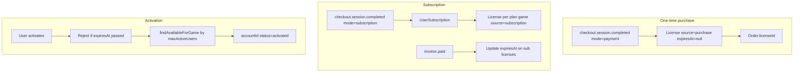
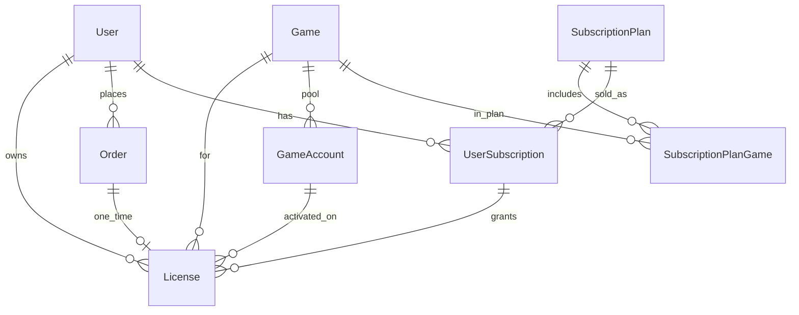

# Entitlements, Pool, and Subscription Plan

**Goal:** Automate license creation after payment, support multi-account pool rotation at activation, time-bounded licenses, and full subscription access to multiple published games.

**Status:** In progress  
**Related:** [STRIPE_PHASE_PLAN.md](./STRIPE_PHASE_PLAN.md), [STEAM_PHASE_PLAN.md](./STEAM_PHASE_PLAN.md)

---

## Recommendations

1. **Post-payment license creation already exists** — `payment-fulfillment.service.ts` mints a `License` on `checkout.session.completed`. Extend; do not rebuild.
2. **Pool assignment at activation** — Payment creates entitlement; activation consumes pool capacity.
3. **One `License` row per game for subscriptions** — `gameId` stays required; `source=subscription` + `expiresAt`.
4. **`expiresAt` on all licenses** — `null` = lifetime (purchase/admin); subscription sets period end.

---

## Architecture

---

## Part 1 — Database schema

### License extensions

| Field | Type | Purpose |
|-------|------|---------|
| `source` | `String` `@default("admin")` | `admin` \| `purchase` \| `subscription` |
| `subscriptionId` | `String?` | FK to `UserSubscription` |
| `validFrom` | `DateTime` `@default(now())` | Access window start |
| `expiresAt` | `DateTime?` | `null` = lifetime |

Order link remains via `Order.licenseId` (existing 1:1).

### Order extensions

| Field | Type | Purpose |
|-------|------|---------|
| `orderType` | `String` `@default("one_time")` | `one_time` \| `subscription` |

### GameAccount extensions

| Field | Type | Purpose |
|-------|------|---------|
| `maxActiveUsers` | `Int` `@default(50)` | Per-account pool cap |

### Subscription tables

- `SubscriptionPlan` — name, slug, stripePriceId, interval, isActive
- `SubscriptionPlanGame` — plan ↔ published game mapping
- `UserSubscription` — user, plan, Stripe ids, period dates, status

### ER diagram

### Migration strategy

1. Add nullable/new columns + tables.
2. Backfill: `source=purchase` where `Order.licenseId` matches; else `source=admin`.
3. Deploy code reading new fields.

---

## Part 2 — One-time purchase (harden)

| Task | Detail |
|------|--------|
| Set `source: purchase` | On webhook fulfillment |
| Set `validFrom` | Payment time |
| Set `expiresAt: null` | Lifetime |
| Log if no pool accounts | Soft warning only |

---

## Part 3 — Pool rotation

- Use `GameAccount.maxActiveUsers` instead of hardcoded 50.
- `findAvailableForGame` picks lowest `activeUsersCount` under per-account cap.
- Admin readiness shows pool capacity.

---

## Part 4 — License validity

| Source | `expiresAt` |
|--------|-------------|
| Admin | null or promo end |
| Purchase | null |
| Subscription | `currentPeriodEnd` |

`validate` / `activate` reject expired licenses.

---

## Part 5 — Subscription (Stripe)

| Event | Action |
|-------|--------|
| `checkout.session.completed` (subscription) | Create `UserSubscription`, mint licenses per plan game |
| `invoice.paid` | Extend `expiresAt` on subscription licenses |
| `customer.subscription.updated` | Sync status and period |
| `customer.subscription.deleted` | Expire access at period end |

**Endpoints:**

- `POST /api/payments/subscription-checkout` `{ planSlug }`
- `GET /api/subscriptions/mine`

---

## Part 6 — Admin CRUD

| Area | Changes |
|------|---------|
| Licenses | `source`, `validFrom`, `expiresAt`, subscription link |
| Accounts | `maxActiveUsers`, capacity display |
| Subscription plans | New admin CRUD + game linking |
| Orders | `orderType`, source badge |

---

## Implementation slices

| Slice | Scope |
|-------|-------|
| **E1** | Prisma migration |
| **E2** | Fulfillment hardening + backfill |
| **E3** | Pool cap + expiry enforcement |
| **E4** | Admin license + account CRUD |
| **E5** | Subscription plan admin CRUD |
| **E6** | Stripe subscription + webhooks |
| **E7** | Buyer My Games + subscribe UX |

---

## Out of scope

- Multi-platform pools beyond Steam field
- Email delivery
- Refund auto-revoke
- Shopping cart
- PPP regional pricing in Stripe
