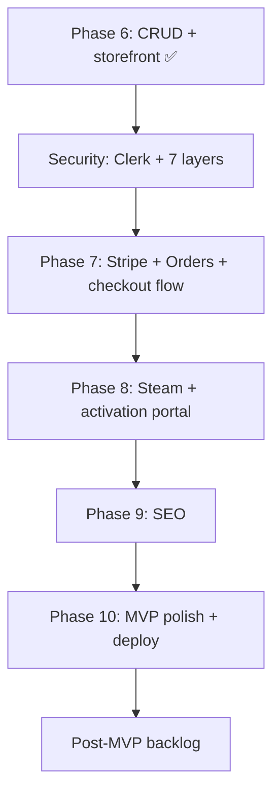

# Next Phases Plan — MVP Launch & Post-MVP

This document is the **execution plan for Phases 7+** of GameStore. It continues after [PHASE_6_PLAN.md](./PHASE_6_PLAN.md) and **[SECURITY_PLAN.md](./SECURITY_PLAN.md)** (run security **before** Phase 7), and aligns with [mvp_structure_and_roadmap.md](./mvp_structure_and_roadmap.md) and [implementation_plan.md](./implementation_plan.md).

**Status:** Phases 0–6 ✅ complete · Security phase ⏳ planned  
**Goal of Phases 7–10:** Reach **MVP launch** — customer can browse, pay, receive a license, activate, and get Steam credentials + Guard codes.

---

## What’s done (Phases 0–6)

| Area | State |
|------|--------|
| Monorepo, theme, routes, BFF proxy | ✅ |
| Prisma + Neon + seed (3 games, 2 licenses) | ✅ |
| Real CRUD: games, licenses, game-accounts | ✅ |
| Storefront: `/shop`, `/games/:slug`, license validate | ✅ |
| Stripe / Steam / Orders routes | Setup text only |
| SEO | File shell (`robots.ts`, `sitemap.ts`, empty metadata builders) |
| Tests | `api-e2e` 18/18, `web-e2e` 20/20 (with `DATABASE_URL`) |

---

## Recommended execution order



| Phase | Focus | MVP question answered |
|-------|--------|------------------------|
| **7** | Real Stripe Checkout + webhook → `License` + `Order` | Can they **pay**? |
| **8** | Account assignment, credentials, real TOTP, cooldown | Can they **activate & play**? |
| **9** | `generateMetadata`, JSON-LD, dynamic sitemap | Can Google **find** the store? |
| **10** | Buy button → checkout, success page, CI deploy | Is it **launch-ready**? |

Phases 7 and 8 are the **critical path**. Phase 9 can overlap with 10 if SEO is not blocking soft launch.

---

## Global rules (Phases 7+)

### No-mock policy

| Allowed | Not allowed |
|---------|-------------|
| Real Stripe test mode + webhook signing | Fake `checkout.session.completed` in app code |
| Real `steam-totp` `generateAuthCode()` in services | Hardcoded 6-digit codes in UI |
| `vi.mock('stripe')` / `vi.mock('steam-totp')` in `*.spec.ts` | MSW for payment/guard in Playwright |
| Stripe CLI / test webhooks in dev | Skipping webhook signature verification |

### Conventions (unchanged)

| Item | Value |
|------|--------|
| NestJS API | `:3333`, global prefix `api` |
| Next.js dev | `:3000` |
| Next.js e2e | `:4200` via `start-stack.mjs` when `DATABASE_URL` set |
| `API_URL` | `http://localhost:3333` (never Next’s own port) |
| `/shop` | `force-dynamic` — catalog must not static-prerender empty |

### Slice workflow

Work **one slice at a time**. After each slice: verify → user reviews → say **continue**.

---

# Phase 7 — Stripe Checkout + Orders + License creation

**Goal:** Replace Stripe setup text with real Checkout Sessions. On successful payment, persist an `Order` and create a `License` linked to the game.

**Depends on:** Phase 6 (real `Game`, `License` CRUD)

**Not in Phase 7:** account pool assignment (Phase 8), email delivery, PPP pricing, subscriptions.

---

## Schema additions (Slice 7.1)

Add `Order` model to `libs/api/prisma/prisma/schema.prisma`:

```prisma
model Order {
  id              String   @id @default(cuid())
  gameId          String
  licenseId       String?  @unique
  stripeSessionId String   @unique
  stripePaymentId String?
  amount          Decimal  @db.Decimal(10, 2)
  currency        String   @default("USD") @db.VarChar(3)
  status          String   @default("pending")  // pending | completed | failed | refunded
  buyerEmail      String?
  createdAt       DateTime @default(now())
  updatedAt       DateTime @updatedAt

  game    Game     @relation(fields: [gameId], references: [id])
  license License? @relation(fields: [licenseId], references: [id])

  @@map("orders")
}
```

Extend `Game` and `License` with `orders Order[]` relation as needed.

**Verify:** `pnpm nx run api-prisma:prisma-migrate` + `db-seed` still runs.

---

## Execution slices

### Slice 7.1 — Order model + repository

- Migration + `OrdersRepository` in `libs/api/data-access`
- Replace `OrdersController` setup stub with read-only `GET /orders`, `GET /orders/:id` (admin/e2e)
- Unit tests mock Prisma

### Slice 7.2 — Real Stripe client

- `libs/api/stripe`: `new Stripe(STRIPE_SECRET_KEY)` in `StripeService`
- `createCheckoutSession({ gameId, slug, priceBase, successUrl, cancelUrl })`
- Return `{ sessionId, url }` from `POST /api/payments/checkout`
- Webhook: verify `STRIPE_WEBHOOK_SECRET`, handle `checkout.session.completed`
- Keep `GET /api/payments/health` as config/health JSON (not setup text)

### Slice 7.3 — Webhook → Order + License

On `checkout.session.completed`:

1. Upsert `Order` (`status: completed`, `stripeSessionId`, amount from session)
2. Generate unique `licenseKey` (e.g. `GS-{cuid}` or formatted segments)
3. Create `License` (`status: available`, `gameId`, `buyerEmail` from session)
4. Link `order.licenseId`

Idempotent on `stripeSessionId` — safe to retry webhooks.

### Slice 7.4 — Frontend checkout wiring

- `feature-checkout`: pass `gameId` / `slug` from query or cart context
- `feature-game-detail` **Buy panel**: link/button → `/checkout?game={slug}`
- `createCheckout()` in `payments.api.ts` → real session URL; redirect with `window.location`
- Remove setup-message-only behavior from checkout payment component

### Slice 7.5 — Checkout success page

- `feature-checkout-success`: read `session_id` query param
- `GET /api/orders/by-session/:sessionId` (new route) or poll license status
- Display **license key** to buyer (MVP: on-page only; email in post-MVP)

### Slice 7.6 — Tests

| Spec | Asserts |
|------|---------|
| `libs/api/stripe/*.spec.ts` | Mock Stripe SDK; session creation params |
| `apps/api-e2e/stripe-checkout.e2e-spec.ts` | Checkout returns `url`; webhook creates license (Stripe test fixtures or signed mock payload in test only) |
| `apps/web-e2e/checkout-flow.spec.ts` | Stub redirect or use Stripe test mode; success page shows key pattern |

**Phase 7 exit criteria**

- [ ] `Order` model migrated
- [ ] Real Checkout Session URL from API
- [ ] Webhook creates `Order` + `License` in Neon
- [ ] Buy flow reaches Stripe test checkout
- [ ] Success page shows license key
- [ ] Setup text removed from checkout route

---

# Phase 8 — Steam activation portal (real Guard + credentials)

**Goal:** After license validation, assign a pool account, show credentials, generate real Steam Guard codes with cooldown enforcement.

**Depends on:** Phase 7 (licenses exist from purchase) or seeded keys for dev

**Not in Phase 8:** geo-based pool matching, health monitor, password rotation, Discord alerts.

---

## Execution slices

### Slice 8.1 — Encryption service

- `libs/api/steam`: `SteamCryptoService` — AES-256-GCM encrypt/decrypt using `STEAM_ENCRYPTION_KEY`
- Encrypt on `GameAccount` create/update; never return `passwordEncrypted` / `sharedSecret` from list APIs
- Unit tests with fixed test key

### Slice 8.2 — Account pool assignment

- `POST /api/licenses/activate` (or extend `validate` when `?activate=true`)
- Logic: find least-loaded `GameAccount` for `gameId` where `isActive`, `activeUsersCount < 50`, not `lockedUntil`
- Set `license.accountId`, `license.status: activated`, `license.activatedAt`, increment `activeUsersCount`
- Return `{ license, account: { username, password } }` — password decrypted server-side only

### Slice 8.3 — Real Steam Guard (TOTP)

- `SteamGuardService.requestGuardCode(licenseKey)`:
  - Resolve license → account → decrypt `sharedSecret`
  - Call `steam-totp` `generateAuthCode()`
  - Set `account.lockedUntil` from `STEAM_GUARD_COOLDOWN_MINUTES`
  - Return `{ code, expiresInSeconds }` (not setup text)
- Enforce cooldown: if `lockedUntil > now` for **other** requests on same account, return `429` with retry-after message

### Slice 8.4 — Frontend activation UI

- `CredentialsPanel`: show username + password after activation (copy buttons)
- `SteamGuardPanel`: display 6-digit code + countdown; use validated `licenseKey` from context
- `ActivationSteps`: update copy to match real flow
- `POST /api/licenses/validate` remains lookup-only; activation is separate step

### Slice 8.5 — Tests

| Spec | Asserts |
|------|---------|
| `api-steam` unit | Mock `steam-totp`; cooldown logic |
| `api-e2e/activation.e2e-spec.ts` | Validate → activate → guard code format `/^\d{6}$/` |
| `web-e2e/activation.spec.ts` | Full flow with seeded license (real API, no HTTP stubs) |

**Phase 8 exit criteria**

- [ ] `generateAuthCode()` used in production code path
- [ ] Passwords encrypted at rest; decrypted only for authorized activation response
- [ ] Account assignment respects cap + cooldown
- [ ] My Games shows credentials + live TOTP
- [ ] Setup text removed from guard route

---

# Phase 9 — SEO (real metadata + sitemap)

**Goal:** Implement `libs/shared/seo` builders and wire `generateMetadata` on public routes.

**Depends on:** Phase 6 (real `Game` rows for dynamic pages)

**Not in Phase 9:** blog/guides, hreflang multi-locale, Search Console setup.

---

## Execution slices

### Slice 9.1 — Metadata builders

- Implement `build-page-metadata.ts`, `build-game-metadata.ts` using `Game.metaTitle`, `metaDescription`, `ogImage`
- Fallback to `title` / `description` / `coverImage` / site defaults from `site-config.ts`

### Slice 9.2 — Wire Next.js metadata

| Route | Metadata |
|-------|----------|
| `/` | Home title + description |
| `/shop` | Catalog title |
| `/games/[slug]` | Per-game OG + Twitter cards |
| `/faq`, `/contact`, `/my-games` | Static page metadata |

### Slice 9.3 — JSON-LD + sitemap

- `Product` or `SoftwareApplication` JSON-LD on game detail
- `build-sitemap.ts` → include published games from `GET /api/games` (or direct Prisma in Next server)
- `robots.ts` — allow crawl, point to sitemap URL

### Slice 9.4 — Tests

- Unit tests for metadata output shape
- `web-e2e/seo.spec.ts`: game page `<title>`, `og:title` meta tags
- Extend existing `seo-setup.spec.ts` if needed

**Phase 9 exit criteria**

- [ ] View-source on `/games/demo-game-1` shows game-specific title + OG tags
- [ ] `/sitemap.xml` lists published game URLs
- [ ] `TODO(implement-seo)` removed from implemented paths

---

# Phase 10 — MVP polish + deploy

**Goal:** End-to-end purchase → activation happy path works in production-like environment; CI deploys.

**Depends on:** Phases 7–8 minimum; Phase 9 recommended before public launch.

---

## Execution slices

### Slice 10.1 — Catalog UX (MVP backlog items)

- `CatalogSearch`: client-side filter by title (wire existing input)
- `CatalogFilters`: filter grid by `platform` (client-side on loaded games)
- `CatalogCard`: cover image, platform badge polish
- Optional: sort by price / title

### Slice 10.2 — Game detail buy flow

- `GameDetailBuyPanel`: **Buy now** → checkout with correct `gameId`
- Show regional price placeholder (base price only until PPP phase)

### Slice 10.3 — Environment & secrets

- Document production env: Neon prod branch, Stripe live/test keys, `STEAM_ENCRYPTION_KEY`, `NEXT_PUBLIC_SITE_URL`
- `.env.example` updates for all required production vars

### Slice 10.4 — CI/CD pipeline

- GitHub Actions: lint, test, `api-e2e`, `web-e2e` (Neon CI branch secret)
- Deploy: Vercel (`web`) + API host (Railway/Fly/Render) — document chosen target
- Run `prisma migrate deploy` on API boot or CI migrate step

### Slice 10.5 — Full-stack smoke test checklist

Manual script (or Playwright `@smoke` tag):

1. `/shop` → game card → game detail
2. Buy → Stripe test card → success → license key visible
3. `/my-games` → validate → activate → credentials → guard code
4. Guard code works again after cooldown (or shows wait message)

**Phase 10 exit criteria**

- [ ] E2E happy path documented and passing in CI
- [ ] Production deploy instructions complete
- [ ] MVP question answered: **find → pay → activate → play in &lt; 5 min**

---

# Post-MVP backlog (Phases 11+)

Prioritized from [mvp_structure_and_roadmap.md](./mvp_structure_and_roadmap.md). **Not slice-planned here** — create `PHASE_11_PLAN.md` etc. when ready.

| Priority | Feature | Phase suggestion |
|----------|---------|------------------|
| 🔴 P1.1 | Smart 2FA queue / login cooldown UI | 11 — extend Phase 8 cooldown UX |
| 🔴 P1.2 | Account health monitor | 11 — cron + `lastHealthCheck` |
| 🔴 P1.3 | Discord admin webhooks | 11 — alerts on ban/failures |
| 🔴 P1.4 | Password rotation | 12 |
| 🟠 P2.1 | Auto refund / key swap | 12 |
| 🟠 P2.3 | Geo-IP PPP (`GamePricingRegion`) | 13 |
| 🟠 P2.x | Multi-language (`/en`, `/ar`) | 13 |
| 🟡 P3.x | IGDB metadata seeder | 14 — feeds catalog + SEO |
| 🟡 P3.x | Admin UI (protected CRUD) | 14 — games/accounts/licenses |
| 🟡 P4.3 | SEO blog / guides | 15 |

---

## Verify commands (Phases 7–10)

```bash
# After schema changes
pnpm nx run api-prisma:prisma-generate
pnpm nx run api-prisma:prisma-migrate
pnpm nx run api-prisma:db-seed

# Unit
pnpm nx test api-stripe
pnpm nx test api-steam
pnpm nx test shared-seo

# E2E
pnpm nx e2e api-e2e
$env:NODE_ENV='production'; pnpm nx build web
$env:CI='true'; pnpm exec playwright test --config=apps/web-e2e/playwright.config.mts

# Stripe local webhook (Phase 7)
stripe listen --forward-to localhost:3333/api/payments/webhook
```

---

## Document map

| File | Role |
|------|------|
| [implementation_plan.md](./implementation_plan.md) | Phases 0–6 blueprint |
| [PHASE_6_PLAN.md](./PHASE_6_PLAN.md) | CRUD + storefront (✅ done) |
| [SECURITY_PLAN.md](./SECURITY_PLAN.md) | Clerk auth + 7-layer security (**before Phase 7**) |
| **NEXT_PHASES_PLAN.md** | **This file** — Phases 7–10 + post-MVP |
| [mvp_structure_and_roadmap.md](./mvp_structure_and_roadmap.md) | Product priorities |
| [README.md](./README.md) | Architecture reference |

---

## Known issues to carry forward

| Issue | Mitigation |
|-------|------------|
| `api-data-access` no standalone `@nx/js:tsc` build | Consumed from source via `apps/api` webpack |
| Web e2e needs API before web | `apps/web-e2e/scripts/start-stack.mjs` |
| `/shop` empty if statically built | Keep `force-dynamic` on shop page |
| Windows `prisma generate` EPERM | Stop `nx serve api` before generate |
| Stripe webhook local testing | Stripe CLI + `STRIPE_WEBHOOK_SECRET` |

---

*Complete [SECURITY_PLAN.md](./SECURITY_PLAN.md) (Slices S.1–S.9) first, then start **Phase 7, Slice 7.1** (`Order` model + migration). Review after each slice before continuing.*
