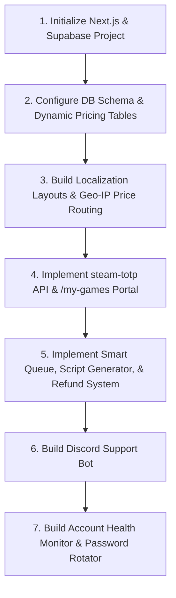

# Game Store Development Guide & Roadmap (Advanced Website-Only Architecture)

This document outlines the architecture, tech stack, security features, database schema, and roadmap for building an automated, website-only game activation storefront. It includes advanced features to mitigate account bans, handle 2FA queues, automate setup on Steam Deck, check account health, sync with IGDB, encrypt database credentials, and manage automated account pools.

---

## 1. Technical Architecture & Tech Stack

This architecture manages user access, security, automated Steam Guard codes, and administrative sync entirely through the web interface, external APIs, and helper scripts.

*   **Frontend & API Gateway**: **Next.js (React)**. Handles the public store catalog, SEO optimization, dynamic localization/routing, and serverless API endpoints (validation, 2FA generation, webhook listeners).
*   **Database**: **Supabase (PostgreSQL)**. Stores game data, license keys, account pools, and shared authenticator secrets.
*   **External Integrations**:
    *   **IGDB API**: Automates fetching game metadata (description, cover art, release date).
    *   **Discord API / Discord.js**: Powers the support bot for ticket actions and license retrieval.
*   **2FA Generation**: Node.js `steam-totp` library for generating Steam Guard codes on request.
*   **Automation Services**: Supabase Edge Functions or background cron jobs for account health monitoring and password rotation.

---

## 2. Advanced Features

### A. Anti-Ban & Account Protection Features
To prevent Steam accounts from being flagged or banned, the system implements the following:
*   **Load Balanced Account Pools**: Hard cap of **40–50 users per Steam account** tracked in the database. New users are automatically assigned to the least-loaded active account. Once an account reaches the cap, it is skipped and the next available account is used.
*   **Geographical Clustering (IP-Based Region Matching)**: Detects the customer's IP location upon activation and maps them to an account pool matching their continent (e.g., EU accounts for European IPs) to prevent suspicious geographic login hops.
*   **Time-Gap Throttle (Smart Login Cooldown)**: When a 2FA code is generated for an account, that account enters a **15–30 minute cooldown** locking further 2FA generation on the site. Subsequent users requesting activation for the same account see a clean waiting countdown timer.
*   **Unique Account Registration Profiles**: Each Steam account is registered with isolated email aliases/addresses and distinct billing configurations to prevent chain-bans.

### B. Security & Encryption
*   **Encrypted Credentials in Database**: Account passwords are encrypted in the database using AES-256-GCM. The decryption master key is kept in secure environment variables only accessed by the Next.js server runtime, keeping accounts safe even in the event of database leaks.

### C. Steam Deck & Linux Auto-Setup Script
*   Provides a simple Bash script (`activate.sh`) generated dynamically per user/license.
*   The user downloads and runs the script on their Steam Deck in Desktop Mode.
*   The script writes the shared account credentials directly to `~/.steam/steam/config/loginusers.vdf`, sets the account configurations to offline, and disables Steam cloud sync.

### D. Live Account Health Monitor & Discord Alerts
*   A background monitor service tests login availability for all active accounts every 30 minutes.
*   If an account is flagged as locked, password changed, or rate-limited by Steam, the database updates `is_active = FALSE`.
*   A Discord webhook alerts the admin panel immediately with the specific account detail so replacement can be handled.

### E. Discord Bot Integration
*   A Discord bot that users can DM or query in designated support channels.
*   Commands:
    *   `/activate [key]`: Registers license key and shows account credentials securely.
    *   `/code [key]`: Generates a fresh 2FA code instantly inside Discord.

### F. Game Metadata Sync (IGDB)
*   Admin dashboard connects directly to Twitch's IGDB API.
*   When adding a new game, typing the title queries IGDB, allowing the administrator to import covers, summaries, and release dates with a single click.

### G. Administrative Automation & Account Provisioners
*   **Automated Account Creator (Puppeteer / Selenium)**: Headless scripts that automate the creation of Steam accounts, wallet code funding, game purchases, and authenticator configuration (generating the `shared_secret`), uploading the credentials directly to the database.

### H. Multi-Language & Purchasing Power Parity (Localization & Dynamic Pricing)
*   **Geo-IP Language Matching**: Automatically detects client country via IP on first load and routes them to their localized page subpath (e.g., `/ar` for Arabic-speaking countries, `/en` for English, `/es` for Spanish/Latin America).
*   **Dynamic Localization Configs**: Supports translating UI elements based on minimal country-code settings.
*   **Purchasing Power Parity (PPP) Pricing**: Adjusts game prices dynamically based on the visitor's local country. Developed markets (e.g., US, Germany) pay standard pricing, while emerging markets (e.g., Egypt, Turkey, Brazil) receive adjusted lower rates to maximize conversions.

### I. Automated Self-Service Refund & Key Swap System
*   **Self-Healing Key Failures**: If the background health checker flags a user's assigned game account as compromised, the user can click **"Request Replacement Account"** in the activation portal.
*   **Automated Verification**: The server verifies the health status of the assigned account. If it is bad, the backend automatically updates the license mapping to the next healthy account in the pool, generates a new setup script, and credentials without manual support interaction.
*   **Store Credit / Automated Refund**: If no replacement account is available under the limits, the system automatically revokes the license and issues store credit or calls the Stripe/PayPal refund webhooks.

---

## 3. Database Schema Design (Supabase/PostgreSQL)

```sql
-- Games Catalog
CREATE TABLE games (
    id UUID PRIMARY KEY DEFAULT gen_random_uuid(),
    igdb_id INT UNIQUE, -- Linked to IGDB metadata source
    title VARCHAR(255) NOT NULL,
    slug VARCHAR(255) UNIQUE NOT NULL,
    price_base NUMERIC(10, 2) NOT NULL, -- Standard USD/EUR base price
    platform VARCHAR(50) NOT NULL,
    cover_image VARCHAR(512),
    description TEXT,
    created_at TIMESTAMP WITH TIME ZONE DEFAULT CURRENT_TIMESTAMP
);

-- Regional Pricing Adjustments (PPP)
CREATE TABLE game_pricing_regions (
    id UUID PRIMARY KEY DEFAULT gen_random_uuid(),
    game_id UUID REFERENCES games(id) ON DELETE CASCADE,
    country_code VARCHAR(2) NOT NULL, -- ISO-2 code (e.g. 'EG', 'TR', 'US')
    price_adjusted NUMERIC(10, 2) NOT NULL,
    currency VARCHAR(3) DEFAULT 'USD',
    created_at TIMESTAMP WITH TIME ZONE DEFAULT CURRENT_TIMESTAMP,
    UNIQUE(game_id, country_code)
);

-- Accounts Pool with Health Metrics & Lock Status
CREATE TABLE game_accounts (
    id UUID PRIMARY KEY DEFAULT gen_random_uuid(),
    game_id UUID REFERENCES games(id) ON DELETE CASCADE,
    platform VARCHAR(50) NOT NULL,
    username VARCHAR(255) NOT NULL,
    password_encrypted TEXT NOT NULL, -- Encrypted AES-256-GCM password
    shared_secret VARCHAR(255) NOT NULL, -- Used by steam-totp to generate 2FA codes
    region VARCHAR(50) DEFAULT 'global', -- Match to Geo-IP regions
    active_users_count INT DEFAULT 0,
    is_active BOOLEAN DEFAULT TRUE,
    locked_until TIMESTAMP WITH TIME ZONE, -- For smart login queue / time-gap throttle
    last_health_check TIMESTAMP WITH TIME ZONE,
    created_at TIMESTAMP WITH TIME ZONE DEFAULT CURRENT_TIMESTAMP
);

-- Active Licenses
CREATE TABLE licenses (
    id UUID PRIMARY KEY DEFAULT gen_random_uuid(),
    license_key VARCHAR(100) UNIQUE NOT NULL,
    game_id UUID REFERENCES games(id) ON DELETE CASCADE,
    account_id UUID REFERENCES game_accounts(id) ON DELETE SET NULL,
    status VARCHAR(50) DEFAULT 'available', -- 'available', 'activated', 'refunded', 'swapped'
    buyer_email VARCHAR(255),
    buyer_country VARCHAR(2), -- Stored at checkout to monitor region alignment
    activated_at TIMESTAMP WITH TIME ZONE,
    created_at TIMESTAMP WITH TIME ZONE DEFAULT CURRENT_TIMESTAMP
);
```

---

## 4. Step-by-Step Implementation Roadmap


