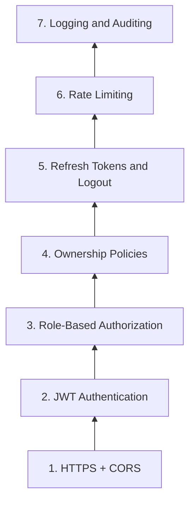

# Security Plan Clerk Auth + Neon Sync (7-Layer Roadmap)

This document is the **security execution plan** for GameStore. It implements the **7-layer API security model** (foundation → production-ready) using **Clerk** for identity and **Neon/Prisma** as the source of truth for roles and ownership.

**Run this plan before [NEXT_PHASES_PLAN.md](./NEXT_PHASES_PLAN.md) Phase 7** (Stripe). Payments, admin CRUD, and user-owned orders/licenses all depend on auth.

**Parent docs:** [implementation_plan.md](./implementation_plan.md) · [PHASE_6_PLAN.md](./PHASE_6_PLAN.md) · [NEXT_PHASES_PLAN.md](./NEXT_PHASES_PLAN.md)

---

## Security goal

| Role | Sign-up | Sign-in | Access |
|------|---------|---------|--------|
| **user** | ✅ Public `/sign-up` | ✅ `/sign-in` | Storefront, own licenses/orders, My Games |
| **admin** | ❌ **No sign-up** (invite-only in Clerk) | ✅ `/sign-in` (same as users) | Full CRUD: games, licenses, accounts, orders |

**Clerk** handles JWT issuance, refresh sessions, and logout. **Neon** stores `User`, `role`, ownership links, and `AuditLog`.

---

## 7-layer roadmap (image model)



| Layer | Name | Frontend (`apps/web`) | Backend (`apps/api`) |
|-------|------|------------------------|----------------------|
| **1** | HTTPS + CORS | Vercel HTTPS; secure cookies via Clerk | TLS in prod; CORS allowlist; `helmet` headers |
| **2** | JWT Authentication | `@clerk/nextjs` `auth()`, middleware | `ClerkAuthGuard` verify Bearer JWT via JWKS |
| **3** | Role-Based Authorization | Route groups `/admin/*` = admin only | `@Roles('admin')` + `RolesGuard` |
| **4** | Ownership Policies | Hide UI; API enforces anyway | `ownerId` checks; admin bypass |
| **5** | Refresh Tokens & Logout | Clerk session + `<SignOutButton>` | Trust Clerk JWT `exp`; optional session revoke webhook |
| **6** | Rate Limiting | Middleware on sensitive routes | `@nestjs/throttler` per route/IP/user |
| **7** | Logging & Auditing | Client error boundary (no secrets) | `AuditLog` table + structured request logs |

---

## Prerequisites (must be complete)

| Item | Status |
|------|--------|
| Phase 6 CRUD + storefront | ✅ Done |
| Neon + Prisma (`libs/api/prisma`) | ✅ Done |
| BFF proxy `apps/web/src/app/api/[...path]` | ✅ Done |
| Clerk account + application | ⏳ Create in [clerk.com](https://clerk.com) |
| No auth in codebase today | ✅ Clean slate |

---

## Current state (before security phase)

| Item | Status |
|------|--------|
| Clerk / JWT / guards | **Not implemented** |
| `User` model in Prisma | **Not created** |
| `License.ownerId` / `Order.ownerId` | **Not on schema** |
| CORS / helmet / throttler | **Not configured** in `main.ts` |
| Admin routes | **Not separated** all CRUD is open |
| Audit logging | **Not implemented** |

---

## Architecture overview

```
┌─────────────────────────────────────────────────────────────────┐
│  Browser                                                         │
│  Clerk session (JWT) ──► Next.js (middleware + ClerkProvider)    │
└───────────────────────────────┬─────────────────────────────────┘
                                │ Authorization: Bearer <JWT>
                                ▼
┌─────────────────────────────────────────────────────────────────┐
│  BFF  /api/*  (forwards Authorization header)                    │
└───────────────────────────────┬─────────────────────────────────┘
                                ▼
┌─────────────────────────────────────────────────────────────────┐
│  NestJS  :3333                                                   │
│  ClerkAuthGuard → RolesGuard → OwnershipGuard → Controller       │
└───────────────────────────────┬─────────────────────────────────┘
                                ▼
┌─────────────────────────────────────────────────────────────────┐
│  Neon (Prisma)                                                   │
│  User · License.ownerId · Order.ownerId · AuditLog               │
└─────────────────────────────────────────────────────────────────┘

Clerk Webhooks ──► POST /api/webhooks/clerk ──► upsert User in Neon
```

**Source of truth for roles:** Neon `User.role` (synced from Clerk `publicMetadata.role`). Nest always reads role from DB after JWT validates `clerkId`.

---

## Schema additions (Slice S.1)

Add to `libs/api/prisma/prisma/schema.prisma`:

```prisma
model User {
  id        String   @id @default(cuid())
  clerkId   String   @unique
  email     String   @unique
  role      String   @default("user")  // "user" | "admin"
  createdAt DateTime @default(now())
  updatedAt DateTime @updatedAt

  licenses  License[]
  orders    Order[]

  @@map("users")
}

model AuditLog {
  id         String   @id @default(cuid())
  userId     String?
  action     String
  resource   String?
  resourceId String?
  ip         String?
  userAgent  String?
  metadata   Json?
  createdAt  DateTime @default(now())

  user User? @relation(fields: [userId], references: [id], onDelete: SetNull)

  @@index([userId, createdAt])
  @@index([action, createdAt])
  @@map("audit_logs")
}
```

Extend existing models (Phase 7 `Order` may be added later include `ownerId` when Order lands):

```prisma
model License {
  // ... existing fields
  ownerId  String?
  owner    User?   @relation(fields: [ownerId], references: [id], onDelete: SetNull)
}
```

Migration + seed: optional dev `admin` user row linked manually after first Clerk admin login.

---

## Route access matrix (target)

| Route | Public | User | Admin |
|-------|--------|------|-------|
| `GET /games`, `GET /games/:slug` | ✅ | ✅ | ✅ |
| `GET /health`, `GET /health/db` | ✅ | ✅ | ✅ |
| `POST /payments/webhook` | ✅ (Stripe sig) | | |
| `POST /licenses/validate` | ✅* | ✅ | ✅ |
| `POST /steam/guard-code` | ❌ | ✅ (own license) | ✅ |
| `GET /orders` (own) | ❌ | ✅ | ✅ (all) |
| `POST/PUT/DELETE /games` | ❌ | ❌ | ✅ |
| `POST /licenses`, `GET /licenses`, `POST .../revoke` | ❌ | ❌ | ✅ |
| `GET/POST /game-accounts` | ❌ | ❌ | ✅ |
| `POST /webhooks/clerk` | ✅ (Clerk sig) | | |

\* `POST /licenses/validate` stays public for license-key flow but gets **strict rate limiting** (Layer 6). Logged-in users can also validate keys they own.

---

## Clerk configuration (admin = login only)

| Setting | User app | Admin |
|---------|----------|-------|
| Sign-up | Enabled on `/sign-up` | **Disabled** no `/admin/sign-up` route |
| Sign-in | `/sign-in` | `/sign-in` (redirects to `/admin` after login) |
| User creation | Self-service | **Clerk Dashboard invite** or manual user create |
| Role assignment | Default `publicMetadata.role = "user"` | Set `publicMetadata.role = "admin"` in Dashboard only |
| Session | Clerk managed | Same |

**Clerk Dashboard checklist:**

1. Create application (development instance).
2. **Disable public sign-up** for admin emails OR use separate Clerk instance for admin (optional; single app + metadata is simpler).
3. Create admin user manually → set `publicMetadata: { role: "admin" }`.
4. Enable **webhooks**: `user.created`, `user.updated`, `user.deleted`, `session.created` (optional).
5. Copy `CLERK_SECRET_KEY`, `CLERK_WEBHOOK_SECRET`, publishable key.

**Prevent admin self-registration:**

- Do **not** render `<SignUp />` under `/admin/*`.
- Next.js middleware: `/admin/*` requires `auth()` + role `admin`; redirect others to `/admin/sign-in`.
- Optional Clerk **allowlist** / restrict sign-ups to approved domains only for extra hardening.

---

## Environment variables

Add to `.env.example`:

```env
# Clerk (auth)
NEXT_PUBLIC_CLERK_PUBLISHABLE_KEY=pk_test_...
CLERK_SECRET_KEY=sk_test_...
CLERK_WEBHOOK_SECRET=whsec_...
# Nest verifies JWTs from this Clerk instance (same keys)
CLERK_JWT_ISSUER=https://<your-clerk-domain>.clerk.accounts.dev

# CORS (NestJS comma-separated origins)
CORS_ORIGINS=http://localhost:3000,http://localhost:4200

# Rate limiting
THROTTLE_TTL_MS=60000
THROTTLE_LIMIT_DEFAULT=100
THROTTLE_LIMIT_AUTH=20
THROTTLE_LIMIT_LICENSE_VALIDATE=10
```

---

## Target file structure

```
libs/api/auth/
├── src/
│   ├── index.ts
│   └── lib/
│       ├── auth.module.ts
│       ├── clerk.config.ts
│       ├── clerk-auth.guard.ts
│       ├── roles.guard.ts
│       ├── roles.decorator.ts
│       ├── ownership.guard.ts
│       ├── current-user.decorator.ts
│       ├── users.repository.ts
│       ├── audit-log.service.ts
│       └── clerk-webhook.controller.ts   # or apps/api webhook module

apps/web/
├── src/middleware.ts                     # Clerk middleware + route protection
├── src/app/sign-in/[[...sign-in]]/page.tsx
├── src/app/sign-up/[[...sign-up]]/page.tsx
├── src/app/admin/sign-in/[[...sign-in]]/page.tsx
└── src/app/admin/                        # admin shell (future CRUD UI)

apps/api/src/main.ts                        # CORS, helmet, global prefix
apps/api/src/app/webhooks/clerk.controller.ts
```

**BFF change:** Forward `Authorization` header in `apps/web/src/app/api/[...path]/route.ts`.

---

## Execution slices (review after each)

Work **one slice at a time**. After each slice: verify → user reviews → say **continue**.

---

### Slice S.1 Clerk + Neon user sync

**Goal:** `User` model, Clerk webhook, JIT sync fallback.

**Tasks:**

1. Migration: `User`, `AuditLog`, `License.ownerId`
2. `libs/api/auth` `UsersRepository`, `ClerkWebhookController`
3. `POST /api/webhooks/clerk` verify `svix` signature; upsert/delete `User`
4. `ClerkAuthGuard` verify JWT; if user missing in DB, JIT upsert from token claims (`sub`, `email`, `role` from metadata)
5. Install: `@clerk/nextjs`, `@clerk/backend` (Nest JWT verify)

**Frontend:**

- Wrap `layout.tsx` with `<ClerkProvider>`
- Add sign-in / sign-up pages (user only)

**Verify:**

```bash
pnpm nx run api-prisma:prisma-migrate
# Clerk Dashboard → send test webhook user.created
curl http://localhost:3333/api/health   # still public
```

**Exit criteria:**

- [ ] `User` row created in Neon when Clerk user signs up
- [ ] `clerkId` unique index works
- [ ] Webhook rejects unsigned payloads

---

### Slice S.2 Layer 1: HTTPS + CORS

**Goal:** Secure transport and origin policy.

**Backend (`apps/api/src/main.ts`):**

```typescript
import helmet from 'helmet';

app.use(helmet());
app.enableCors({
  origin: process.env.CORS_ORIGINS?.split(',') ?? ['http://localhost:3000'],
  credentials: true,
  allowedHeaders: ['Content-Type', 'Authorization'],
});
```

**Frontend:**

- Document: production URLs must be `https://`
- Clerk: add production domain in Dashboard
- Vercel: enforce HTTPS redirect

**Verify:**

- Preflight `OPTIONS` from `localhost:3000` → 204 with CORS headers
- Unknown origin blocked in production config

**Exit criteria:**

- [ ] `helmet` active on Nest
- [ ] CORS allowlist from env
- [ ] No `Access-Control-Allow-Origin: *` in production

---

### Slice S.3 Layer 2: JWT authentication

**Goal:** Every protected Nest route requires valid Clerk JWT.

**Backend:**

- `@UseGuards(ClerkAuthGuard)` on protected controllers
- `@Public()` decorator for health, catalog read, webhooks, license validate (temporary)
- `@CurrentUser()` param decorator → `{ id, clerkId, email, role }`

**Frontend:**

- `middleware.ts` `clerkMiddleware()`; protect `/admin/*`, `/account/*` (if added)
- `libs/web/data-access/api-client.ts` attach token on client:

```typescript
// client-side only
const token = await window.Clerk?.session?.getToken();
headers: { Authorization: `Bearer ${token}` }
```

- BFF proxy forwards `Authorization` to Nest

**Verify:**

```bash
curl http://localhost:3333/api/games          # 200 without token
curl http://localhost:3333/api/licenses       # 401 without token (after guard added)
curl -H "Authorization: Bearer <clerk-jwt>" ... # 200 for admin
```

**Exit criteria:**

- [ ] Invalid/missing JWT → `401`
- [ ] BFF forwards Bearer token
- [ ] Public routes still work without auth

---

### Slice S.4 Layer 3: Role-based authorization (admin vs user)

**Goal:** Admin-only routes; admin has **login only**.

**Backend:**

- `@Roles('admin')` + `RolesGuard` reads `user.role` from Neon
- Apply to: `GamesController` mutating methods, `LicensesController` admin methods, `GameAccountsController`, `OrdersController` list-all

**Frontend:**

- `/admin/sign-in` `<SignIn />` only (no sign-up link)
- `/sign-up` user registration only
- `middleware.ts`:

```typescript
if (req.nextUrl.pathname.startsWith('/admin')) {
  // require auth + admin role from session claims or DB
}
```

- Header: show **Admin** link only if `role === 'admin'`

**Admin bootstrap:**

1. Create user in Clerk Dashboard
2. Set `publicMetadata.role = "admin"`
3. Webhook syncs to Neon

**Verify:**

- User JWT on `POST /api/games` → `403 Forbidden`
- Admin JWT on `POST /api/games` → `201`
- `/admin/sign-up` route does not exist (404)

**Exit criteria:**

- [ ] Two roles enforced on API
- [ ] Admin sign-up impossible via UI
- [ ] User cannot access admin routes

---

### Slice S.5 Layer 4: Ownership policies

**Goal:** Users access only their licenses/orders; admins access all.

**Backend:**

- `OwnershipGuard` or service checks:
  - `license.ownerId === currentUser.id` OR admin
  - `order.ownerId === currentUser.id` OR admin
- On purchase (Phase 7): set `license.ownerId` / `order.ownerId` from JWT `userId`
- `POST /licenses/validate` if key has `ownerId`, require matching user (or admin)

**Frontend:**

- My Games: only show activation for keys user owns (after login)
- Hide admin nav items from non-admins

**Verify:**

- User A cannot `GET` User B's order by ID → `403`
- Admin can list all licenses

**Exit criteria:**

- [ ] `ownerId` on `License` (and `Order` when Phase 7 adds it)
- [ ] Ownership enforced in service layer, not UI alone

---

### Slice S.6 Layer 5: Refresh tokens & logout

**Goal:** Secure sessions via Clerk (Clerk handles refresh); explicit logout.

**Frontend:**

- `<SignInButton />`, `<UserButton />` with sign-out in header
- Admin layout: sign-out clears session and redirects to `/admin/sign-in`
- Server components: `auth()` for session state

**Backend:**

- Trust Clerk JWT `exp` no custom refresh token storage
- Optional: handle Clerk `session.revoked` webhook → audit log entry

**Verify:**

- Sign in → API calls work with fresh token
- Sign out → next API call → `401`
- Session refresh happens without user action (Clerk SDK)

**Exit criteria:**

- [ ] Logout works on web + admin
- [ ] No homemade refresh token tables
- [ ] Expired JWT rejected by Nest

---

### Slice S.7 Layer 6: Rate limiting

**Goal:** Stop abuse on auth and sensitive endpoints.

**Backend:**

```bash
pnpm add @nestjs/throttler
```

| Route group | Limit (example) |
|-------------|-----------------|
| Global default | 100 req / min / IP |
| `POST /licenses/validate` | 10 req / min / IP |
| `POST /steam/guard-code` | 5 req / min / user |
| `POST /webhooks/*` | exempt (signature auth) |
| `GET /games` | 60 req / min / IP |

**Frontend:**

- Optional: Next middleware rate limit on `/api/*` proxy (e.g. `@upstash/ratelimit` in production)

**Verify:**

- 11th validate request in 1 min → `429 Too Many Requests`

**Exit criteria:**

- [ ] Throttler configured globally + per-route overrides
- [ ] License validate rate-limited
- [ ] Health/webhooks not accidentally throttled

---

### Slice S.8 Layer 7: Logging & auditing

**Goal:** Audit trail for security-relevant events.

**Backend:**

- `AuditLogService.log({ userId, action, resource, resourceId, ip, metadata })`
- Log events:
  - `auth.login_failed`, `auth.unauthorized`, `auth.forbidden`
  - `admin.game.create`, `admin.license.revoke`, etc.
  - `license.validate`, `steam.guard.request`
- Nest interceptor: request ID + structured JSON log (no passwords, no JWT bodies)

**Admin API (future slice):**

- `GET /api/audit-logs` admin only, paginated

**Frontend:**

- Never log tokens or license keys to console in production

**Verify:**

- Failed admin access creates `AuditLog` row
- Admin create game creates audit entry with `userId`

**Exit criteria:**

- [ ] `audit_logs` table populated on key actions
- [ ] PII/secrets redacted in logs
- [ ] Admin can query audit logs (API)

---

### Slice S.9 Tests & e2e

**Goal:** Security regressions caught in CI.

| Suite | Tests |
|-------|-------|
| `libs/api/auth/*.spec.ts` | Guards mock JWT claims; roles; ownership |
| `apps/api-e2e/auth.e2e-spec.ts` | 401 without token; 403 user on admin route |
| `apps/api-e2e/ownership.e2e-spec.ts` | User cannot read another user's resource |
| `apps/web-e2e/auth.spec.ts` | `/admin` redirects unauthenticated; no admin sign-up page |

Use Clerk **testing tokens** or mock JWKS in e2e (test-only).

**Exit criteria:**

- [ ] `pnpm nx test api-auth` passes
- [ ] `pnpm nx e2e api-e2e` includes auth specs
- [ ] Web e2e covers admin sign-in route exists, sign-up does not under `/admin`

---

## Full exit criteria (security phase)

- [ ] **Layer 1** HTTPS + CORS configured
- [ ] **Layer 2** JWT auth on protected Nest routes; BFF forwards token
- [ ] **Layer 3** `admin` / `user` roles; admin login-only
- [ ] **Layer 4** Ownership on licenses (and orders when added)
- [ ] **Layer 5** Clerk sessions + logout
- [ ] **Layer 6** Rate limiting on sensitive endpoints
- [ ] **Layer 7** Audit log + structured logging
- [ ] Clerk ↔ Neon user sync via webhook + JIT
- [ ] Documented in `.env.example`

---

## Relationship to NEXT_PHASES_PLAN

| Next phase | Security dependency |
|------------|---------------------|
| **Phase 7** Stripe | `Order.ownerId`, authenticated checkout optional |
| **Phase 8** Steam | Guard code requires auth + ownership |
| **Phase 10** Admin UI | `/admin/*` routes + role guard already in place |

**Recommended order:** Complete **Slices S.1–S.4** before Phase 7; complete **S.5–S.8** before public launch.

---

## Verify commands

```bash
# DB
pnpm nx run api-prisma:prisma-migrate
pnpm nx run api-prisma:db-seed

# Unit / e2e
pnpm nx test api-auth
pnpm nx e2e api-e2e

# Manual
pnpm nx serve api
pnpm nx dev web
# Sign up as user → check users table in Neon
# Sign in as admin (Dashboard-created) → POST /api/games succeeds
```

---

## Known issues to avoid

| Issue | Prevention |
|-------|------------|
| BFF strips `Authorization` | Forward header in `[...path]/route.ts` |
| Role only in JWT, not DB | Always sync Clerk → Neon; Nest reads DB role |
| Admin sign-up exposed | No `/admin/sign-up`; Clerk invite-only |
| Catalog breaks for anonymous users | `@Public()` on `GET /games` |
| Stripe/Clerk webhooks rate-limited | `@SkipThrottle()` on webhook routes |
| `prisma generate` EPERM (Windows) | Stop `nx serve api` before migrate |

---

## Document map

| File | Role |
|------|------|
| **SECURITY_PLAN.md** | **This file** Clerk + 7-layer security |
| [NEXT_PHASES_PLAN.md](./NEXT_PHASES_PLAN.md) | Phases 7–10 (after security) |
| [PHASE_6_PLAN.md](./PHASE_6_PLAN.md) | CRUD + storefront (✅ done) |
| [implementation_plan.md](./implementation_plan.md) | Monorepo blueprint |

---

*Start with **Slice S.1** (Clerk install + `User` model + webhook sync). Review after each slice before continuing.*
