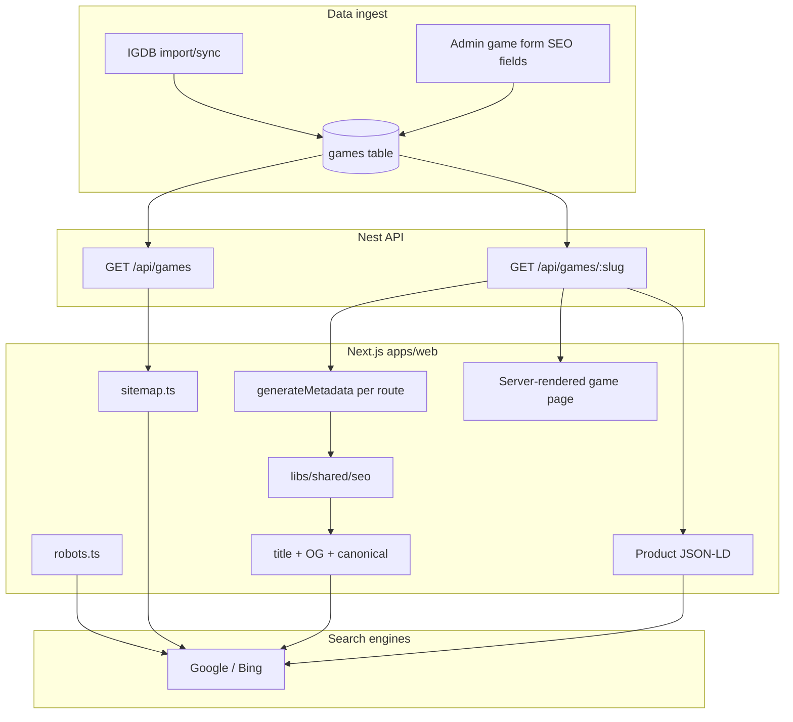
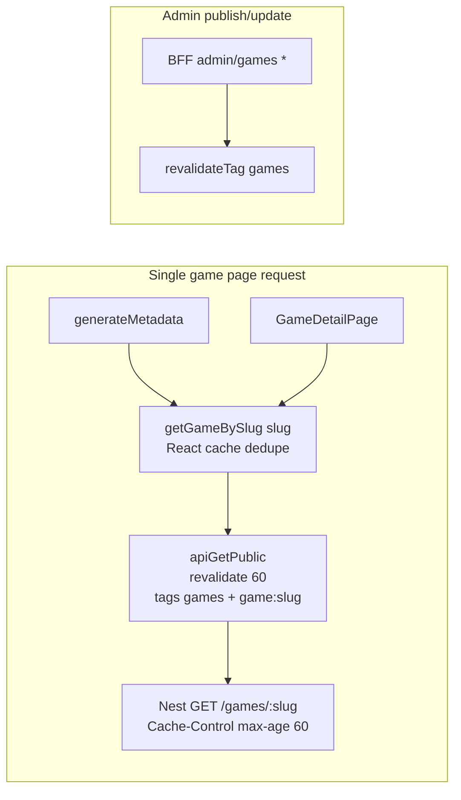
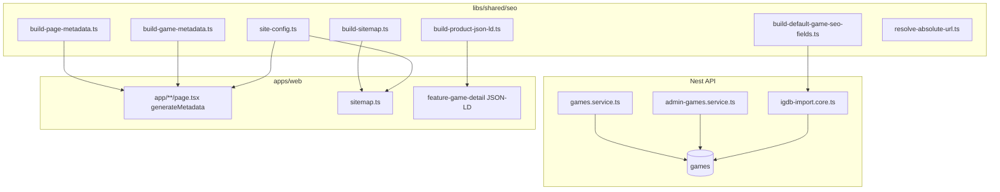

# SEO Phase End-to-End Plan

**Goal:** Implement full technical SEO so every public catalog page is crawlable with unique metadata, Open Graph/Twitter tags, JSON-LD on game pages, a dynamic sitemap, and correct robots rules — using **deterministic IGDB templates** and **admin overrides** (no AI).

**Status:** SEO file shell ✅; real metadata / sitemap / JSON-LD ❌  
**Prerequisite:** Phase 6 storefront + real `Game` rows (done)  
**Aligns with:** [NEXT_PHASES_PLAN.md](./NEXT_PHASES_PLAN.md) Phase 9

**Related plans:**

| Document | Relationship |
|----------|----------------|
| [NEXT_PHASES_PLAN.md](./NEXT_PHASES_PLAN.md) Phase 9 | Original slice breakdown; this document expands it |
| [implementation_plan.md](./implementation_plan.md) | Integration I.3 SEO + schema fields on `Game` |
| [mvp_structure_and_roadmap.md](./mvp_structure_and_roadmap.md) | P4.3 SEO blog/guides (post-MVP) |
| [AdmiImplementionPlan/ADMIN_PLAN.md](./AdmiImplementionPlan/ADMIN_PLAN.md) | Admin form/state patterns for Slice 9.3 |

**Explicitly out of scope:** AI-generated copy, `/guides` blog, hreflang/multi-locale, genre landing pages, Search Console ops, legal pages (privacy/terms)

---

## 1. End-to-end journey (what “done” looks like)



**MVP SEO scope:** English-only, single domain, template-driven meta + manual admin overrides. No separate SEO microservice, no AI pipeline.

---

## 2. Goal and realistic outcomes

**Technical goal:** Every public catalog page has a unique, correct `<title>`, meta description, canonical URL, Open Graph/Twitter tags, and game pages include `Product` JSON-LD. Published games appear in `/sitemap.xml`.

**Business outcome (honest):** This gets the store **indexed** and competitive on **long-tail** queries (`buy [game] steam activation`, branded searches). It does **not** guarantee #1 for `"[AAA game] offline"` without future content (guides) and domain authority.

**Content strategy without AI:** Use **deterministic templates** seeded from IGDB import (`summary` → `description`) plus optional **admin overrides** on `metaTitle`, `metaDescription`, `ogImage`.

**Performance goal:** SEO implementation must preserve existing **60s ISR**, **React `cache()` request deduplication**, and **tagged fetch cache** (`games`, `game:{slug}`). No additional API round-trips per page view. See §3.6.

---

## 3. Global rules

### 3.1 No-mock policy (SEO phase)

| Allowed | Not allowed |
|---------|-------------|
| Real `GET /api/games` / `GET /api/games/:slug` in `generateMetadata` and sitemap | Hardcoded game titles/slugs in metadata builders |
| `vi.mock` / fixture games in `*.spec.ts` only | MSW or fake SEO responses in production route files |
| Deterministic template strings in `libs/shared/seo` only | Duplicate title/description templates in `apps/web` or `apps/api` |
| Empty/fallback metadata when game 404s | Throwing from `generateMetadata` and breaking the page |

### 3.2 Reuse policy (single source of truth)

All SEO string logic, truncation, URL resolution, JSON-LD shape, and sitemap entry building live in **`libs/shared/seo`**. Every consumer imports from there:

| Consumer | Reuses from `libs/shared/seo` |
|----------|-------------------------------|
| `apps/web` `generateMetadata` | `buildPageMetadata`, `buildGameMetadata` |
| `apps/web` `sitemap.ts` | `buildSitemapEntries`, `siteConfig` |
| `apps/web` JSON-LD component | `buildProductJsonLd` |
| `libs/api/igdb` import | `buildDefaultGameSeoFields` (seed `meta*` on first import) |
| `apps/api` DTO mapping | **No** template logic — only persist/return DB fields |
| `tools/gamestore-plugin/seo-lib` generator | Mirror final builders after implementation |

**Do not** add a second metadata builder in Nest or Next. **Do not** duplicate `truncateDescription` or canonical URL helpers.

### 3.3 Backend best practices

| Rule | Detail |
|------|--------|
| **Layering** | Template/resolve logic → `libs/shared/seo`. Persistence → `GamesRepository`. Mapping → `GamesService` / `AdminGamesService`. IGDB orchestration → `igdb-import.core.ts`. |
| **No new public SEO endpoint** | Extend existing `GameDetailDto`; crawlers read HTML head, not a JSON SEO API. |
| **No extra DB query** | `metaTitle`, `metaDescription`, `ogImage` already on `Game`; include in existing `findBySlug` select/include. |
| **IGDB sync safety** | On re-sync: refresh `description` from IGDB; **never** overwrite non-null `metaTitle` / `metaDescription` / `ogImage` (admin wins). |
| **Validation** | Optional `class-validator` on admin DTOs: `metaTitle` max 70, `metaDescription` max 320, `ogImage` URL format. |
| **Types** | Extend `CreateGameDto` / `AdminCreateGameDto` — do not introduce parallel `SeoGameDto` on the API unless shared in `@gamestore/shared/seo`. |
| **Tests** | Service unit tests mock Prisma; e2e hits real DB like existing `games.e2e-spec.ts`. |
| **Select discipline** | SEO fields come from existing `findBySlug` include — no `findBySlug` + second query for meta |
| **DTO payload** | Add only `metaTitle`, `metaDescription`, `ogImage` strings — do not expand detail DTO with media for SEO |
| **IGDB seeding** | `buildDefaultGameSeoFields` runs once at import time — not on every `GET` request |

### 3.4 Frontend best practices

| Rule | Detail |
|------|--------|
| **Server-first metadata** | `generateMetadata` only in `apps/web/src/app/**/page.tsx` (Server Components). Never in `'use client'` feature libs. |
| **One fetch per game page** | `getGameBySlug` is wrapped in React `cache()` — use the **same** call in `generateMetadata` and `GameDetailPage` so Next dedupes the request. |
| **No SEO client state** | Storefront pages do not need `useState` for metadata. Head tags are server-rendered. |
| **Admin form state** | Extend existing `AdminGameFormValues` + `parseAdminGameForm` / `toAdminGameInput` — **do not** add a separate SEO context or global store. SEO fields are controlled inputs on the same form as `description`, using existing `updateField` / `setValues` in `admin-game-edit-page.tsx`. |
| **Admin async pattern** | Keep `useAdminResourceState` + `AdminAsyncView` for load/save; SEO fields load/save with the rest of the game — no separate SEO save button. |
| **On-page SEO in Server Components** | Description excerpt + JSON-LD render in `game-detail-page.tsx` (async server component). Client tabs (`game-detail-tabs.tsx`) stay for UX only. |
| **Image alts** | Use `game.title` in alt strings; no empty `alt=""` on catalog/game covers. |
| **Constants** | Static page copy for titles/descriptions in `libs/shared/seo` page config map — not scattered in each `page.tsx`. |
| **ISR preserved** | Keep `export const revalidate = 60` on catalog routes; metadata work must not force dynamic rendering |
| **Image LCP** | SEO changes must not set `loading="eager"` on more images; keep existing catalog `priority` pattern only for above-fold cards |
| **Client bundle** | No import of `@gamestore/shared/seo` builders in `'use client'` files — server-only metadata + JSON-LD |

### 3.5 Slice workflow

Work **one slice at a time**. After each slice:

1. Run that slice’s **mandatory tests** (see §8 per slice).
2. Run that slice’s **performance checks** (see §3.6 + per-slice perf notes).
3. Manual smoke check if applicable.
4. User reviews → say **continue** before next slice.

Do not start Slice 9.4 until 9.1 builders exist. Do not start 9.3 admin UI until 9.2 API accepts SEO fields.

### 3.6 Performance best practices (global)

SEO work must **not** regress storefront TTFB, ISR, or API load. Reuse the caching stack already in the repo — do not bolt on extra fetches or `force-dynamic` routes.

#### Existing cache stack (do not break)



| Layer | Current behavior | SEO rule |
|-------|------------------|----------|
| Route ISR | `export const revalidate = 60` on `/`, `/shop`, `/games/[slug]` | **Keep 60** on all indexable catalog routes — do not switch to `force-dynamic` |
| React `cache()` | `getGames`, `getGameBySlug` in `games.api.ts` | Same cached function in `generateMetadata` + page body + JSON-LD — **one logical fetch per slug per request** |
| Next fetch cache | `apiGetPublic` → `next: { revalidate: 60, tags: ['games', 'game:slug'] }` | Do not bypass with `cache: 'no-store'` on public game reads |
| Nest HTTP cache | `Cache-Control: public, max-age=60, stale-while-revalidate=300` on `GET /games*` | Unchanged; SEO fields ride on existing responses |
| BFF invalidation | `revalidateTag('games')` on `admin/games` POST/PUT/PATCH/DELETE | Extend to also `revalidateTag(\`game:${slug}\`)` when slug known (Slice 9.4/9.5) so game detail + metadata refresh after admin edit without waiting full 60s |
| Server fetch path | `API_URL` direct from RSC (not browser BFF) | `generateMetadata` / sitemap use `data-access` helpers — never `$fetch` from client for SEO |

#### Hard performance rules

| Rule | Why |
|------|-----|
| **No dedicated SEO API route** | Avoids duplicate DB query + extra network hop; metadata comes from existing `GameDetailDto` |
| **No `fetch()` inside `libs/shared/seo`** | Builders stay sync pure functions — zero I/O, tree-shakeable, instant in tests |
| **No second `getGameBySlug` for JSON-LD** | Pass the same `game` object from page into `GameDetailJsonLd` |
| **No SEO-only Prisma query** | `metaTitle` / `metaDescription` / `ogImage` are columns on the row already loaded by `findBySlug` |
| **Static routes use `export const metadata`** | `/`, `/shop`, `/faq`, etc. — build-time constants, no runtime API call for head tags |
| **`robots.ts` stays sync** | No `async`, no fetch — static config only |
| **Sitemap uses `getGames()` not N× `getGameBySlug`** | List endpoint returns slugs only; one API call for entire sitemap |
| **Sitemap is cached** | `export const revalidate = 60` in `sitemap.ts` (match catalog ISR) |
| **JSON-LD stays minimal** | `Product` + `Offer` only — no embedding screenshots/media arrays |
| **Excerpt ≤ 160 chars** | Server-rendered SEO blurb under H1 — do not duplicate full IGDB `description` in HTML (avoids bloated TTFB/HTML weight) |
| **OG images are URLs in metadata** | Use `openGraph.images` with absolute URLs — do not run covers through `next/image` for meta tags |
| **Admin SEO fields add no fetch** | Same `getAdminGame` / `updateAdminGame` round-trip as today |

#### Anti-patterns (never do)

- `export const dynamic = 'force-dynamic'` on `/games/[slug]` or `/shop` for SEO
- Calling `getGameBySlug` inside `buildGameMetadata` (builder must not fetch)
- Separate `GET /api/games/:slug/seo` endpoint
- Loading all game **details** in a loop to build sitemap
- Client-side `useEffect` + fetch to inject meta tags
- `revalidate = 0` on sitemap to “always be fresh” (hammer DB on every crawler hit)
- Embedding full `description` + JSON-LD + media URLs in `<head>`

#### Performance verification (per slice + phase exit)

| Check | How |
|-------|-----|
| Single fetch per game page | Unit test: mock `getGameBySlug`; render `generateMetadata` + page in same test harness; assert **1 call** |
| Builders are sync | `shared-seo` tests run without `await` on builders |
| Sitemap one list fetch | Mock `getGames`; call sitemap handler; assert **not** `getGameBySlug` |
| Route still ISR | `games/[slug]/page.tsx` exports `revalidate = 60` after Slice 9.4 |
| Payload size | `GameDetailDto` adds only 3 nullable strings (~bytes, not KB) |
| Manual | DevTools Network: one `/api/games/:slug` (or direct Nest) per hard refresh of game page |

---

## 4. Current state (codebase analysis)

### 4.1 Implemented ✅

| Area | Path | Notes |
|------|------|-------|
| SEO lib shell | `libs/shared/seo` | `siteConfig` from env; builders are stubs |
| Env vars | `.env.example` | `NEXT_PUBLIC_SITE_URL`, `SITE_NAME`, `DEFAULT_OG_IMAGE` |
| DB SEO columns | `libs/api/prisma/prisma/schema.prisma` | `metaTitle`, `metaDescription`, `ogImage`, `publishedAt` |
| Admin repo select | `libs/api/data-access/.../games.repository.ts` | `adminGameSelect` includes SEO fields |
| Game pages + ISR | `apps/web/src/app/games/[slug]/page.tsx` | `revalidate = 60`; no metadata yet |
| Public games cache | `games.api.ts` + `games.controller.ts` | `cache()` + `revalidate: 60` + `Cache-Control max-age=60` |
| BFF cache invalidation | `apps/web/src/app/api/[...path]/route.ts` | `revalidateTag('games')` on admin game mutations |
| IGDB import | `libs/api/igdb/src/lib/igdb-import.core.ts` | Seeds `title`, `description`, covers, media |
| Default OG asset | `apps/web/public/og/default.png` | Exists |
| Dev preview route | `apps/web/src/app/dev/seo-preview/page.tsx` | Stub message; `noindex` |

### 4.2 Missing ❌ (this phase)

| Gap | Impact |
|-----|--------|
| `buildPageMetadata` / `buildGameMetadata` stubs | All pages share root layout title |
| No `generateMetadata` on `/games/[slug]` | Game pages invisible to search as unique URLs |
| `GameDetailDto` omits SEO fields | Web cannot build accurate metadata from API |
| IGDB import does not seed `meta*` | Admin must hand-fill SEO for every import |
| Admin form has no SEO override fields | DB columns unused |
| Sitemap = homepage only | Google cannot discover game URLs efficiently |
| `robots.ts` allows everything | Private routes not disallowed at crawl level |
| No JSON-LD | No rich product snippets |
| `alt=""` on images | Accessibility + image SEO weak |
| Game `description` in client tab only | Crawlers may under-weight body copy |
| `seo-setup.spec.ts` asserts stub text | E2E does not verify real SEO |
| No per-slug cache invalidation on admin edit | Stale game metadata up to 60s after admin SEO save (fix in Slice 9.4) |
| `sitemap.ts` uncached / single homepage URL | Crawlers miss games; extra work when fixed if not ISR-cached |

### 4.3 On-page issues (fix in Slice 9.6)

| Issue | File |
|-------|------|
| Empty image alts | `catalog-card.tsx`, `game-detail-page.tsx` |
| Description behind client tab | `game-detail-tabs.tsx` (default tab is product-details, not game-description) |

---

## 5. Architecture



**Metadata resolution order (per game):**

1. `metaTitle` / `metaDescription` / `ogImage` (admin override, if set)
2. Template fallback via `buildGameMetadata` using `title`, `description`, `platform`, `priceBase`, `coverImage`
3. Site defaults from `libs/shared/seo/src/lib/site-config.ts`

---

## 6. Target layout (end state)

```
libs/shared/seo/src/lib/
├── site-config.ts
├── metadata/
│   ├── build-page-metadata.ts
│   ├── build-game-metadata.ts
│   ├── build-default-game-seo-fields.ts   # IGDB import seeding
│   ├── page-metadata.constants.ts         # static page titles/descriptions
│   └── seo-game.types.ts                  # SeoGameInput shared type
├── json-ld/
│   └── build-product-json-ld.ts
├── sitemap/
│   └── build-sitemap.ts
└── url/
    └── resolve-absolute-url.ts

libs/web/feature-game-detail/src/lib/components/
└── game-detail-json-ld.tsx                # server component, uses buildProductJsonLd

apps/web/src/app/
├── layout.tsx                             # metadataBase + defaults
├── page.tsx, shop/, faq/, contact/, subscriptions/  # static metadata
├── games/[slug]/page.tsx                  # generateMetadata
├── sitemap.ts, robots.ts
└── dev/seo-preview/page.tsx               # live preview of builders
```

---

## 7. Page matrix

### Index (unique metadata + sitemap entry)

| Route | Title pattern (example) |
|-------|-------------------------|
| `/` | `{siteName} — Premium offline game activation` |
| `/shop` | `Shop PC Games \| {siteName}` |
| `/games/[slug]` | `Buy {title} — {platform} Activation \| {siteName}` |
| `/faq` | `FAQ — Activation & Support \| {siteName}` |
| `/contact` | `Contact \| {siteName}` |
| `/subscriptions` | `Subscriptions \| {siteName}` |

### Noindex (metadata `robots.index: false` + robots.txt disallow)

| Route | Reason |
|-------|--------|
| `/checkout`, `/checkout/success` | Transactional |
| `/account`, `/my-games` | Auth-gated / private |
| `/admin/*`, `/auth/*`, `/sign-in`, `/sign-up` | Staff/auth |
| `/dev/*` | Dev tools |

> **Note:** `NEXT_PHASES_PLAN.md` listed `/my-games` under static metadata — **this plan overrides that**: `/my-games` must be `noindex`.

---

## 8. Execution slices

Each slice ends with **mandatory tests** — do not proceed until they pass.

---

### Slice 9.1 — Shared SEO library (pure functions)

**Goal:** Single source of truth for all SEO output shapes.

**Files to create/update:**

- `libs/shared/seo/src/lib/metadata/seo-game.types.ts` — `SeoGameInput`
- `libs/shared/seo/src/lib/metadata/page-metadata.constants.ts` — static page copy
- `libs/shared/seo/src/lib/metadata/build-page-metadata.ts`
- `libs/shared/seo/src/lib/metadata/build-game-metadata.ts`
- `libs/shared/seo/src/lib/metadata/build-default-game-seo-fields.ts` — for IGDB seeding
- `libs/shared/seo/src/lib/url/resolve-absolute-url.ts`
- `libs/shared/seo/src/lib/json-ld/build-product-json-ld.ts`
- `libs/shared/seo/src/lib/sitemap/build-sitemap.ts`
- `libs/shared/seo/src/index.ts` — export all public APIs

**Implement:**

- `buildPageMetadata(pageId)` — `home` \| `shop` \| `faq` \| `contact` \| `subscriptions`
- `buildGameMetadata(game: SeoGameInput)` — full Next `Metadata` object
- `truncateDescription(text, maxLen = 160)`
- `resolveAbsoluteUrl(path)` — prefix `siteConfig.siteUrl`; handle `/og/default.png`
- `buildDefaultGameSeoFields({ title, platform, priceBase, summary?, coverImage? })` — returns `{ metaTitle, metaDescription, ogImage }`
- `buildProductJsonLd(game)` — schema.org `Product` + `Offer` (`InStock` / `OutOfStock`)
- `buildSitemapEntries({ games })` — static routes + `/games/{slug}`

**Metadata shape:** `title`, `description`, `alternates.canonical`, `openGraph`, `twitter`.

**Best practices:**

- Pure functions only — no `fetch`, no Prisma, no React imports.
- **Sync only** — all builders return synchronously; safe to call from `generateMetadata` without adding async work beyond the data fetch.
- Golden-file style fixtures in tests for 2–3 representative games (with/without overrides).
- Export `SeoGameInput` so web + igdb import share one type.
- Keep `SeoGameInput` minimal (fields needed for meta + JSON-LD only) — consumers map from full `GameDetail` at the edge.

**Performance:**

- No dependencies beyond `next` types for `Metadata` — keeps `shared-seo` lightweight.
- `truncateDescription` / `resolveAbsoluteUrl` are O(n) on small strings — no regex-heavy pipelines.
- `buildSitemapEntries` accepts `{ slug }[]` — does not require full game detail objects.

**Mandatory tests (Slice 9.1 exit):**

```bash
pnpm nx test shared-seo
```

| Test file | Cases |
|-----------|-------|
| `build-page-metadata.spec.ts` | Each page id returns unique title + canonical |
| `build-game-metadata.spec.ts` | Override wins → template fallback → site default |
| `build-default-game-seo-fields.spec.ts` | IGDB summary + price sentence; empty summary edge case |
| `resolve-absolute-url.spec.ts` | Relative `/og/...` and absolute URLs |
| `build-product-json-ld.spec.ts` | Valid JSON-LD; `soldOut` → `OutOfStock` |
| `build-sitemap.spec.ts` | Static routes + N game slugs; no drafts |

**Perf tests (Slice 9.1):**

| Test | Cases |
|------|-------|
| `build-game-metadata.spec.ts` | Builder returns without `async` / microtask |
| `build-sitemap.spec.ts` | 500 slugs still completes in < 50ms (unit timing smoke) |

**Slice 9.1 done when:** `pnpm nx test shared-seo` green; no `TODO(implement-seo)` in `libs/shared/seo`.

---

### Slice 9.2 — API: expose SEO fields + IGDB template seeding

**Goal:** Persist and return SEO fields; seed on IGDB import without overwriting admin edits.

**Public read path:**

- Extend `GameDetailDto` in `apps/api/src/app/games/games.service.ts` with `metaTitle`, `metaDescription`, `ogImage`
- Map in `toDetailDto` from existing Prisma row
- Update `libs/web/data-access/src/lib/games.api.ts` `GameDetail` type

**IGDB import** (`libs/api/igdb/src/lib/igdb-import.core.ts`):

- Import `buildDefaultGameSeoFields` from `@gamestore/shared/seo`
- **First import:** set `metaTitle`, `metaDescription`, `ogImage` from helper when null
- **Re-sync:** merge SEO fields — only fill nulls; never replace admin values

**Admin write path:**

- Extend `AdminCreateGameDto` / `AdminUpdateGameDto` with optional `metaTitle`, `metaDescription`, `ogImage`
- Wire `buildCreateInput` / `buildUpdateInput` in `admin-games.service.ts`
- Return SEO fields in `AdminGameDto` / admin GET responses (already in `adminGameSelect`)

**Best practices:**

- `buildDefaultGameSeoFields` called only from igdb-import — not from `GamesService`.
- Trim empty strings to `null` on write so templates apply consistently.
- Add optional validation DTO decorators; reject absurd lengths with 400.

**Performance:**

- Map SEO fields in existing `toDetailDto` — **no** new repository method or JOIN.
- IGDB import: compute defaults once per import transaction, not per screenshot/media row.
- Public list `GET /games` unchanged for SEO (sitemap uses slug list only; catalog DTO stays lean).

**Mandatory tests (Slice 9.2 exit):**

```bash
pnpm nx test api-igdb
pnpm nx test api --testPathPattern="games|admin-games"
pnpm nx e2e api-e2e --testPathPattern=games
```

| Test | Cases |
|------|-------|
| `igdb-import.core.spec.ts` | First import seeds `meta*`; re-sync preserves admin `metaTitle` |
| `games.service.spec.ts` | `toDetailDto` includes SEO fields |
| `admin-games.service.spec.ts` | Create/update persists SEO overrides |
| `apps/api-e2e/src/games.e2e-spec.ts` | `GET /api/games/:slug` returns `metaTitle`, `metaDescription`, `ogImage` |

**Slice 9.2 done when:** above tests green; IGDB import uses shared helper only.

---

### Slice 9.3 — Admin UI: SEO override fields

**Goal:** Admins can view/edit SEO overrides in the existing game form without new state architecture.

**Files:**

- `libs/web/feature-admin/src/lib/games/admin-games.types.ts`
- `libs/web/feature-admin/src/lib/games/admin-game-form.tsx`
- `libs/web/data-access/src/lib/admin-games.api.ts` (types if needed)

**UI (Storefront tab, below description):**

- Meta title (~60 char hint)
- Meta description (~160 char hint)
- OG image URL (placeholder: current `coverImage`)

Helper: *"Leave blank to use auto-generated defaults. IGDB import pre-fills these on first import."*

**State management (follow existing patterns):**

```typescript
// Extend AdminGameFormValues — same object as description/price
export type AdminGameFormValues = {
  // ...existing fields
  metaTitle: string;
  metaDescription: string;
  ogImage: string;
};
```

- Load via `parseAdminGameForm` from API response (no extra fetch).
- Save via `toAdminGameInput` → `updateAdminGame` with the rest of the form.
- Use existing `updateField('metaTitle', value)` — **no** `useContext`, **no** Zustand, **no** separate SEO form.
- Optional: character counters as derived UI only (`value.length`), not separate state.

**Best practices:**

- Disabled state when `saving` / `disabled` prop matches other fields.
- Empty string on submit → send `undefined` so API stores `null` and templates apply.
- Vitest uses controlled `formState` prop pattern already in `admin-game-edit-page` tests.

**Performance:**

- SEO inputs are plain controlled fields — **no** `useEffect` preview fetch to `/api/games/:slug`.
- Character count = `value.length` inline — no debounced re-render pipeline.
- No live “Google preview” widget in v1 (would add state + re-fetch).

**Mandatory tests (Slice 9.3 exit):**

```bash
pnpm nx test web-feature-admin --testPathPattern=admin-game
```

| Test | Cases |
|------|-------|
| `admin-game-form.spec.tsx` (new or extend) | Renders SEO fields on Storefront tab |
| `admin-games.types.spec.ts` (new) | `parseAdminGameForm` / `toAdminGameInput` round-trip SEO fields |
| `admin-game-edit-page` wired spec | Save sends `metaTitle` to API mock |

**Slice 9.3 done when:** admin can save/load SEO fields; form tests green.

---

### Slice 9.4 — Wire Next.js `generateMetadata`

**Goal:** Server-rendered unique head tags per route using shared builders.

| File | Change |
|------|--------|
| `apps/web/src/app/layout.tsx` | `metadataBase: new URL(siteConfig.siteUrl)`; default metadata from `buildPageMetadata('home')` |
| `apps/web/src/app/page.tsx` | `export const metadata = buildPageMetadata('home')` |
| `apps/web/src/app/shop/page.tsx` | `buildPageMetadata('shop')` |
| `apps/web/src/app/faq/page.tsx` | `buildPageMetadata('faq')` |
| `apps/web/src/app/contact/page.tsx` | `buildPageMetadata('contact')` |
| `apps/web/src/app/subscriptions/page.tsx` | `buildPageMetadata('subscriptions')` |
| `apps/web/src/app/games/[slug]/page.tsx` | `export async function generateMetadata({ params })` — `getGameBySlug` + `buildGameMetadata`; 404 → `{ title: 'Game not found', robots: { index: false } }` |
| `apps/web/src/app/checkout/page.tsx` | `robots: { index: false, follow: false }` |
| `apps/web/src/app/checkout/success/page.tsx` | same |
| `apps/web/src/app/account/page.tsx` | same |
| `apps/web/src/app/my-games/page.tsx` | same |
| `apps/web/src/app/dev/seo-preview/page.tsx` | Render resolved sample metadata from builders (not stub text) |

- No inline title strings in `page.tsx` — only `buildPageMetadata` / `buildGameMetadata`.
- Keep `export const revalidate = 60` on game route (and `/shop`, `/`).

**Performance:**

```typescript
// apps/web/src/app/games/[slug]/page.tsx
export const revalidate = 60; // ISR — do NOT replace with force-dynamic

export async function generateMetadata({ params }: PageProps): Promise<Metadata> {
  const { slug } = await params;
  try {
    const game = await getGameBySlug(slug); // React cache() — deduped with page + JSON-LD
    return buildGameMetadata(game);         // sync pure fn after fetch
  } catch {
    return { title: 'Game not found', robots: { index: false, follow: false } };
  }
}

export default async function Page({ params }: PageProps) {
  const { slug } = await params;
  return <GameDetailPage slug={slug} />;  // same getGameBySlug inside — 1 fetch total
}
```

- Static pages (`/faq`, `/contact`, …): `export const metadata = buildPageMetadata(...)` — **zero** runtime API calls.
- `layout.tsx`: set `metadataBase` once — avoids repeating absolute URL resolution.
- **Cache invalidation (Slice 9.4):** extend `apps/web/src/app/api/[...path]/route.ts` `shouldRevalidateGamesCatalog` handler to call `revalidateTag('games')` **and** `revalidateTag(\`game:${slug}\`)` when response body or path includes slug (admin update/delete), so metadata/HTML refresh promptly after publish.

**Mandatory tests (Slice 9.4 exit):**

```bash
pnpm nx e2e web-e2e --grep "seo"
```

| Test | Cases |
|------|-------|
| `apps/web-e2e/src/seo.spec.ts` (new) | Published game: unique `<title>`, `og:title`, `link[rel=canonical]` |
| `apps/web-e2e/src/seo.spec.ts` | `/shop` title differs from `/` |
| `apps/web-e2e/src/seo.spec.ts` | `/checkout` has `noindex` (robots meta) |
| `apps/web-e2e/src/seo-setup.spec.ts` | Update: preview shows real builder output |

**Perf tests (Slice 9.4):**

| Test | Cases |
|------|-------|
| `games/[slug]/page.spec.ts` (new, server) | Mock `getGameBySlug`; metadata + default export both invoked → **1** API call |
| Manual | Game page View Source: metadata present; Network tab shows single games fetch |

**Slice 9.4 done when:** view-source shows per-route titles; e2e seo spec green; `revalidate = 60` still exported.

---

### Slice 9.5 — Sitemap and robots

**Goal:** Crawlers discover all public URLs; private paths disallowed.

**`apps/web/src/app/sitemap.ts`:**

```typescript
import type { MetadataRoute } from 'next';
import { getGames } from '@gamestore/web/data-access';
import { buildSitemapEntries, siteConfig } from '@gamestore/shared/seo';

export const revalidate = 60; // match catalog ISR — avoid DB hit on every crawler request

export default async function sitemap(): Promise<MetadataRoute.Sitemap> {
  const games = await getGames(); // one list fetch, React cache + tagged
  return buildSitemapEntries({ games, siteUrl: siteConfig.siteUrl });
}
```

- `lastModified`: use `publishedAt` from game DTO for v1 (optional later: expose `updatedAt` on `GameDto`).
- **Do not** call `getGameBySlug` per game — O(1) API calls, not O(n).

**`apps/web/src/app/robots.ts`:**

- `allow: /`
- `disallow: /admin`, `/checkout`, `/account`, `/my-games`, `/auth`, `/dev`, `/sign-in`, `/sign-up`
- `sitemap: ${siteUrl}/sitemap.xml`
- Keep **synchronous** — no `async function robots()`

**Best practices:**

- Sitemap includes **only** routes from §7 index matrix — not checkout/admin.
- Draft games (`publishedAt: null`) excluded via `getGames()` (already published-only).
- When catalog exceeds ~1000 URLs (post-MVP), add sitemap index splitting — not needed for launch.

**Performance:**

- `getGames()` shares cache tag `games` with `/shop` — admin publish invalidates both sitemap and catalog.
- `buildSitemapEntries` is pure CPU on small arrays — no I/O inside builder.

**Mandatory tests (Slice 9.5 exit):**

```bash
pnpm nx test shared-seo --testPathPattern=build-sitemap
pnpm nx e2e web-e2e --grep "seo"
```

| Test | Cases |
|------|-------|
| `build-sitemap.spec.ts` | Contains `/shop`, `/faq`, `/games/demo-game-1` when game passed |
| `seo.spec.ts` | `GET /sitemap.xml` returns 200 with published game URL |
| `seo.spec.ts` | `GET /robots.txt` contains `Disallow: /admin` |

**Perf tests (Slice 9.5):**

| Test | Cases |
|------|-------|
| `sitemap` unit/integration | Mock `getGames` once; never spies on `getGameBySlug` |
| `seo.spec.ts` | `GET /sitemap.xml` responds 200 (cached route, not 5xx under load) |

**Slice 9.5 done when:** sitemap/robots e2e assertions pass; `sitemap.ts` exports `revalidate = 60`.

---

### Slice 9.6 — On-page SEO fixes

**Goal:** Crawlable body content + structured data in HTML.

| Fix | File |
|-----|------|
| Cover `alt="{title} cover"` | `libs/web/feature-catalog/.../catalog-card.tsx` |
| Cover/screenshot alts | `libs/web/feature-game-detail/.../game-detail-page.tsx` |
| Server-rendered excerpt (1–2 sentences) under H1 | `game-detail-page.tsx` — use `truncateDescription` from `@gamestore/shared/seo` |
| `GameDetailJsonLd` server component | `libs/web/feature-game-detail/.../game-detail-json-ld.tsx` |

**Best practices:**

- JSON-LD component receives `game` prop from parent — calls `buildProductJsonLd`, renders `<script type="application/ld+json">` with `dangerouslySetInnerHTML` only in this isolated server component.
- Excerpt is plain `<p>` in server HTML — not inside client tabs.
- Reuse `truncateDescription` — do not copy truncation logic.

**Performance:**

- **Do not refetch** game inside `GameDetailJsonLd` — parent already has `game` from `getGameBySlug`.
- Excerpt: max ~160 chars — full `description` remains in client tab for UX only.
- JSON-LD script is small static JSON — exclude `media[]`, screenshots, and long requirements blobs from schema.
- Alt text changes only — no new images or layout shifts (CLS).
- Screenshots keep `loading="lazy"`; hero cover keeps current `loading="eager"` only on game detail hero.

**Mandatory tests (Slice 9.6 exit):**

```bash
pnpm nx test web-feature-game-detail
pnpm nx test web-feature-catalog
pnpm nx e2e web-e2e --grep "seo"
```

| Test | Cases |
|------|-------|
| `game-detail-page.spec.tsx` (new/extend) | Renders excerpt when `description` set |
| `game-detail-json-ld.spec.tsx` (new) | Script tag contains `"@type":"Product"` |
| `catalog-card.spec.tsx` (extend) | `img` has non-empty `alt` |
| `seo.spec.ts` | Page source contains `application/ld+json` |

**Slice 9.6 done when:** unit + e2e pass; no empty cover alts.

---

### Slice 9.7 — Integration cleanup and generator sync

**Goal:** Remove stubs; full regression; keep codegen in sync.

**Tasks:**

- Remove all `TODO(implement-seo)` from implemented paths
- Update `tools/gamestore-plugin/src/generators/seo-lib/files/**` to match final builders
- Cross-check `NEXT_PHASES_PLAN.md` Phase 9 exit criteria
- Verify no `'use client'` module imports `@gamestore/shared/seo` metadata builders (bundle check)

**Performance regression suite (Slice 9.7):**

```bash
# Confirm ISR flags still present
rg "revalidate = 60" apps/web/src/app/page.tsx apps/web/src/app/shop/page.tsx apps/web/src/app/games apps/web/src/app/sitemap.ts

# Confirm no force-dynamic added for SEO
rg "force-dynamic" apps/web/src/app

# Confirm builders stay fetch-free
rg "fetch\\(" libs/shared/seo/src
```

**Mandatory tests (Slice 9.7 / phase exit):**

```bash
pnpm nx test shared-seo
pnpm nx test api-igdb
pnpm nx test web-feature-admin --testPathPattern=admin-game
pnpm nx test web-feature-game-detail
pnpm nx e2e web-e2e --grep "seo"
pnpm nx e2e api-e2e --testPathPattern=games
```

**Full phase exit:** all commands green + manual view-source check on one published game.

---

## 9. IGDB → SEO mapping (no AI)

| IGDB field | Stored field | SEO use |
|------------|--------------|---------|
| `name` | `title` | H1, title template |
| `summary` | `description` | Body copy + meta description template |
| `genres.name` | `genres[]` | Keywords (future genre pages) |
| `first_release_date` | `releaseDate` | JSON-LD / meta chips |
| `cover.url` | `coverImage`, `ogImage` default | OG image |
| Screenshots/videos | `GameMedia` | Engagement; not direct meta |

**Not fetched from IGDB (v1):** `storyline`, `keywords`, `themes` — defer unless templates prove insufficient.

**Template example (in `buildDefaultGameSeoFields`):**

- `metaTitle`: `Buy {title} — {platform} Activation`
- `metaDescription`: `{truncated summary} Instant delivery, offline play, activation guide included. From ${price}.`

---

## 10. Env and production checklist

| Variable | Purpose |
|----------|---------|
| `NEXT_PUBLIC_SITE_URL` | Canonical URLs + sitemap (must be HTTPS in prod) |
| `NEXT_PUBLIC_SITE_NAME` | Title suffix |
| `NEXT_PUBLIC_DEFAULT_OG_IMAGE` | Fallback OG image |

Post-deploy (manual, out of scope): Google Search Console + sitemap submit.

---

## 11. Phase exit criteria (all slices)

- [ ] View-source on `/games/{published-slug}` shows unique title, description, `og:image`, canonical
- [ ] `/sitemap.xml` lists `/`, `/shop`, `/faq`, `/contact`, `/subscriptions`, and all published `/games/*`
- [ ] `/robots.txt` disallows private routes
- [ ] IGDB first import seeds `metaTitle` / `metaDescription` / `ogImage`; admin can override; re-sync preserves overrides
- [ ] Checkout/account/my-games are `noindex`
- [ ] Game page includes valid `Product` JSON-LD
- [ ] Image alts are non-empty on catalog + game detail
- [ ] Server-rendered description excerpt visible in HTML source
- [ ] All `TODO(implement-seo)` removed
- [ ] Every slice’s mandatory tests pass (§8)
- [ ] **Performance:** `revalidate = 60` on `/`, `/shop`, `/games/[slug]`, `sitemap.ts`; no `force-dynamic` on indexable routes
- [ ] **Performance:** `generateMetadata` + game page share one `getGameBySlug` call (unit test or manual Network check)
- [ ] **Performance:** Sitemap built from single `getGames()` call
- [ ] **Performance:** Admin game update triggers `revalidateTag` for `games` + `game:{slug}`
- [ ] **Performance:** `@gamestore/shared/seo` has zero `fetch` / Prisma / React imports

---

## 12. Post-MVP backlog (not this plan)

| Item | Why later |
|------|-----------|
| AI-generated meta/guides | Explicitly out of scope |
| `/guides/[slug]` content pages | Rank for `"[game] offline"` informational queries |
| Genre/platform landing pages | Internal linking at scale |
| Privacy / Terms / Refund pages | Trust + merchant requirements |
| `hreflang` multi-locale | When i18n routing ships |
| `updatedAt` on public `GameDto` | Finer sitemap `lastModified` |
| Search Console monitoring | Ops, not code |
| Sitemap index chunking (50k+ URLs) | Large-catalog crawl budget |
| Lightweight `GET /games/:slug/meta` | Only if profiling shows detail payload too heavy for metadata path |

---

## 13. Suggested implementation order

1. **Slice 9.1** — builders + unit tests (no dependencies)
2. **Slice 9.2** — API + IGDB seeding + api e2e
3. **Slice 9.4** — Next `generateMetadata` (can run parallel with 9.5 after 9.1)
4. **Slice 9.5** — sitemap + robots
5. **Slice 9.3** — admin UI overrides
6. **Slice 9.6** — on-page + JSON-LD
7. **Slice 9.7** — full regression + generator sync

**Estimated touch surface:** ~30 files across `libs/shared/seo`, `apps/web`, `apps/api`, `libs/web/feature-admin`, `libs/api/igdb`, `libs/web/feature-game-detail`, `libs/web/feature-catalog`, tests.

---

## 14. Commands reference

```bash
# Per-slice (run after each slice per §8)
pnpm nx test shared-seo
pnpm nx test api-igdb
pnpm nx test api --testPathPattern="games|admin-games"
pnpm nx test web-feature-admin --testPathPattern=admin-game
pnpm nx test web-feature-game-detail
pnpm nx test web-feature-catalog
pnpm nx e2e web-e2e --grep seo
pnpm nx e2e api-e2e --testPathPattern=games

# Manual verification
# View-source: http://localhost:3000/games/{slug}
# Sitemap:      http://localhost:3000/sitemap.xml
# Robots:       http://localhost:3000/robots.txt
# SEO preview:  http://localhost:3000/dev/seo-preview

# Performance regression (Slice 9.7)
rg "revalidate = 60" apps/web/src/app/page.tsx apps/web/src/app/shop/page.tsx apps/web/src/app/games apps/web/src/app/sitemap.ts
rg "force-dynamic" apps/web/src/app
rg "fetch\\(" libs/shared/seo/src
```
