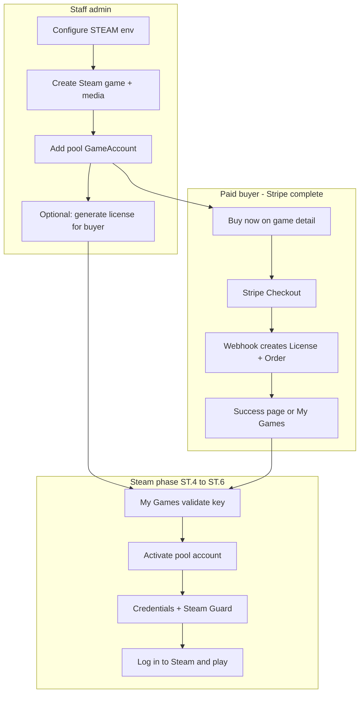

# Steam Phase — End-to-End Plan

**Goal:** From **Steam env configuration** through **buyer receiving a license** (via Stripe purchase or admin issuance) to **activating and playing** on a shared Steam pool account (credentials + Steam Guard code).

**Status:** **Steam phase ST.0–ST.7 complete** for core buyer + admin paths. **Stripe phase ✅ (SP.0–SP.10)**. Optional polish: success-page real key polling, checkout auth gate.

**Related plans:**

| Document | Relationship |
|----------|----------------|
| [STRIPE_PHASE_PLAN.md](./STRIPE_PHASE_PLAN.md) | **Complete** — prerequisite for paid buyers; see [Stripe §13 handoff](./STRIPE_PHASE_PLAN.md#13-handoff-to-steam-phase) |
| [ADMIN_MANUAL_GAMES_PLAN.md](./AdmiImplementionPlan/ADMIN_MANUAL_GAMES_PLAN.md) | **S1** — Steam catalog + pool accounts on game edit (staff prerequisite) |
| [NEXT_PHASES_PLAN.md](./NEXT_PHASES_PLAN.md) Phase 8 | Technical slices (encryption, activate, TOTP) — merged here |
| [ADMIN_PLAN.md](./AdmiImplementionPlan/ADMIN_PLAN.md) AD.7 | Admin accounts UI + My Games integration |

---

## 1. End-to-end journey (what “done” looks like)



**Production buyers:** Stripe → real `License` (`status: available`, optional `ownerId`) → Steam **activate** → credentials + Guard.

**Staff / local dev without payment:** admin generate (ST.3) or seed keys → same activate path.

**Dev shortcuts:**

- **Paid path:** `stripe listen` + test card `4242…` → real `GS-…` key in My Games (when webhook configured).
- **No Stripe CLI:** seed keys `DEMO-KEY-0001` / `DEMO-KEY-0002` or admin generate — pool secrets remain placeholders until ST.2/ST.1 complete.

**Success page note:** `/checkout/success` currently shows a **demo** key (`GS-DEMO-…`) for payment confirmation only. The webhook still mints the **real** license in the DB — use **My Games** or admin orders for the activation key until success-page polling is restored (optional Stripe polish, not blocking ST.4).

---

## 2. Current state (project analysis)

### 2.1 Implemented ✅

| Area | Path / endpoint | Notes |
|------|-----------------|-------|
| **Stripe checkout + orders** | `PaymentsService`, `PaymentFulfillmentService`, `Order` | SP.0–SP.4 complete |
| **License auto-mint on payment** | Webhook `checkout.session.completed` | `generateLicenseKey()` → `License` linked to order |
| **Buyer checkout UI** | `libs/web/feature-checkout/` | Server-loaded game summary; Pay → Stripe redirect |
| **Buy now** | `game-detail-buy-cta.tsx` | Links to `/checkout?game={slug}` |
| **Admin orders** | `GET /api/admin/orders` | Status badges; masked license keys |
| **`GET /api/licenses/mine`** | `licenses.controller.ts` | Signed-in buyers see purchased licenses |
| Steam env reader | `libs/api/steam/src/lib/steam.config.ts` | Validates `STEAM_ENCRYPTION_KEY`, cooldown |
| Steam Guard TOTP | `POST /api/steam/guard-code`, `SteamGuardAppService` | Live 6-digit codes + cooldown |
| License activation | `POST /api/licenses/activate` | Pool assignment + decrypted credentials |
| Admin games CRUD | `/api/admin/games` | Full tabbed form (S1) |
| Admin pool accounts | `/api/admin/accounts` | Plaintext → encrypt on create |
| Admin license issuance | `/api/admin/licenses` | Generate `GS-…` keys, revoke |
| My Games activation UI | `feature-steam-access`, `feature-my-games` | Validate → activate → credentials + guard |
| Seed pool encryption | `seed-steam-pool.ts` | Optional `SEED_STEAM_*` when re-seeding |
| Schema | `Game` → `GameAccount` → `License` → `User` | See §4 |
| Seed | `demo-game-1/2` (steam), pool accounts, 2 demo licenses | Placeholder secrets |

### 2.2 Missing ❌ (optional polish)

| Gap | Notes |
|-----|--------|
| Success page real license polling | `/checkout/success` still shows `GS-DEMO-…`; webhook + My Games hold truth |
| Checkout auth required | Guest checkout allowed today |
| Email license delivery | Post-MVP |

### 2.3 Explicitly out of scope (Steam phase)

- Restoring success-page **real key polling** on `/checkout/success` (optional Stripe polish; webhook + My Games already hold truth)
- Email delivery of license keys
- IGDB import, Microsoft/Epic platforms (separate plans)
- Account health monitor, password rotation, geo pool matching
- Stripe refunds UI, cart, regional pricing (see [STRIPE_PHASE_PLAN](./STRIPE_PHASE_PLAN.md))

**Buyer license sources (post-Stripe):**

1. **Paid purchase** — webhook creates `License` (`GS-…` format) with optional `ownerId`
2. **Admin generate** (ST.3) — staff, comp keys, dev without Stripe CLI
3. **Seed** — `DEMO-KEY-*` for local testing without payment

### 2.4 Stripe handoff contract

| Stripe delivers | Steam slice uses |
|-----------------|----------------|
| `License` with `gameId`, `licenseKey`, `status: available` | ST.4 `POST /api/licenses/activate` |
| `ownerId` when buyer signed in at checkout | ST.4 ownership binding; ST.5 guard ownership |
| `buyerEmail` on order/license | Admin audit; optional future email |
| Buyer lists licenses in My Games | ST.6 validate → activate UX |

**Local dev (paid path):** set `STRIPE_WEBHOOK_SECRET` from `stripe listen --forward-to localhost:3333/api/payments/webhook` (see [`.env.example`](../.env.example), [`scripts/stripe-webhook-dev.ps1`](../scripts/stripe-webhook-dev.ps1)). Restart API after updating `.env`.

---

## 3. Prerequisites

| Requirement | Status |
|-------------|--------|
| **Stripe phase** (checkout + webhook fulfillment) | **Complete** |
| Webhook secret for local paid testing | Required to mint real keys via test purchase |
| Neon DB + migrations | Required |
| Clerk auth (buyer sign-in for `/my-games`) | Required |
| Admin user (`role: admin` in Clerk metadata) | Required |
| At least one **published** Steam game | Seed or [ADMIN_MANUAL_GAMES S1](./AdmiImplementionPlan/ADMIN_MANUAL_GAMES_PLAN.md) |
| Pool `GameAccount` with real shared secret (after ST.2) | Required before activation + Guard |
| `steam-totp@2.1.2` in `package.json` | Installed; not wired |

---

## 4. Data model (Steam path)

```
Game (platform: 'steam', publishedAt set)
  │
  ├── GameMedia[]          video, screenshot, activation
  ├── GameAccount[]        pool: username, passwordEncrypted, sharedSecret, isActive
  └── License[]            licenseKey, status, ownerId?, accountId?, activatedAt?

Order (Stripe) ──licenseId──► License
User (Clerk) ──ownerId──► License ──accountId──► GameAccount
```

**License lifecycle (target):**

| status | Meaning |
|--------|---------|
| `available` | Key issued (purchase or admin); not yet activated by buyer |
| `activated` | Pool account assigned; buyer has credentials |
| `revoked` | Admin revoked; validate fails |

**Pool cap:** `activeUsersCount < 50` per account (from existing plans).

---

## 5. Environment setup (Slice ST.0 — start here)

### 5.1 Variables (`.env`)

Copy from `.env.example` and set:

```bash
# Required for Steam phase
STEAM_ENCRYPTION_KEY=<64-char-hex OR 32+ char secret>
STEAM_GUARD_COOLDOWN_MINUTES=15

# Already required for app
DATABASE_URL=...
DIRECT_URL=...
API_URL=http://localhost:3333
NEXT_PUBLIC_API_URL=http://localhost:3000/api
NEXT_PUBLIC_CLERK_PUBLISHABLE_KEY=...
CLERK_SECRET_KEY=...

# Stripe (already set from completed phase — needed for paid-path testing)
STRIPE_SECRET_KEY=sk_test_...
STRIPE_WEBHOOK_SECRET=whsec_...
NEXT_PUBLIC_STRIPE_PUBLISHABLE_KEY=pk_test_...

# Throttle (defaults OK)
THROTTLE_LIMIT_STEAM_GUARD=5
THROTTLE_LIMIT_LICENSE_VALIDATE=10
```

### 5.2 Generate encryption key

```powershell
# Option A: 64-char hex (32 bytes)
node -e "console.log(require('crypto').randomBytes(32).toString('hex'))"

# Option B: 32+ character random secret (also accepted by SteamConfig.validateEncryptionKey)
```

### 5.3 Verify configuration

```bash
pnpm nx serve api
curl http://localhost:3333/api/steam/health
curl http://localhost:3333/api/payments/health
```

**ST.0 exit:** Steam health returns encryption status `valid` (ST.1 upgrades response from setup → `ok` when crypto is live). Stripe health should report `secretKey` / `publishableKey` valid.

### 5.4 Dev pool account secrets

For local TOTP testing you need a **real** Steam shared secret (from your own test Steam account’s 2FA setup — never commit). Store via admin create after ST.2 encrypts at rest.

---

## 6. Implementation slices (in order)

Work **one slice at a time** — backend + frontend together where noted.

### ST.1 — Encryption service

**Backend:** `libs/api/steam`

| Task | Detail |
|------|--------|
| ST.1.1 | `SteamCryptoService`: AES-256-GCM `encrypt(plain)` / `decrypt(cipher)` using `STEAM_ENCRYPTION_KEY` |
| ST.1.2 | Fail fast on startup if key missing/invalid when `NODE_ENV=production` |
| ST.1.3 | Unit tests: round-trip with fixed test key |

**Exit:** Passwords never stored plaintext in DB after this slice.

---

### ST.2 — Admin Steam catalog + pool accounts

**Depends on:** [ADMIN_MANUAL_GAMES_PLAN](./AdmiImplementionPlan/ADMIN_MANUAL_GAMES_PLAN.md) **S1** (or minimum subset below).

| Task | Backend | Frontend |
|------|---------|----------|
| ST.2.1 | Extend admin game DTO (genres, requirements, media summary) | Tabbed Steam game form |
| ST.2.2 | `POST /api/admin/accounts` real (wrap `GameAccountsService`) | Enable `/admin/accounts` + inline section on game edit |
| ST.2.3 | Accept **plaintext** `password` + `sharedSecret` on create → encrypt in ST.1 | Account form fields |
| ST.2.4 | Validate `game.platform === 'steam'` for new accounts in Steam phase | Steam games only in dropdown |

**Staff verify:** Create game → add pool account `pool-my-game-slug` → publish.

**Reuses:** `/api/game-accounts` as implementation; UI uses `/api/admin/accounts`.

---

### ST.3 — Admin license issuance (supplemental keys)

**Goal:** Staff can mint license keys for comp gifts, support, or dev **without** running a Stripe payment. **Not** the primary production path — paid buyers already receive licenses from webhook fulfillment.

| Task | Detail |
|------|--------|
| ST.3.1 | Replace `AdminLicensesController` setup with real service (delegate to `LicensesService`) |
| ST.3.2 | `POST /api/admin/licenses/generate-key` → `{ licenseKey, gameId, status: 'available' }` (crypto-random key, `GS-…` format aligned with Stripe) |
| ST.3.3 | `POST /api/admin/licenses` — manual key + `gameId` + optional `buyerEmail` |
| ST.3.4 | Optional: set `ownerId` when buyer already has Clerk account (email lookup later) |
| ST.3.5 | Wire `admin-licenses.api.ts` + enable admin license form |
| ST.3.6 | Audit: `admin.license.create`, `admin.license.generate` |
| ST.3.7 | Admin list shows **both** webhook-minted (purchase) and staff-generated licenses |

**Frontend:** `/admin/licenses` — list, generate key, copy to clipboard, revoke.

**Staff verify:** Generate key for `demo-game-1` → hand key to test buyer (alternate to Stripe test purchase).

---

### ST.4 — License activation + pool assignment

**Backend:** `POST /api/licenses/activate`

```typescript
// Request
{ licenseKey: string }

// Response (auth required; optional owner binding)
{
  licenseKey: string;
  status: 'activated';
  game: { id, title, slug };
  account: { username: string; password: string }; // decrypted once
}
```

| Task | Detail |
|------|--------|
| ST.4.1 | Auth required (`@CurrentUser`) |
| ST.4.2 | Find license by key; status must be `available` (accept keys from Stripe `GS-…`, admin generate, or seed) |
| ST.4.3 | Pick least-loaded active `GameAccount` for `license.gameId` (`activeUsersCount < 50`, `lockedUntil` null or past) |
| ST.4.4 | Set `license.accountId`, `status: 'activated'`, `activatedAt`; set `ownerId` = current user if unset, or enforce match if already set at purchase |
| ST.4.5 | Increment `account.activeUsersCount` |
| ST.4.6 | Decrypt password for response only; audit `license.activate` |
| ST.4.7 | `POST /api/licenses/validate` stays lookup-only |

**Errors:** `404` no license; `403` owner mismatch (purchased with different account); `409` already activated; `503` no pool account available.

---

### ST.5 — Real Steam Guard (TOTP)

**Backend:** Replace stub in `SteamGuardService` + `POST /api/steam/guard-code`

```typescript
// Request
{ licenseKey: string }

// Response
{ code: string; expiresInSeconds: number }  // code is 6 digits
```

| Task | Detail |
|------|--------|
| ST.5.1 | Resolve license → must be `activated` with `accountId` |
| ST.5.2 | Ownership: `license.ownerId` must match user (set at purchase or first activate) |
| ST.5.3 | `generateAuthCode(sharedSecret)` via `steam-totp` |
| ST.5.4 | Set `account.lockedUntil` = now + `STEAM_GUARD_COOLDOWN_MINUTES` |
| ST.5.5 | Return `429` if account locked for another user’s request |
| ST.5.6 | Remove setup JSON from guard route when configured |

**Exit:** `GET /api/steam/health` returns `{ status: 'ok' }` when encryption + TOTP path ready.

---

### ST.6 — My Games buyer UI

| Component | Change |
|-----------|--------|
| `my-licenses-panel.tsx` | List purchased licenses from `GET /api/licenses/mine` (signed-in buyers) |
| `license-key-form.tsx` | Manual key entry + validate; show **Activate** after success |
| New `activate-license-form.tsx` or extend validate flow | Calls `POST /api/licenses/activate` |
| `credentials-panel.tsx` | Show username + password + copy buttons after activation |
| `steam-guard-panel.tsx` | Show 6-digit code + countdown; handle 429 cooldown |
| `activation-steps.tsx` | Copy matches real flow (validate → activate → Steam login → guard) |

**Two entry paths:**

1. **Signed-in at purchase** — open My Games → pick license from list → activate (no re-typing key).
2. **Guest or manual** — paste key from admin handoff; do **not** use success-page `GS-DEMO-…` placeholder — use real key from My Games or admin orders.

**New data-access:** `activateLicense()`, update `requestSteamGuardCode()` response types.

---

### ST.7 — Seed, tests, documentation

| Task | Detail |
|------|--------|
| ST.7.1 | Update seed: encrypt demo passwords if dev secrets provided via env (optional `SEED_STEAM_PASSWORD`, `SEED_STEAM_SHARED_SECRET`) |
| ST.7.2 | `api-e2e/activation.e2e-spec.ts`: **Stripe checkout (test mode) → webhook → activate → guard** `/^\d{6}$/` |
| ST.7.3 | `api-e2e/activation-admin.e2e-spec.ts` (or same file): admin generate key → validate → activate → guard |
| ST.7.4 | `api-e2e`: replace admin accounts/licenses setup expectations |
| ST.7.5 | `api-steam` unit: crypto round-trip, cooldown logic |
| ST.7.6 | `web-e2e/activation.spec.ts`: real API (no MSW stub for guard) |
| ST.7.7 | Vitest: admin license generate, activate service mocks |

---

## 7. Slice summary table

| Slice | Name | Staff / Buyer | Key deliverable |
|-------|------|---------------|-----------------|
| **ST.0** | Env setup | Staff | `STEAM_ENCRYPTION_KEY` valid in `.env` |
| **ST.1** | Encryption | Backend | AES at rest for pool passwords |
| **ST.2** | Catalog + pool | Staff | Steam game + `GameAccount` in admin |
| **ST.3** | License issuance | Staff | Supplemental admin-generated keys |
| **ST.4** | Activation | Buyer | Assign pool account + credentials |
| **ST.5** | Steam Guard | Buyer | Live TOTP code |
| **ST.6** | My Games UI | Buyer | Full activation UX (purchase + manual key) |
| **ST.7** | Tests + seed | Both | E2E green (Stripe + admin paths) |

**Suggested commits:**

1. `feat(steam): ST.0-ST.1 env validation and credential encryption`
2. `feat(steam): ST.2 admin steam pool accounts API and UI`
3. `feat(steam): ST.3 admin license generation for supplemental keys`
4. `feat(steam): ST.4-ST.5 license activation and steam guard totp`
5. `feat(steam): ST.6-ST.7 my games activation UI and e2e`

---

## 8. API contract (final state)

### Admin (staff)

| Method | Path | Purpose |
|--------|------|---------|
| POST | `/api/admin/licenses/generate-key` | `{ gameId }` → new key |
| POST | `/api/admin/licenses` | Create with custom key |
| GET | `/api/admin/licenses` | List (mask keys in UI) |
| POST | `/api/admin/licenses/:id/revoke` | Revoke |
| POST | `/api/admin/accounts` | Create pool account (plaintext → encrypt) |
| GET | `/api/admin/accounts?gameId=` | List pool |
| CRUD | `/api/admin/games` | Steam catalog (see ADMIN_MANUAL_GAMES) |
| GET | `/api/admin/orders` | Purchases (from Stripe phase) |

### Buyer (public / auth)

| Method | Path | Auth | Purpose |
|--------|------|------|---------|
| POST | `/api/payments/checkout` | Optional | Stripe session (Stripe phase — complete) |
| GET | `/api/orders/by-session/:id` | Public* | Order + license after payment |
| POST | `/api/licenses/validate` | Optional | Lookup key + game |
| POST | `/api/licenses/activate` | Required | Assign account + credentials |
| POST | `/api/steam/guard-code` | Required | 6-digit TOTP |
| GET | `/api/licenses/mine` | Required | Buyer’s licenses (including purchased) |

---

## 9. Manual test script (after ST.6)

### Path A — Paid buyer (Stripe; preferred for production-like test)

1. Set `STRIPE_WEBHOOK_SECRET`; run `stripe listen --forward-to localhost:3333/api/payments/webhook`; restart API.
2. Sign in as buyer → published Steam game → **Buy now** → pay with test card `4242 4242 4242 4242`.
3. Open **My Games** (or admin → orders) → confirm real `GS-…` license (not success-page `GS-DEMO-…`).
4. **Validate** → **Activate** → copy Steam username/password.
5. **Request Steam Guard code** → enter 6-digit code in Steam client.
6. Download/play game from shared library (manual verification).

### Path B — Staff-generated key (no Stripe CLI)

1. Set `STEAM_ENCRYPTION_KEY` in `.env`; restart API.
2. Admin: publish Steam game with pool account (real test Steam `sharedSecret`).
3. Admin: **Generate license** for that game → copy key.
4. Buyer: sign in → `/my-games` → enter key → **Validate** → **Activate**.
5. Continue steps 4–6 from Path A.

---

## 10. Phase exit criteria

- [x] `STEAM_ENCRYPTION_KEY` documented and validated on boot
- [x] Admin can add encrypted Steam pool account without curl
- [x] Admin can **generate license keys** for a Steam game (supplemental path)
- [x] Buyer who **purchased via Stripe** (signed in) can activate the webhook-minted license in My Games
- [x] Buyer can validate → activate → see credentials (purchase or admin key)
- [x] Buyer receives real **Steam Guard TOTP** (not setup JSON)
- [x] Cooldown enforced per pool account
- [x] No setup text on `/api/steam/guard-code` or `/api/admin/accounts`
- [x] api-e2e activation path green (Stripe + admin generate)
- [x] Security: secrets never in list APIs; decrypt only on activate response

---

## 11. After Steam phase (next)

| Phase | Delivers |
|-------|----------|
| Success page real key polling | Show webhook license on `/checkout/success` (optional Stripe polish) |
| **ADMIN_MANUAL_GAMES S2+** | IGDB, Microsoft, SEO fields |
| **Post-MVP** | Email keys, refunds UI, account health checks, password rotation |

---

**Prerequisite:** Stripe paid flow verified (checkout redirects, webhook mints license when `STRIPE_WEBHOOK_SECRET` is set).

*Steam phase core complete. Optional next: success-page polling, checkout auth gate, ADMIN_MANUAL_GAMES S2+.*
