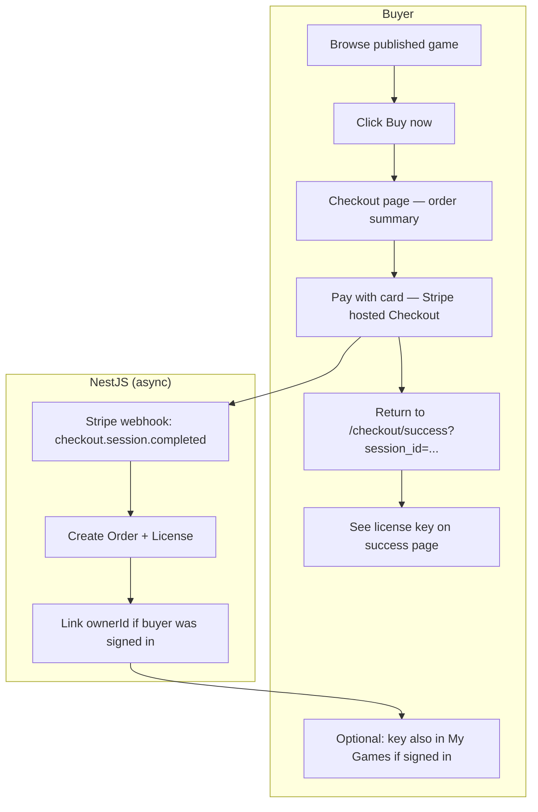
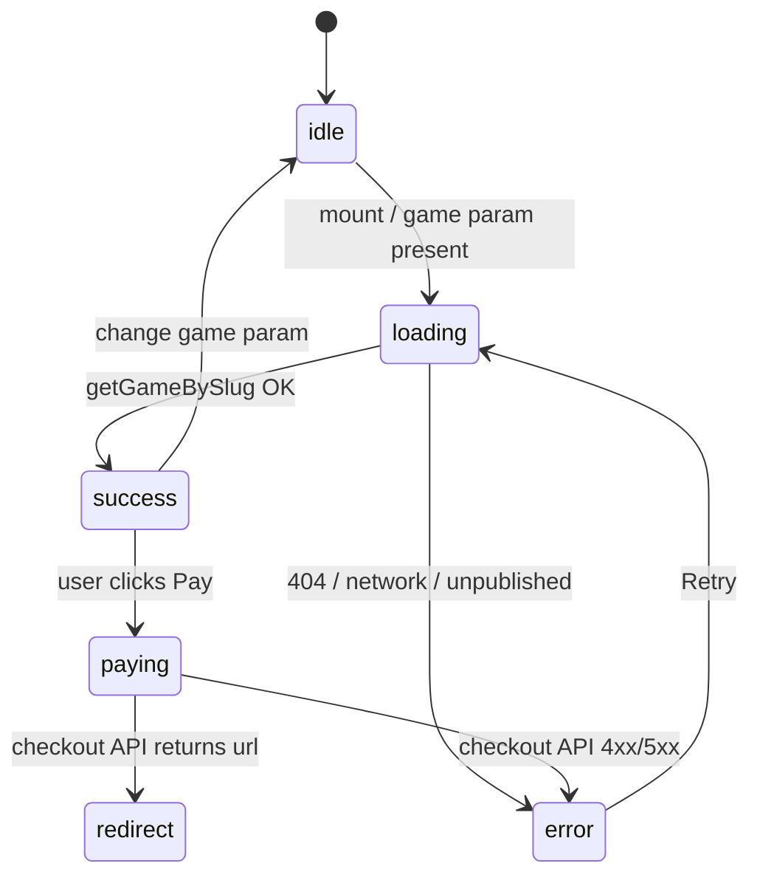
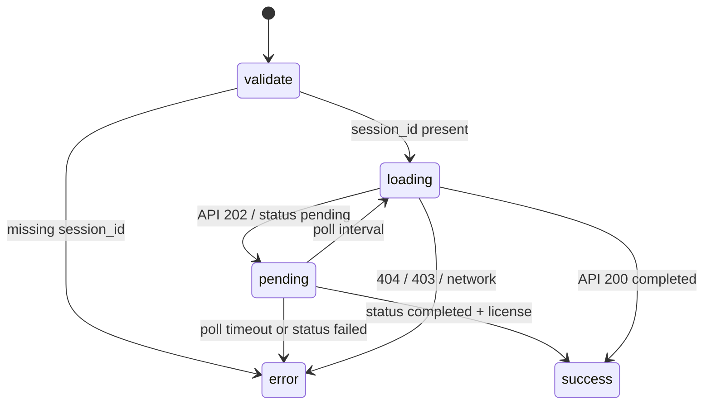

# Stripe Phase — End-to-End Plan

**Goal:** From **Stripe env configuration** through **buying a published game with Stripe Checkout** to **receiving a license key** on the success page (ready for Steam activation in [STEAM_PHASE_PLAN.md](./STEAM_PHASE_PLAN.md)).

**Status:** Planning — Stripe shell ✅; real checkout / orders / fulfillment ❌  
**Prerequisite for:** Steam phase buyer path via **paid purchase** (alternative to admin-generated keys)

**Related plans:**

| Document | Relationship |
|----------|----------------|
| [NEXT_PHASES_PLAN.md](./NEXT_PHASES_PLAN.md) Phase 7 | Original slice breakdown — merged and expanded here |
| [STEAM_PHASE_PLAN.md](./STEAM_PHASE_PLAN.md) | Activation after purchase (Phase 8) |
| [SECURITY_PLAN.md](./SECURITY_PLAN.md) | Clerk auth, throttling — should be done before production checkout |

---

## 1. End-to-end journey (what “done” looks like)



**MVP scope:** single-game checkout (one `gameId` per session). Cart / multi-item is post-MVP.

---

## 2. Current state (project analysis)

### 2.1 Implemented ✅

| Area | Path / endpoint | Notes |
|------|-----------------|-------|
| `stripe` npm package | `package.json` `^22.3.0` | Installed, not instantiated |
| Env validation | `libs/api/stripe/src/lib/stripe.config.ts` | Validates `sk_*`, `pk_*`, `whsec_*` format |
| Stripe module shell | `libs/api/stripe/` | `StripeService`, `StripeWebhookController` |
| Payments routes | `GET /api/payments/health`, `POST /api/payments/checkout` | Return setup JSON |
| Webhook route | `POST /api/payments/webhook` | Setup stub; `@Public`, `@SkipThrottle` |
| Raw body for webhooks | `apps/api/src/main.ts` `{ rawBody: true }` | Required for signature verification |
| License CRUD | `LicensesService`, `LicensesRepository` | Real Prisma; no auto-create from payment |
| Clerk auth on API | `api-client.ts` forwards JWT | Checkout can attach buyer identity |
| Checkout UI shell | `libs/web/feature-checkout/` | Summary/payment/terms placeholders |
| Success UI shell | `libs/web/feature-checkout-success/` | Placeholder license display |
| Routes | `/checkout`, `/checkout/success` | Public in `middleware.ts` |
| Game detail buy UI | `game-detail-buy-panel.tsx`, `game-detail-buy-cta.tsx` | **Buy now disabled** |
| Admin orders page | `/admin/orders` | Setup stub via `getAdminOrders()` |
| API proxy | `apps/web/src/app/api/[...path]/route.ts` | Browser → Nest via `/api/*` |
| E2E expectations | `payments.e2e-spec.ts`, `checkout.spec.ts` | Assert setup JSON today |

### 2.2 Env status (your `.env`)

| Variable | Status | Notes |
|----------|--------|-------|
| `STRIPE_SECRET_KEY` | ✅ Set (`sk_test_…`) | Server-only; used by Nest |
| `NEXT_PUBLIC_STRIPE_PUBLISHABLE_KEY` | ✅ Set (`pk_test_…`) | Loaded by Next from root `.env` |
| `STRIPE_WEBHOOK_SECRET` | ❌ **Empty** | Required before webhook fulfillment works |
| `NEXT_PUBLIC_SITE_URL` | Check | Used for `success_url` / `cancel_url` |
| `API_URL` | `http://localhost:3333` | Nest direct URL |

**Action before SP.0 exit:** run Stripe CLI `listen` and paste `whsec_…` into `.env` (see §6).

### 2.3 Missing ❌ (this phase)

| Gap | Impact |
|-----|--------|
| No `Order` model in Prisma | Cannot persist purchases |
| No `OrdersRepository` / `OrdersService` | No order reads or fulfillment |
| `StripeService` stub only | No Checkout Session |
| Webhook stub | No license after payment |
| No license key generator | Fulfillment must mint unique keys |
| `POST /api/payments/checkout` accepts no body | Cannot pass `gameId` / `slug` |
| Checkout page ignores `?game=` query | No order summary |
| Buy button disabled, no link to checkout | Cannot start purchase |
| Success page ignores `session_id` | No license display |
| No loading / error / pending UI on checkout or success | Poor UX; e2e cannot assert states |
| Admin orders API stub | Staff cannot see orders |
| BFF proxy omits `stripe-signature` header | Webhook via Next `/api` would fail verification |
| No `ownerId` on license at purchase | Signed-in buyers won’t see key in My Games |
| Regional pricing (`GamePricingRegion`) unused | MVP uses `priceBase` USD only |

### 2.4 Explicitly out of scope (Stripe phase)

- Steam pool activation ( [STEAM_PHASE_PLAN](./STEAM_PHASE_PLAN.md) )
- Email delivery of license keys
- Refunds UI / `charge.refunded` handling (stub `status: refunded` only)
- PPP / `GamePricingRegion` in Checkout line items
- Shopping cart (multiple games)
- Stripe Customer Portal / saved cards
- Live mode keys (test mode only for MVP)

---

## 3. Prerequisites

| Requirement | Status |
|-------------|--------|
| Published games in DB (`publishedAt` set) | Seed has `demo-game-1/2` |
| Clerk sign-in (recommended, not required for guest checkout) | ✅ |
| Neon DB + migrations | Required |
| Stripe test account | Keys in `.env` |

---

## 4. Data model

### 4.1 New `Order` model

Add to `libs/api/prisma/prisma/schema.prisma`:

```prisma
model Order {
  id              String   @id @default(cuid())
  gameId          String
  ownerId         String?  // DB User.id when buyer was signed in at checkout
  licenseId       String?  @unique
  stripeSessionId String   @unique
  stripePaymentId String?
  amount          Decimal  @db.Decimal(10, 2)
  currency        String   @default("USD") @db.VarChar(3)
  status          String   @default("pending") // pending | completed | failed | refunded
  buyerEmail      String?
  createdAt       DateTime @default(now())
  updatedAt       DateTime @updatedAt

  game    Game     @relation(fields: [gameId], references: [id])
  license License? @relation(fields: [licenseId], references: [id])
  owner   User?    @relation(fields: [ownerId], references: [id], onDelete: SetNull)

  @@index([gameId, status])
  @@index([ownerId])
  @@map("orders")
}
```

Extend existing models:

```prisma
model Game {
  // ...
  orders Order[]
}

model License {
  // ...
  order Order?
}

model User {
  // ...
  orders Order[]
}
```

### 4.2 Fulfillment targets

On successful payment:

| Record | Fields |
|--------|--------|
| `Order` | `status: completed`, `stripeSessionId`, `stripePaymentId`, `amount`, `currency`, `buyerEmail`, `ownerId?` |
| `License` | `licenseKey` (unique), `gameId`, `status: available`, `buyerEmail`, `ownerId?` |

**License key format:** `GS-XXXX-XXXX-XXXX` (crypto-random segments; reuse pattern from admin `generate-key` when implemented).

**Idempotency:** if `Order` with `stripeSessionId` exists and `status === completed`, webhook handler returns 200 without duplicating license.

### 4.3 Order status lifecycle (backend)

| `Order.status` | When set | Buyer-facing meaning |
|----------------|----------|----------------------|
| `pending` | Checkout session created; payment not confirmed | “Processing payment…” |
| `completed` | Webhook `checkout.session.completed` fulfilled | License issued — success UI |
| `failed` | Session expired, payment failed, or async payment failed | “Payment did not complete” |
| `refunded` | Post-MVP: `charge.refunded` webhook | License revoked (out of MVP UI) |

**Stripe → Order mapping:**

| Stripe event / condition | Order update |
|--------------------------|--------------|
| `checkout.session.completed` + `payment_status: paid` | `completed` + license |
| `checkout.session.completed` + `payment_status: unpaid` (async methods) | stay `pending`; poll until paid or timeout |
| `checkout.session.expired` | `failed` |
| `checkout.session.async_payment_failed` | `failed` |
| User abandons Stripe (no event) | stays `pending` until session expires → `failed` |

---

## 5. UI & async state handling (loading · success · failed)

Every buyer-facing screen in this phase must handle **loading**, **success**, and **failed** (plus **idle** / **empty** where relevant). Follow the same pattern as admin (`AdminAsyncState` + `AdminAsyncView`).

### 5.1 Shared type

Add `libs/web/feature-checkout/src/lib/types/checkout-async-state.ts`:

```typescript
export type CheckoutAsyncState<T> =
  | { status: 'idle' }
  | { status: 'loading' }
  | { status: 'success'; data: T }
  | { status: 'error'; message: string };

/** Success page: webhook not finished yet */
export type OrderFulfillmentState<T> =
  | CheckoutAsyncState<T>
  | { status: 'pending'; message?: string }; // poll in progress
```

Add `CheckoutAsyncView` (mirror `AdminAsyncView`): `role="status"` for loading, `role="alert"` for error, `data-testid` hooks for e2e.

### 5.2 Checkout page (`/checkout?game={slug}`)



| UI state | Trigger | What buyer sees |
|----------|---------|-----------------|
| **idle** | No `game` query param | Empty state: “Select a game from the shop” + link to `/shop` |
| **loading** | `?game=` present; fetching game | Skeleton or spinner on summary panel; pay button disabled |
| **success** | Game loaded, published, price &gt; 0 | Summary with cover/title/price; **Pay with card** enabled |
| **paying** (loading) | `createCheckout()` in flight | Button “Redirecting to secure checkout…”; disabled |
| **error** | Any failure below | Banner + **Retry** where applicable |

**Error cases (failed state):**

| Cause | Message (example) | Action |
|-------|-------------------|--------|
| Missing `?game=` | “No game selected.” | Link to shop |
| Game 404 | “This game could not be found.” | Back to shop |
| Unpublished / no `publishedAt` | “This game is not available for purchase.” | Link to game page (view only) |
| `priceBase <= 0` | “Invalid price for this game.” | Contact support copy |
| Checkout API 503 | “Payments are temporarily unavailable.” | Retry |
| Checkout API 401/403 | “Sign in to continue.” (if auth required) | Link to sign-in |
| Network / timeout | “Could not reach the server. Try again.” | Retry |

**Cancel return:** Stripe `cancel_url` → `/checkout?game={slug}&cancelled=1`. In **success** (game loaded) state, show non-blocking info banner: “Payment cancelled — you can try again when ready.” Do **not** treat cancel as **error**.

### 5.3 Success page (`/checkout/success?session_id={id}`)



| UI state | Trigger | What buyer sees |
|----------|---------|-----------------|
| **error** | No `session_id` in URL | “Invalid checkout session.” + link to shop |
| **loading** | First fetch in progress | “Confirming your payment…” spinner |
| **pending** | Order exists, `status: pending` (webhook delay) | “Processing your order…” + subtle progress; keep polling |
| **success** | Order `completed` + license | Thank-you, game title, **license key** + copy, link to My Games |
| **error** | Order `failed` | “Payment was not completed.” + link back to game/checkout |
| **error** | Poll timeout (~30–45 s) | “Taking longer than expected.” + support note + “Check My Games” if signed in |
| **error** | 404 session | “Order not found.” |
| **error** | 403 (owner mismatch) | “Sign in with the account used to purchase.” |

**Polling rules (SP.7):**

- Interval: 1 s → 2 s → 3 s (backoff); max ~12 attempts or 45 s total
- Stop on `completed`, `failed`, or timeout
- Use `GET /api/orders/by-session/:sessionId` — see §SP.5 response shapes

### 5.4 Game detail buy CTA

| State | Behavior |
|-------|----------|
| Default | **Buy now** link enabled for published games |
| Unpublished game | Button hidden or disabled with “Coming soon” |
| Loading (optional) | Rare — game already loaded on detail page |

No separate checkout loading on game detail; navigation to checkout page owns fetch state.

### 5.5 Admin orders page

Reuse `AdminAsyncState<T>`:

| State | UI |
|-------|-----|
| **loading** | Table skeleton |
| **success** | Orders table with status badge (`pending` / `completed` / `failed`) |
| **empty** | “No orders yet.” |
| **error** | Error banner (403, network) |

Status badges: `completed` = success tone, `pending` = warning, `failed` = error tone.

### 5.6 Global CSS / a11y

Add to `libs/shared/theme` (or checkout module CSS):

- `.checkout-banner-info` — cancelled payment (not an error)
- `.checkout-banner-error` — failed / timeout
- `.checkout-loading` — spinner region with `aria-live="polite"`
- License key block: `user-select: all`, copy button with “Copied!” feedback

### 5.7 `data-testid` contract (for e2e)

| testid | State |
|--------|-------|
| `checkout-summary-loading` | loading |
| `checkout-summary-error` | error |
| `checkout-summary-ready` | success (game loaded) |
| `checkout-pay-button` | enabled in success |
| `checkout-pay-loading` | paying |
| `checkout-cancelled-banner` | cancel return |
| `checkout-success-loading` | confirming payment |
| `checkout-success-pending` | webhook delay |
| `checkout-success-ready` | license visible |
| `checkout-success-error` | failed / timeout / invalid session |

---

## 6. Environment setup (Slice SP.0 — start here)

### 6.1 Variables

```bash
# Already set in your .env
STRIPE_SECRET_KEY=sk_test_...
NEXT_PUBLIC_STRIPE_PUBLISHABLE_KEY=pk_test_...

# Required — obtain from Stripe CLI (see below)
STRIPE_WEBHOOK_SECRET=whsec_...

# Checkout redirect URLs
NEXT_PUBLIC_SITE_URL=http://localhost:3000
API_URL=http://localhost:3333
```

### 6.2 Local webhook forwarding

Stripe webhooks must hit Nest with the **raw body** and `stripe-signature` header.

**Recommended (dev):** forward directly to Nest, not through Next BFF:

```powershell
# Install Stripe CLI: https://stripe.com/docs/stripe-cli
stripe login
stripe listen --forward-to localhost:3333/api/payments/webhook
# Copy whsec_... output into .env STRIPE_WEBHOOK_SECRET, restart API
```

**Production:** Stripe Dashboard → Webhooks → endpoint `https://your-api-domain/api/payments/webhook` → copy signing secret.

### 6.3 Verify configuration

```bash
pnpm nx serve api
curl http://localhost:3333/api/payments/health
```

**SP.0 exit:** health reports `secretKey: valid`, `publishableKey: valid`, `webhookSecret: valid` (after SP.2 implementation upgrades health response).

### 6.4 Test card

Use Stripe test card `4242 4242 4242 4242`, any future expiry, any CVC.

---

## 7. Implementation slices (in order)

Work **one slice at a time** — backend + frontend together where noted.

### SP.1 — Order model + repository

| Task | Detail |
|------|--------|
| SP.1.1 | Prisma migration for `Order` + relations |
| SP.1.2 | `OrdersRepository` in `libs/api/data-access` |
| SP.1.3 | `OrdersService` in `apps/api/src/app/orders/` |
| SP.1.4 | `findByStripeSessionId`, `createPending`, `markCompleted` |
| SP.1.5 | Unit tests with mocked Prisma |

**Exit:** `pnpm nx run api-prisma:prisma-migrate` succeeds; seed still runs.

---

### SP.2 — Real Stripe client + checkout session

**Backend:** `libs/api/stripe`

| Task | Detail |
|------|--------|
| SP.2.1 | `StripeService` constructor: `new Stripe(STRIPE_SECRET_KEY, { apiVersion: '…' })` |
| SP.2.2 | `createCheckoutSession(input)` → Stripe `checkout.sessions.create` |
| SP.2.3 | Line item: `price_data` from game `priceBase` (USD cents), product name = game title |
| SP.2.4 | `metadata`: `{ gameId, gameSlug, userId? }` for webhook fulfillment |
| SP.2.5 | `success_url`: `${NEXT_PUBLIC_SITE_URL}/checkout/success?session_id={CHECKOUT_SESSION_ID}` |
| SP.2.6 | `cancel_url`: `${NEXT_PUBLIC_SITE_URL}/games/${slug}` or `/checkout?game=${slug}` |
| SP.2.7 | `customer_email` optional when user signed in |
| SP.2.8 | Return `{ sessionId, url }` — not setup JSON |
| SP.2.9 | Health: `{ status: 'ok' \| 'misconfigured', env: StripeEnvStatus }` |

**Checkout session params (reference):**

```typescript
{
  mode: 'payment',
  line_items: [{
    quantity: 1,
    price_data: {
      currency: 'usd',
      unit_amount: Math.round(priceBase * 100),
      product_data: { name: game.title, images: coverImage ? [coverImage] : [] },
    },
  }],
  metadata: { gameId, gameSlug, userId: user?.id ?? '' },
  success_url: '...',
  cancel_url: '...',
}
```

---

### SP.3 — Payments API + pending order

**`apps/api/src/app/payments/`**

| Task | Detail |
|------|--------|
| SP.3.1 | `PaymentsService` orchestrates game lookup + order + Stripe |
| SP.3.2 | `POST /api/payments/checkout` body: `{ gameId: string }` or `{ slug: string }` |
| SP.3.3 | Validate game exists, `publishedAt != null`, `priceBase > 0` |
| SP.3.4 | Optional auth: `@CurrentUser()` — pass `userId` into session metadata |
| SP.3.5 | Create `Order` with `status: pending` **before** returning session URL |
| SP.3.6 | Throttle checkout route (reuse `THROTTLE_LIMIT_DEFAULT` or new `THROTTLE_LIMIT_CHECKOUT`) |
| SP.3.7 | Audit: `payment.checkout.create` |

**Errors:** `404` unknown game; `400` unpublished / invalid price; `503` Stripe misconfigured.

---

### SP.4 — Webhook: signature + fulfillment

**`StripeWebhookController` + `StripeWebhookService`**

| Task | Detail |
|------|--------|
| SP.4.1 | Read raw body + `stripe-signature` header |
| SP.4.2 | `stripe.webhooks.constructEvent(rawBody, sig, STRIPE_WEBHOOK_SECRET)` |
| SP.4.3 | Handle `checkout.session.completed` |
| SP.4.4 | Idempotent: skip if order already `completed` for `session.id` |
| SP.4.5 | `PaymentFulfillmentService.fulfill(session)` |
| SP.4.6 | Return `400` on bad signature; `200` on success (even duplicate) |
| SP.4.7 | Log + ignore unhandled event types |

**Fulfillment (`fulfill`):**

1. Load pending `Order` by `stripeSessionId` (or create from metadata if missing — defensive)
2. Generate unique `licenseKey`
3. Create `License` (`status: available`, `gameId`, `buyerEmail` from `session.customer_details?.email`, `ownerId` from metadata `userId` if present)
4. Update `Order`: `status: completed`, `licenseId`, `stripePaymentId`, `amount`, `buyerEmail`, `ownerId`
5. Audit: `payment.webhook.completed`, `license.create.from_order`

**Also handle (SP.4b — failed states):**

| Stripe event | Order update |
|--------------|--------------|
| `checkout.session.expired` | `status: failed` |
| `checkout.session.async_payment_failed` | `status: failed` |

Do **not** create a license on failed events.

---

### SP.5 — Buyer order lookup (success page API)

| Task | Detail |
|------|--------|
| SP.5.1 | `GET /api/orders/by-session/:sessionId` — `@Public` with session token rules |
| SP.5.2 | Response shapes below — drive **loading / pending / success / error** UI |
| SP.5.3 | Ownership: if `order.ownerId` set, require matching user (`403`); else allow by `session_id` |
| SP.5.4 | Replace `OrdersController` admin stubs with real `GET /api/orders` (admin) |

**Response shapes (critical for UI states):**

```typescript
// 200 — success (fulfillment complete)
{
  status: 'completed';
  order: { id, amount, currency, buyerEmail, createdAt };
  license: { licenseKey, status, game: { id, title, slug } };
}

// 202 — pending (webhook not processed yet)
{
  status: 'pending';
  message?: 'Payment received — issuing your license…';
}

// 200 — failed (payment did not complete)
{
  status: 'failed';
  message: 'Payment was not completed.';
}

// 404 — unknown session
// 403 — session belongs to another signed-in user
```

**Alternative:** `GET /api/payments/session/:sessionId` under payments module — either is fine; pick one.

---

### SP.6 — Frontend: game detail → checkout (all UI states)

| Task | Detail |
|------|--------|
| SP.6.1 | Enable `GameDetailBuyButton` — `Link` to `/checkout?game={slug}` |
| SP.6.2 | Remove “Checkout connects in a later phase” copy |
| SP.6.3 | `CheckoutPage` + `useCheckoutGame(slug)` hook — `CheckoutAsyncState<GameDetail>` |
| SP.6.4 | `CheckoutAsyncView` — render loading / error / success per §5.2 |
| SP.6.5 | `CheckoutSummary` — only in **success** state: cover, title, platform, price |
| SP.6.6 | `createCheckout({ gameId })` → `{ sessionId, url }`; **paying** sub-state on button |
| SP.6.7 | Redirect `window.location.href = url` on checkout API success |
| SP.6.8 | Cancel banner when `?cancelled=1` (info, not error) |
| SP.6.9 | `data-testid` hooks from §5.7 |
| SP.6.10 | Optional: sign-in redirect with `redirect_url` preserved |

---

### SP.7 — Frontend: success page (loading · pending · success · failed)

| Task | Detail |
|------|--------|
| SP.7.1 | `useOrderFulfillment(sessionId)` — `OrderFulfillmentState` + poll logic (§5.3) |
| SP.7.2 | **error** if `session_id` missing from URL |
| SP.7.3 | **loading** on first request; **pending** on `202` / `status: pending` |
| SP.7.4 | **success**: `CheckoutSuccessMessage` + `CheckoutLicenseDisplay` (key + copy + My Games link) |
| SP.7.5 | **error**: `failed` order, 404, 403, poll timeout — distinct copy per case |
| SP.7.6 | `CheckoutAsyncView` or dedicated `CheckoutSuccessView` for all branches |
| SP.7.7 | Signed-in: license also in `GET /api/licenses/mine` via `ownerId` |
| SP.7.8 | Vitest: each state via mocked API responses; Playwright: success + error paths |

---

### SP.8 — Admin orders

| Task | Detail |
|------|--------|
| SP.8.1 | Real `AdminOrdersController` → `OrdersService.findAll()` |
| SP.8.2 | `admin-orders.api.ts` typed list (not `SetupResponse`) |
| SP.8.3 | `admin-orders-page.tsx`: table with **status badges** (pending / completed / failed) |
| SP.8.4 | `AdminAsyncView` — loading / empty / error / success (§5.5) |
| SP.8.5 | Mask license keys in list (`GS-****-XXXX`) |

---

### SP.9 — BFF + infra fixes

| Task | Detail |
|------|--------|
| SP.9.1 | `proxy-headers.ts`: forward `stripe-signature` (if webhooks ever use Next `/api`) |
| SP.9.2 | Document: dev webhooks → port **3333** directly |
| SP.9.3 | Update `.env.example` comments: webhook secret from CLI |

---

### SP.10 — Tests

| Spec | Asserts |
|------|---------|
| `libs/api/stripe/*.spec.ts` | Mock Stripe SDK; session params, health |
| `apps/api/src/app/payments/*.spec.ts` | Unpublished game rejected; pending order created |
| `apps/api/src/app/orders/*.spec.ts` | Fulfillment idempotency |
| `apps/api-e2e/stripe-checkout.e2e-spec.ts` | Checkout returns `url`; signed webhook fixture creates license |
| `apps/api-e2e/payments.e2e-spec.ts` | Update expectations (no setup JSON) |
| `apps/web-e2e/checkout.spec.ts` | Buy flow → mocked Stripe redirect or test mode |
| `libs/web/feature-checkout/*.spec.tsx` | All `CheckoutAsyncState` branches |
| `libs/web/feature-checkout-success/*.spec.tsx` | loading, pending, success, failed, timeout |
| `apps/web-e2e/checkout.spec.ts` | loading → pay; success page pending → ready; cancel banner |
| `apps/web-e2e/checkout-errors.spec.ts` | Missing game, invalid session, failed order |

---

## 8. Slice summary

| Slice | Name | Key deliverable |
|-------|------|-----------------|
| **SP.0** | Env + webhook CLI | `STRIPE_WEBHOOK_SECRET` in `.env` |
| **SP.1** | Order model | Prisma `Order` migrated |
| **SP.2** | Stripe client | Real Checkout Session URL |
| **SP.3** | Checkout API | `POST /payments/checkout` with `gameId` |
| **SP.4** | Webhook fulfillment | Order + License on payment |
| **SP.5** | Session lookup API | Success page can fetch license |
| **SP.6** | Buy + checkout UI | Game detail → Stripe redirect |
| **SP.7** | Success UI | License key displayed |
| **SP.8** | Admin orders | Staff order list |
| **SP.9** | BFF / docs | Webhook header forwarding |
| **SP.10** | Tests | E2E green |

**Suggested commits:**

1. `feat(stripe): SP.0-SP.1 order model and env health`
2. `feat(stripe): SP.2-SP.4 checkout session and webhook fulfillment`
3. `feat(stripe): SP.5-SP.7 checkout and success page wiring`
4. `feat(stripe): SP.8-SP.10 admin orders and e2e`

---

## 9. API contract (final state)

### Buyer

| Method | Path | Auth | Body / response |
|--------|------|------|-----------------|
| GET | `/api/payments/health` | Public | Stripe env status |
| POST | `/api/payments/checkout` | Optional | `{ gameId }` → `{ sessionId, url }` |
| GET | `/api/orders/by-session/:sessionId` | Public* | See §SP.5 response shapes (`completed` / `pending` / `failed`) |
| POST | `/api/payments/webhook` | Stripe sig | Raw body — no JSON from client |

\*MVP: `session_id` acts as receipt token; tighten with auth when `ownerId` set.

### Admin

| Method | Path | Purpose |
|--------|------|---------|
| GET | `/api/orders` | List all orders |
| GET | `/api/orders/:id` | Order detail + license |
| GET | `/api/admin/orders` | Same data (admin BFF path) |

---

## 10. Frontend routes

| Route | Component | States handled |
|-------|-----------|----------------|
| `/games/[slug]` | Game detail | Buy → checkout (game already loaded) |
| `/checkout?game={slug}` | CheckoutPage | idle · loading · success · paying · error · cancelled banner |
| `/checkout/success?session_id={id}` | CheckoutSuccessPage | loading · pending · success · error (failed / timeout / invalid) |
| `/my-games` | My Games | Lists licenses with `ownerId` |

---

## 11. Manual test script (after SP.7)

**Happy path**

1. Set `STRIPE_WEBHOOK_SECRET` from `stripe listen`; restart API.
2. Open published game → **Buy now** → checkout **loading** → **summary ready**.
3. **Pay with card** → button shows **paying** → Stripe Checkout.
4. Pay with `4242 4242 4242 4242`.
5. Success page: **loading/pending** briefly → **license key visible**.
6. (Signed in) `/my-games` lists license. Admin → order `completed`.

**Failed / edge paths**

| Scenario | Expected UI |
|----------|-------------|
| `/checkout` (no `?game=`) | idle / empty — “Select a game” |
| `/checkout?game=bad-slug` | **error** — game not found |
| Cancel on Stripe | Return with `?cancelled=1` — info banner, can retry |
| `/checkout/success` (no `session_id`) | **error** — invalid session |
| Stop webhook / wrong secret | **pending** then **timeout error** with My Games hint |
| Decline card `4000 0000 0000 0002` | Stay on Stripe; or return failed if configured |

---

## 12. Phase exit criteria

- [ ] `Order` model migrated; no setup JSON on order routes
- [ ] `STRIPE_WEBHOOK_SECRET` configured; webhook creates license
- [ ] Buy button enabled on game detail
- [ ] Full flow: game → checkout → Stripe test payment → success page shows key
- [ ] Signed-in buyer sees license in My Games (`ownerId` set)
- [ ] Admin orders list shows completed purchases
- [ ] Idempotent webhook (replay safe)
- [ ] Checkout page: **loading**, **success**, **error**, **paying**, cancel banner
- [ ] Success page: **loading**, **pending**, **success**, **failed**, timeout **error**
- [ ] Admin orders: **loading** / **empty** / **error** / **success** with status badges
- [ ] `data-testid` hooks from §5.7 covered in e2e
- [ ] Setup text removed from `POST /api/payments/checkout` and checkout UI
- [ ] api-e2e + web-e2e updated for all UI states

---

## 13. Handoff to Steam phase

After Stripe phase:

| Stripe delivers | Steam phase uses |
|-----------------|------------------|
| `License` with `gameId`, `ownerId`, `buyerEmail` | `POST /api/licenses/activate` |
| Buyer knows license key | My Games validate → activate → credentials |

Update [STEAM_PHASE_PLAN.md](./STEAM_PHASE_PLAN.md) buyer path: **purchase via Stripe** replaces admin-generated keys for production buyers.

---

## 14. Risk notes

| Risk | Mitigation |
|------|------------|
| Webhook arrives after user hits success page | **pending** state + poll with backoff (§5.3) |
| Guest checkout — no `ownerId` | License still shown on success page; validate by key in My Games |
| Price tampering | Never trust client price — always read `priceBase` from DB |
| Double license on webhook retry | Unique `stripeSessionId` + idempotent fulfill |
| Next proxy breaks webhook signature | Dev: forward to `:3333`; prod: API URL or fix proxy headers |

---

*Next step: **SP.0** — run `stripe listen`, set `STRIPE_WEBHOOK_SECRET`, then **SP.1** Order migration.*
