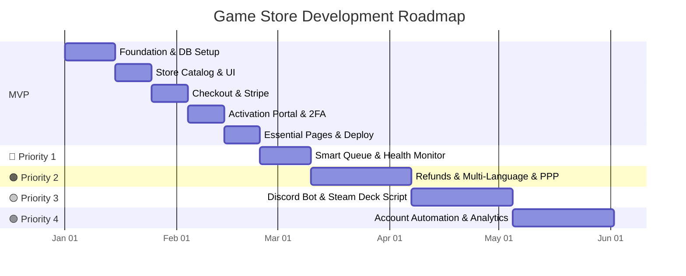

# MVP Structure & Feature Prioritization Roadmap

This document defines the **Minimum Viable Product (MVP)** the smallest version of the platform that can launch, take payments, and deliver game access to customers followed by a prioritized backlog of advanced features to add incrementally after launch.

---

## MVP Scope (Launch Version)

The MVP must answer one question: **Can a customer find a game, pay for it, and start playing offline within 5 minutes?**

Everything below is required for launch. Nothing else.

---

### MVP Phase 1: Foundation (Week 1–2)

| # | Task | Details |
|---|---|---|
| 1.1 | **Initialize Next.js project** | App router, folder structure, environment variables |
| 1.2 | **Setup Supabase** | Create project, configure API keys, enable Row Level Security |
| 1.3 | **Create database tables** | `games`, `game_accounts`, `licenses` (base schema only no regional pricing, no health checks yet) |
| 1.4 | **IGDB Metadata Seeder** | Setup Twitch API access and write script to fetch game details (title, HD cover art, description) and automatically seed the database |
| 1.5 | **Global CSS & dark theme** | Design system: colors, typography, card styles, glassmorphism, responsive grid |

**Deliverable**: Empty app with database connected and dark theme ready.

---

### MVP Phase 2: Store Catalog (Week 2–3)

| # | Task | Details |
|---|---|---|
| 2.1 | **Homepage hero banner** | Promotional section with store branding and call-to-action |
| 2.2 | **Game grid with cards** | Fetch games from Supabase, render as interactive cards (cover, title, platform badge, price) |
| 2.3 | **Search bar** | Real-time client-side filtering of game titles |
| 2.4 | **Platform Filters** | Toggle buttons for Steam / Epic / Ubisoft / EA / Microsoft Store |
| 2.5 | **Sort options** | Sort by price, name, or popularity |
| 2.6 | **Game details page** (`/games/[slug]`) | Full game info, description, "Buy Now" button, platform/account type info |

**Deliverable**: A browsable, searchable, filterable game store.

---

### MVP Phase 3: Checkout & Payment (Week 3–4)

| # | Task | Details |
|---|---|---|
| 3.1 | **Stripe integration** | Stripe Checkout session for one-time game purchases |
| 3.2 | **Payment success webhook** | On successful payment → generate a unique license key → store in `licenses` table → assign to the least-loaded account |
| 3.3 | **Order confirmation page** | Show the license key to the user after payment, also email it |
| 3.4 | **Account pool auto-assignment** | SQL query to find the least-loaded account under the 50-user cap and link it to the new license |

**Deliverable**: Users can pay real money and receive a license key.

---

### MVP Phase 4: Activation Portal (Week 4–5)

| # | Task | Details |
|---|---|---|
| 4.1 | **`/my-games` page** | License key input field + "Activate" button |
| 4.2 | **Key validation API** | `POST /api/license/validate` checks the key, returns the assigned account |
| 4.3 | **Credential display** | Show Username + Password with "Click to Copy" buttons |
| 4.4 | **Steam Guard 2FA generator** | `POST /api/steam-guard/code` uses `steam-totp` + the account's `shared_secret` to generate a live code |
| 4.5 | **Step-by-step activation wizard** | Interactive numbered steps with copy buttons and an embedded video/GIF showing how to go offline in Steam |

**Deliverable**: Users can activate their key, see credentials, get 2FA codes, and follow a visual guide to play offline.

---

### MVP Phase 5: Essential Pages (Week 5–6)

| # | Task | Details |
|---|---|---|
| 5.1 | **FAQ page** (`/faq`) | Accordion with common questions (offline mode, saves, troubleshooting) |
| 5.2 | **Contact page** (`/contact`) | Name/Email/Message form that sends to your email or Discord webhook |
| 5.3 | **Navigation & header** | Logo, nav links (Shop, My Games, FAQ, Contact), cart icon |
| 5.4 | **Footer** | Links, Discord invite, copyright |
| 5.5 | **Mobile responsiveness** | Ensure all pages work perfectly on phone screens |
| 5.6 | **Deploy to Vercel** | Connect GitHub repo → auto-deploy to production |

**Deliverable**: 🚀 **MVP is live and generating revenue.**

---

## Post-MVP Feature Prioritization

Features are ranked by **impact on revenue and retention** vs. **development effort**.

```
Priority = (Revenue Impact + User Retention + Security) / Development Effort
```

---

### 🔴 Priority 1 Critical (Add Immediately After Launch)

These features directly protect your revenue and prevent account loss.

| # | Feature | Why It's Critical | Effort |
|---|---|---|---|
| P1.1 | **Smart 2FA Queue / Login Cooldown** | Without this, multiple users logging in simultaneously will trigger Steam bans → you lose accounts → you lose money | 1–2 days |
| P1.2 | **Live Account Health Monitor** | If an account gets banned and you don't notice, customers will get broken credentials and request refunds | 2–3 days |
| P1.3 | **Discord Alerts (Admin Webhooks)** | You need instant notifications when accounts go down so you can react before customers complain | 3–4 hours |
| P1.4 | **Password Rotation Script** | Users who screenshot the password can keep logging in even after their license expires. Rotating passwords cuts off expired users | 1–2 days |
| P1.5 | **Database Credential Encryption (AES-256)** | If your Supabase dashboard is ever compromised, all account passwords are exposed in plaintext without this | 1 day |

**Timeline**: Week 6–8 (first 2 weeks after launch)

---

### 🟠 Priority 2 High (Grow Revenue & Reduce Support)

These features increase sales and reduce the number of support tickets.

| # | Feature | Why It's Important | Effort |
|---|---|---|---|
| P2.1 | **Automated Refund / Key Swap System** | If an account dies, auto-swapping the user to a new account eliminates 80% of support complaints | 2–3 days |
| P2.2 | **Multi-Language Support (Minimum Countries)** | Opening up Arabic, Turkish, Spanish, and French markets can double your customer base | 3–5 days |
| P2.3 | **Geo-IP Dynamic Pricing (PPP)** | Users in Egypt or Turkey won't pay $15 for a game. Adjusting prices to $3–5 for those markets converts browsers into buyers | 2–3 days |

**Timeline**: Week 8–12

---

### 🟡 Priority 3 Medium (Competitive Advantage)

These features differentiate you from competitors and build community loyalty.

| # | Feature | Why It Matters | Effort |
|---|---|---|---|
| P3.1 | **Discord Bot** (`/activate`, `/code`) | Many gamers live in Discord. Letting them activate without visiting the website reduces friction and feels premium | 3–5 days |
| P3.2 | **Steam Deck / Linux Auto-Setup Script** | Steam Deck users are a growing audience. A one-click `.sh` script makes your store the easiest option for them | 2–3 days |
| P3.3 | **Geographical Account Clustering** | Assigning EU accounts to EU users and NA accounts to NA users further reduces ban risk | 1–2 days |
| P3.4 | **Live Chat Widget (Tawk.to / Crisp)** | Real-time support before purchase increases conversion rate significantly | 2–4 hours |

**Timeline**: Week 12–16

---

### 🟢 Priority 4 Low (Scale & Monetization)

These features matter once you have a stable user base and want to maximize lifetime value.

| # | Feature | Why It Matters | Effort |
|---|---|---|---|
| P4.1 | **Automated Account Creator (Puppeteer)** | When you need to add 20 new accounts per week, doing it manually is unsustainable | 1–2 weeks |
| P4.2 | **Admin Panel & IGDB Game Manager** | Admin dashboard showing revenue analytics, account health, and a UI to search IGDB and add new games instantly | 1 week |
| P4.3 | **SEO Blog & Game Guides** | Drives free organic Google traffic. Articles like "How to play Starfield offline" bring in new customers | Ongoing |

**Timeline**: Week 16+

---

## Visual Roadmap



---

## Summary Table

| Layer | What's Included | When |
|---|---|---|
| **MVP** | Store catalog with IGDB seeding, search, Filters, Stripe checkout, license keys, activation portal with 2FA, FAQ, Contact, deploy | Weeks 1–6 |
| **🔴 P1** | Login cooldown queue, health monitor, Discord alerts, password rotation, DB encryption | Weeks 6–8 |
| **🟠 P2** | Auto-refund/swap, multi-language, dynamic pricing | Weeks 8–12 |
| **🟡 P3** | Discord bot, Steam Deck script, geo-clustering, live chat | Weeks 12–16 |
| **🟢 P4** | Account auto-creator, admin panel & IGDB manager, SEO blog | Week 16+ |
