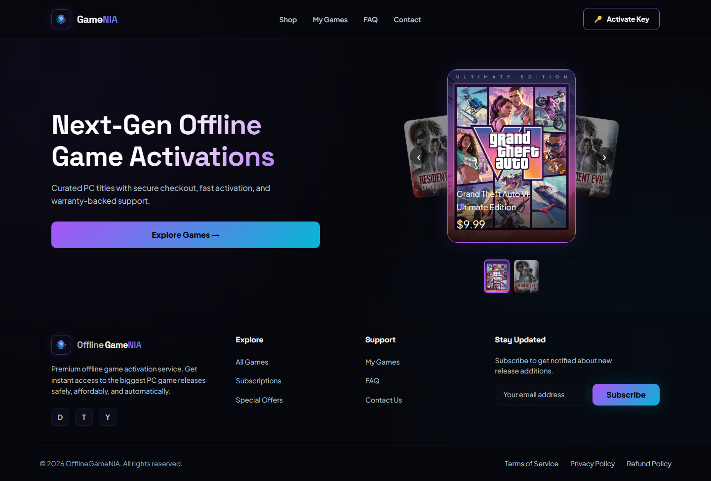
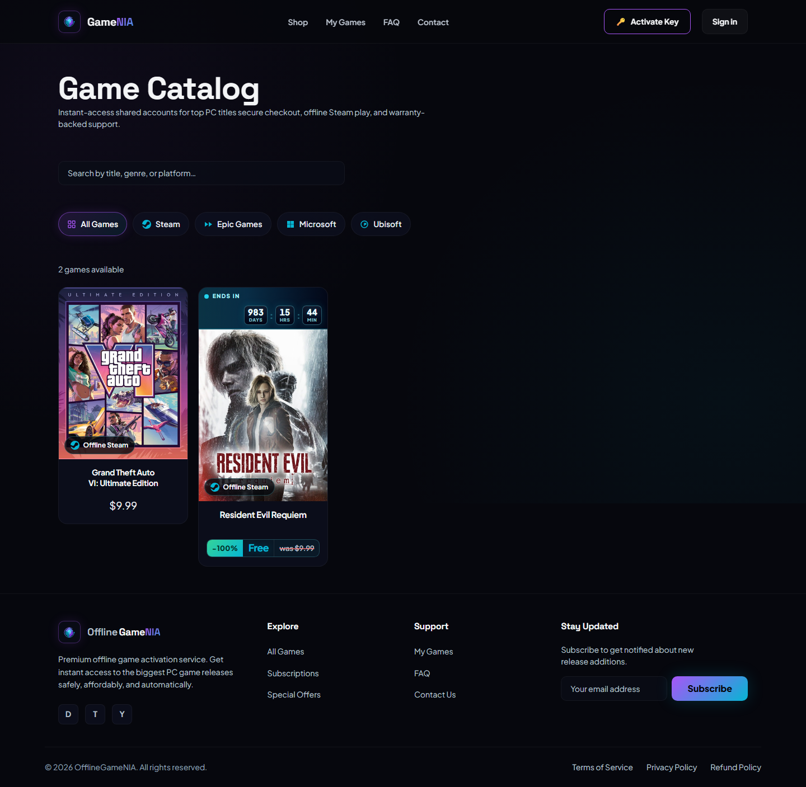
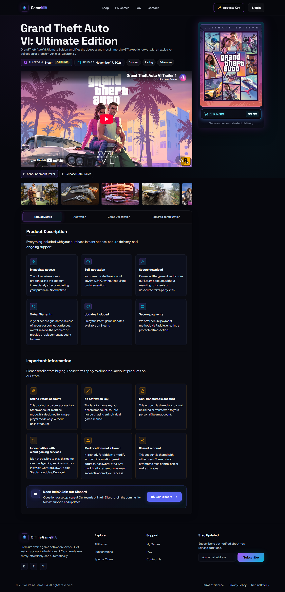
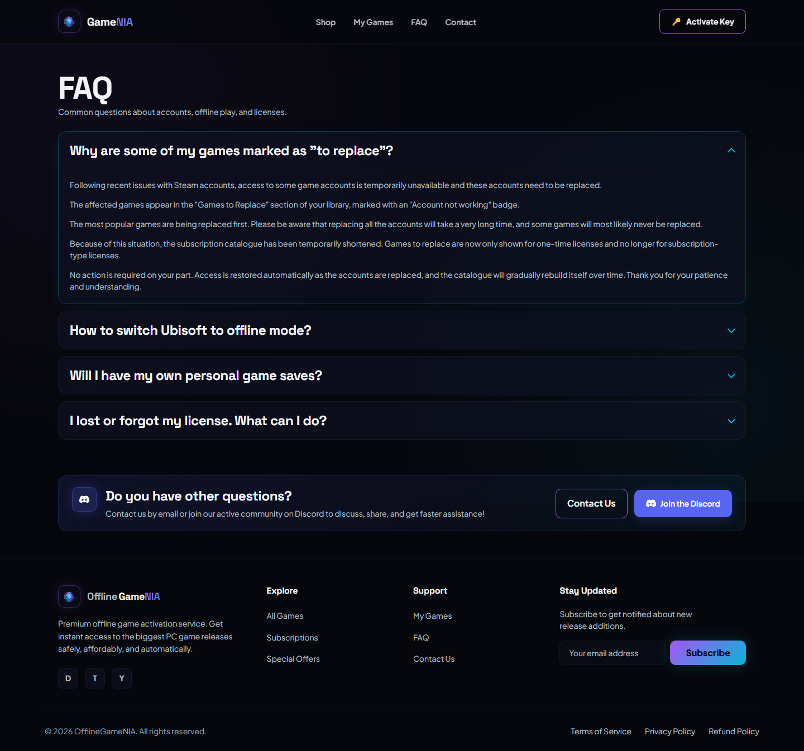
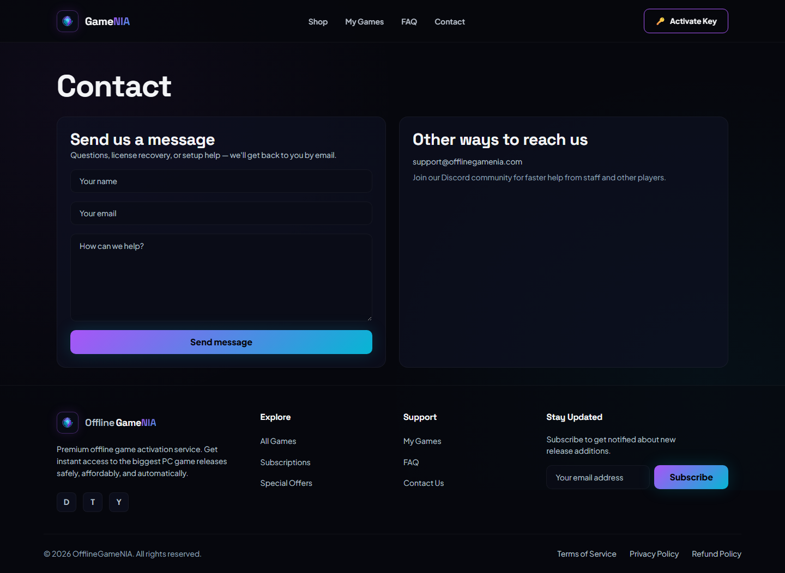
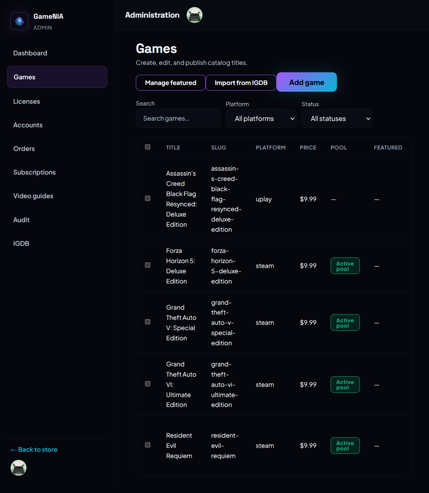
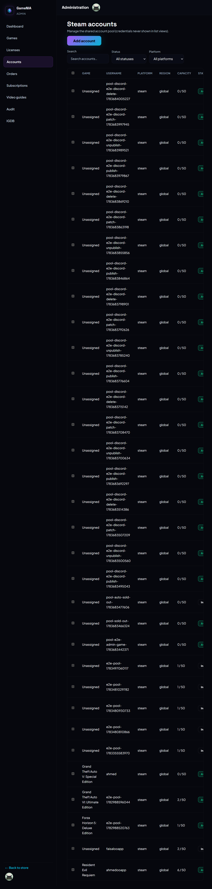
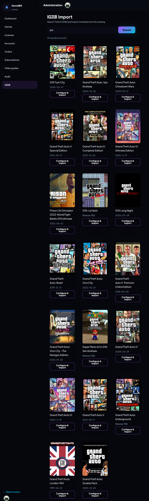
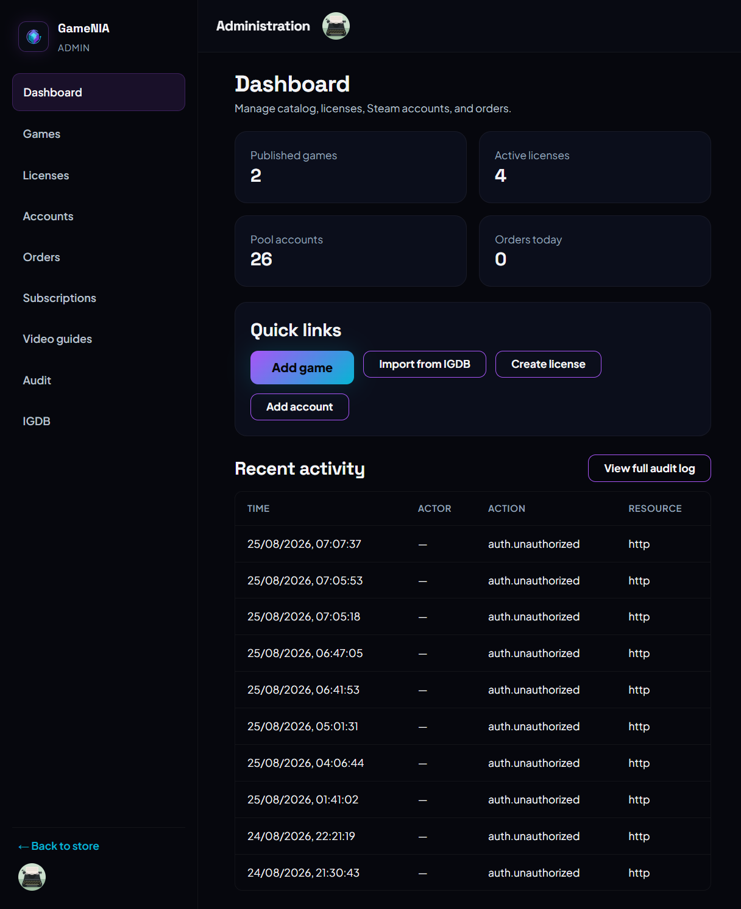

# OfflineGameNIA — GameStore


A full-stack, type-safe game license storefront: catalog, Stripe checkout, automated license assignment, AES-256-GCM encrypted Steam account pools, time-gated Steam Guard 2FA codes, role-based admin tooling, and subscription plans.

**Live demo:** [https://offlinegamenia.com](https://offlinegamenia.com)

## What I built and why

Offline game activation is brittle: shared game accounts get banned, credentials leak, 2FA requests collide, and customers need support. I built this platform to automate the buyer-to-activation flow while keeping accounts and license keys secure, auditable, and scalable.

## The hardest engineering problems

- **Account pool isolation & throttling:** Distributing buyers across least-loaded game accounts, enforcing per-account user caps, and gating Steam Guard code requests with cooldowns to reduce ban risk.
- **Credential security:** AES-256-GCM encryption of all pooled account passwords and shared secrets, with environment-bound keys so a leaked staging key cannot decrypt production accounts.
- **Webhook integrity:** Stripe webhooks hit the NestJS API directly (not the Next.js BFF) so raw request bodies can be verified against signatures; Clerk webhooks sync users to Neon.
- **Auth model that separates users and admins:** Clerk handles identity, but role and ownership are enforced in the database, not just in the JWT.
- **Real e-commerce end-to-end flow:** Catalog → Stripe Checkout → webhook fulfillment → license key generation → entitlement → Steam Guard code, all instrumented with audit logs and rate limits.

## Key features

### Customer-facing

- Public storefront with home, catalog (`/shop`), game detail, subscriptions, FAQ, contact, and legal pages
- Clerk-powered sign-in/sign-up and role-aware admin routes
- Stripe one-time and subscription checkout with webhook fulfillment
- License key validation and assignment to the least-loaded game account
- Steam Guard TOTP code generation with request throttling and cooldown UI
- Account, order, and license ownership tied to the authenticated user

### Admin-facing

- Admin dashboard for games, game accounts, licenses, orders, subscription plans, and store settings
- IGDB/Twitch import for game metadata and media
- Discount scheduling with countdown UI
- Audit logs for security-relevant actions

### Platform

- Nx monorepo with `apps/web`, `apps/api`, and shared `libs/*`
- NestJS API with Prisma/Neon PostgreSQL, Helmet, CORS, and `@nestjs/throttler`
- Next.js 16 App Router with a BFF proxy to the backend
- Playwright and Vitest test suites for web and API
- Vercel (web) + Railway (API) deployment configuration

## Architecture

```text
Browser
   │
   ▼
Vercel — Next.js 16 + Clerk (web)
   │  ┌─ BFF /api/* → forwards to Railway
   │  └─ /api/webhooks/clerk
   ▼
Railway — NestJS API + Helmet + Throttler
   │
   ▼
Neon PostgreSQL via Prisma
```

- **Next.js on Vercel** serves the public storefront, protects admin routes, and proxies API calls.
- **NestJS on Railway** exposes `/api/*`, runs Prisma migrations, and receives raw-body Stripe webhooks.
- **Neon PostgreSQL** stores games, account pools, licenses, orders, subscriptions, audit logs, and users.
- **Clerk** provides JWT auth and user webhooks; **Stripe** handles payments and webhooks.

## Tech stack

| Layer | Technology |
|-------|------------|
| Monorepo & tooling | Nx 23, pnpm 9, TypeScript 5.9, SWC, ESLint, Prettier |
| Frontend | Next.js 16, React 19, Tailwind + custom theme tokens, Google Fonts |
| Backend | NestJS 11, Express, Helmet, `@nestjs/throttler` |
| Data | Prisma 6, PostgreSQL (Neon) |
| Auth | Clerk (`@clerk/nextjs`, `@clerk/backend`) |
| Payments | Stripe (`stripe`) with Checkout Sessions and webhooks |
| Integrations | `steam-totp`, `discord.js`, IGDB/Twitch API, Svix (Clerk webhooks) |
| Testing | Vitest, Playwright, Supertest |
| Deployment | Vercel (`vercel.json`), Railway (`railway.toml`) |

## Important technical decisions

- **Nx monorepo:** Shared Prisma client, shared types, and one command (`pnpm nx ...`) for lint, test, build, and serve across apps and libraries.
- **Frontend/backend split:** Vercel hosts the Next.js storefront; Railway hosts the NestJS API. This keeps the Stripe webhook endpoint on a single origin with raw-body access and clean CORS policy.
- **BFF proxy at `apps/web/src/app/api/[...path]/route.ts`:** Browser calls `/api/*` and the Next.js route handler forwards to `API_URL` with the `Authorization` header.
- **AES-256-GCM for Steam credentials:** `libs/api/steam/src/lib/steam-crypto.service.ts` uses a 64-char hex `STEAM_ENCRYPTION_KEY`. Encrypted values carry an IV, auth tag, and a `v1` prefix so key mismatches are detected safely.
- **Rate limiting by route group:** Global throttle at 100 req/min, with stricter limits for license validation (10/min), Steam Guard (5/min user), checkout (20/min), and auth (20/min).
- **Database-first roles & ownership:** Nest guards read `User.role` from Neon after Clerk JWT is verified; services enforce `ownerId` checks on licenses and orders.
- **Raw Stripe webhooks on Nest:** Signature verification needs the untouched body, so the webhook bypasses the Next.js BFF and hits `POST /api/payments/webhook` directly.

## Project structure

```text
GameStore/
├── apps/
│   ├── web/                 # Next.js storefront (App Router)
│   ├── api/                 # NestJS backend
│   ├── web-e2e/             # Playwright e2e suite
│   ├── api-e2e/             # HTTP e2e suite against real DB
│   └── discord-bot/         # Discord support bot (optional)
├── libs/
│   ├── api/                 # Prisma, auth, Stripe, Steam, data-access
│   ├── web/                 # Feature libraries (home, catalog, checkout, ...)
│   ├── shared/              # Theme tokens, SEO, pricing, UI primitives
│   └── testing/             # Test utilities
├── docs/
│   ├── images/              # Screenshot capture guide
│   └── legal/               # Terms/privacy/refund policy markdown
├── .env.example             # All required environment variables
├── vercel.json              # Vercel build settings
├── railway.toml             # Railway API deploy settings
└── nx.json                  # Nx workspace configuration
```

## Getting started

### Prerequisites

- Node.js 20+
- pnpm 9+
- A Neon PostgreSQL database (or any PostgreSQL instance with SSL)
- Clerk application
- Stripe account (Test mode for local dev)
- (Optional) Twitch app for IGDB import
- (Optional) Discord bot token for the support bot

### 1. Install dependencies

```bash
pnpm install --frozen-lockfile
```

### 2. Configure environment variables

```bash
cp .env.example .env
# Edit .env with your real values (never commit .env)
```

Required local variables: `DATABASE_URL`, `DIRECT_URL`, `NEXT_PUBLIC_CLERK_PUBLISHABLE_KEY`, `CLERK_SECRET_KEY`, `NEXT_PUBLIC_STRIPE_PUBLISHABLE_KEY`, `STRIPE_SECRET_KEY`, and `STEAM_ENCRYPTION_KEY`.

See `.env.example` for the full matrix and documentation.

### 3. Generate the Prisma client and run migrations

```bash
pnpm db:generate
pnpm db:migrate
```

### 4. Start the API and web servers

```bash
pnpm nx serve api   # http://localhost:3333
pnpm nx dev web     # http://localhost:3000
```

### 5. Run tests

```bash
# Unit tests
pnpm nx run-many -t test

# E2E (requires DATABASE_URL and a running stack)
pnpm nx e2e web-e2e
pnpm nx e2e api-e2e
```

E2E specs that require a database will skip gracefully if `DATABASE_URL` is not set.

## Demo & screenshots

- **Live site:** [https://offlinegamenia.com](https://offlinegamenia.com)
- **Screenshot guide:** [docs/images/screenshots.md](docs/images/screenshots.md)

| Home | Shop |
|------|------|
|  |  |

| Game detail | FAQ |
|-------------|-----|
|  |  |

| Contact |
|---------|
|  |

### Admin dashboard

| Games | Steam accounts |
|-------|----------------|
|  |  |

| IGDB import | Dashboard |
|-------------|-----------|
|  |  |

> Checkout, My Games, and license-management screens require authentication and are not shown here.

## Deployment

The repo ships with production-oriented config for Vercel and Railway:

- `vercel.json` — builds `apps/web` with `pnpm run vercel-build` and outputs `apps/web/.next`
- `railway.toml` — builds `apps/api`, runs Prisma migrations, and starts `dist/apps/api/main.js`
- Neon `DATABASE_URL` is pooled for runtime; `DIRECT_URL` is direct for migrations
- Each environment uses isolated Clerk, Stripe, and Steam encryption keys
- Secrets are set in the host dashboard; `.env` and `.env.staging` are not committed

## Security

- All secrets live in environment variables and host dashboards; `.env` files are gitignored and not in history
- Steam credentials are encrypted at rest with AES-256-GCM and a per-environment key
- Clerk JWTs are verified on both frontend middleware and backend guards
- Admin routes are protected by role checks in the database
- Helmet headers, CORS allowlists, and route-level throttling on the API
- Audit logs capture security-relevant actions
- Stripe and Clerk webhooks verify signatures before processing

## Performance & scalability considerations

- Neon pooled `DATABASE_URL` for runtime; direct `DIRECT_URL` only for migrations
- Next.js static generation where possible; BFF proxy reuses a single API origin
- Prisma connection management via a singleton service
- Throttling prevents brute-force and abuse on sensitive endpoints
- Stateless API and web containers allow horizontal scaling on Railway/Vercel

## Future improvements

- Multi-language support and purchasing-power-parity (PPP) regional pricing
- Discord bot `/activate` and `/code` slash commands
- Automated Steam account health monitor and password rotation
- Steam Deck / Linux auto-setup script
- Account auto-creator and advanced admin analytics

## License

This source code is provided for **inspection and recruitment purposes only**. All rights reserved. No license is granted to use, modify, distribute, or commercialize this code without explicit written permission. See [LICENSE](./LICENSE) for the full terms.

## Author

[NEEDS MY INPUT — add your name, LinkedIn, and contact email here]
