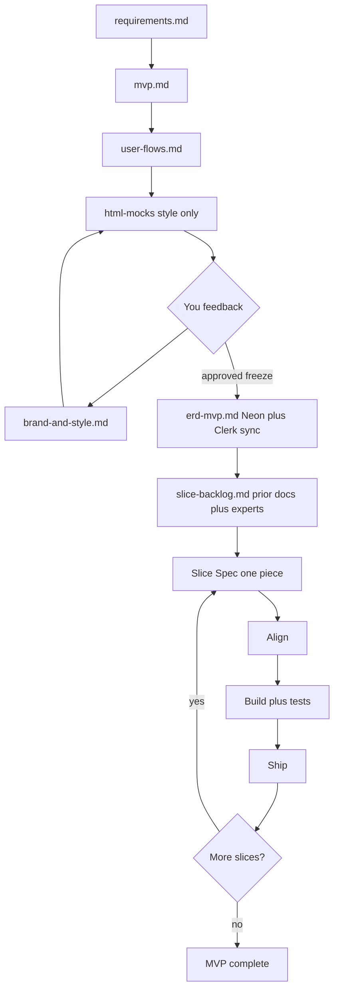

# SaaS AI Build System Blueprint

Constitution for building full-stack SaaS apps with a reusable Cursor skill team.  
Stack default: **Nx + pnpm + TypeScript**, **Next.js** (App Router), **NestJS**, **Prisma + Neon Postgres**, **Clerk** (synced to Neon), **Stripe**, **Vercel + Railway**, **Vitest + Playwright**.

This file is **not** the skills themselves. It defines how to create and run them later.

---

## 1. Purpose

Solo founder / small startup OS:

- Plan with real requirements (from existing SaaS), not invention.
- Produce a **Product Spec Pack** (multiple artifacts) before any feature coding.
- Get visual style agreement via an HTML mock ↔ design feedback loop.
- Name **all MVP slices** from that pack **plus expert-person review**, then build one slice at a time.
- Use **named track experts** (backend, frontend, security, SEO, DevOps, etc.) — not one mega “platform” person.
- Keep specialists on demand; keep coding standards always on.
- Reuse the monorepo; prefer Nx generators; never forget frontend or security.

---

## 2. Principles

1. **Product Spec Pack + Slice Specs** — multiple planning artifacts first; one Slice Spec per piece.
2. **Coding never invents pieces** — slice backlog is derived from the pack + expert review only.
3. **One expert per track** — each has a Person Spec (expert + best practices) and **must do Spec work + Build work on every relevant slice**.
4. **Specialists fill sections** — they do not run a second parallel process.
5. **Security per slice** — security expert applies the ladder on that slice’s endpoints.
6. **Align before new code** — analyze structure, reuse shared UI, prefer Nx generators.
7. **Tests are part of Build** — no ship without green tests for the slice.
8. **Two modes everywhere** — Development vs Production, every track.
9. **Real API always** — frontend calls real endpoints; unfinished APIs return stubs in the final response shape.
10. **Person Spec per skill** — every specialist has job + domain best practices + research step.
11. **Style feedback loop before ERD** — HTML style mock → your feedback → Design/style → refine mock until you approve.
12. **Neon + Clerk sync** — auth identity lives in Clerk; app `User` (and roles) sync into Neon for ownership.

---

## 3. Stack profile

| Layer | Default |
|-------|---------|
| Monorepo | Nx + pnpm + TypeScript |
| Frontend | Next.js App Router + React + CSS Modules + shared UI/theme |
| Backend | NestJS + Prisma |
| Database | **Neon Postgres** (`DATABASE_URL` pooled, `DIRECT_URL` for migrations) |
| Auth | **Clerk** → webhook sync into Neon `User` (Clerk id, email, role metadata) |
| Payments | Stripe (checkout + webhooks) |
| Deploy | Vercel (web) + Railway (API) |
| Tests | Vitest + Testing Library + Playwright + API e2e |

**First action of the orchestrator on any repo:** analyze structure (`apps/`, `libs/`, generators, shared UI, Clerk/Neon wiring) and map it to this profile. Adapt paths; do not invent a parallel architecture.

**Clerk ↔ Neon sync (baseline for data + security + backend):**

- Clerk handles sign-in/sign-up/session.
- Webhook upserts Neon `User` with `clerkId` / public metadata role.
- Ownership policies use Neon `userId` (FK), not Clerk-only checks in business data.

---

## 4. The system (Choice B — Product Spec Pack)

Not one mega “Product Spec.” Use a **pack of artifacts**, then slices.

### 4.1 Product Spec Pack (before any feature coding)

| Order | Artifact | Owner(s) | Purpose | Gate |
|-------|----------|----------|---------|------|
| 1 | `docs/pack/requirements.md` | requirements-analyst | Must / should / later from researched SaaS | — |
| 2 | `docs/pack/mvp.md` | product-planner | MVP cut: in / out / non-goals | You agree MVP cut |
| 3 | `docs/pack/user-flows.md` | ux-flow-mapper | MVP journeys, pages, key actions | — |
| 4 | `docs/pack/html-mocks/` | frontend-engineer + brand-designer | **Style-only** HTML mocks so you *see* the look | Enter feedback loop |
| 5 | `docs/pack/brand-and-style.md` | brand-designer | Formal design/style system from the loop | — |
| 4↔5 | **Feedback loop** | you + brand-designer + frontend-engineer | Mock → feedback → Design/style → refine mock | **You approve style freeze** |
| 6 | `docs/pack/erd-mvp.md` | data-modeler (+ security-engineer review for ownership) | MVP ERD + draft Prisma; Neon; Clerk sync | — |
| 7 | `docs/pack/slice-backlog.md` | product-planner + orchestrator + **all track experts** | All MVP pieces from prior docs **+ expert review** | Freeze backlog |

Then per piece:

| Artifact | When | Contains |
|----------|------|----------|
| `docs/slices/NN-slug.md` | Before that piece’s code | Slice Spec with **one section per expert track** for this slice only |

### 4.2 HTML mock vs Design/style (feedback loop)

**HTML mock comes first** and is **only for seeing style** (colors, type, spacing, first-viewport feel, component look). It is not full product implementation and not a substitute for user-flows.

```text
user-flows.md
    → html-mocks/          (style exploration — you can SEE it)
    → your feedback
    → brand-and-style.md   (capture decisions: tokens, type, rules)
    → refine html-mocks/   (match the written style)
    → your feedback again  (repeat until approved)
    → STYLE FREEZE
    → erd-mvp.md
    → slice-backlog.md     (prior docs + all expert persons)
```

Rules for the loop:

- Mock before formal Design/style doc exists.
- Design/style is written **from** what you liked/rejected in the mock.
- Loop until you explicitly approve; then freeze both mock + Design/style.
- Do not start ERD or slices until style freeze.
- Later Build must match frozen Design/style and reuse shared UI/theme derived from it.

### 4.3 The full loop

```text
Product Spec Pack (1→7, with style feedback loop at 4↔5)
    → Slice Spec (each expert fills their section)
    → Align (analyze / reuse / generate)
    → Build (implement + tests)
    → Ship (production mode)
    → next slice
```



### 4.4 Where pieces are defined

| Question | Answer |
|----------|--------|
| Where are **all** MVP pieces defined? | `slice-backlog.md` — from all prior pack docs **+ every track expert’s review** |
| Where is **one** piece fully defined? | `docs/slices/NN-*.md` — sections filled by each expert |
| When does feature coding start? | After Align for that frozen Slice Spec (pack must be complete first) |

---

## 5. Modes: Development vs Production

Every track has both modes. **Build** uses Development. **Ship** promotes to Production.

| Track | Development | Production |
|-------|-------------|------------|
| Data / Neon | Neon branch or dev DB, seed | Neon prod, migrate on deploy |
| Backend | Verbose errors, API stubs allowed (final shape) | Safe errors, real logic |
| Security | Localhost CORS, test keys | Strict CORS, HTTPS, live keys, rate limits + audit on |
| Payments | Stripe test keys / test webhooks | Live keys, verified webhooks, idempotency |
| Auth (Clerk) | Dev instance; webhook → Neon sync tested | Production instance; prod webhook → Neon |
| Frontend | Dev server; UI preview states (loading/empty/error) | Optimized build; no debug UI; match frozen style |
| SEO | `noindex` / preview robots | Indexable sitemap/robots/canonicals |
| DevOps | Local or preview deploy | Vercel/Railway prod + prod smoke + rollback |
| QA | Fast unit/component | Full suite + E2E on prod-like build |

### API stubs (not frontend mocks)

- Frontend **always** calls the **real** API endpoint and client.
- If an endpoint is not fully implemented, the **backend** returns stub data in the **final response contract/shape**.
- When real logic replaces the stub, the frontend does not change.
- **Forbidden:** hardcoded fake arrays/objects in frontend components for “mock data.”
- **Allowed in frontend (dev):** preview UI states (loading / empty / error / success).
- **HTML style mocks** in the pack are planning artifacts only — not runtime frontend mock data.

---

## 6. Skills (the people) — full expert roster

Do **not** merge backend + security + data into one “platform” person. Each track has its own expert skill. They load **on demand**; only the tracks needed for the current artifact or slice run.

### 6.1 Artifact map

| Artifact | Location (default) | Role |
|----------|--------------------|------|
| Skills | `~/.cursor/skills/` | Specialists + orchestrator (on demand) |
| Rules | `~/.cursor/rules/` | Thin always-on standards per track |
| Product Spec Pack | `docs/pack/` | Requirements → … → slice backlog |
| Slice Specs | `docs/slices/` | Per-piece build contracts |

### 6.2 Person Spec shape (required for every skill)

Every expert is **three things at once**:

1. **Expert** — owns one track only  
2. **Best-practice engine** — researches and applies current best practice for that track on this stack  
3. **Slice worker** — in **every** relevant slice: fills their Slice Spec section, then does their Build work for that slice  

Every skill `SKILL.md` must include this Person Spec:

| Field | Meaning |
|-------|---------|
| Mission | What they own |
| Expert scope | What they are allowed to decide / change |
| Best-practice track | Stack-specific standards they must follow |
| Research step | Refresh domain practice before writing Spec or coding |
| Pack work | What they do during Product Spec Pack |
| Slice Spec work | What they write in **each** Slice Spec |
| Slice Build work | What they implement/test in **each** slice after Spec freeze |
| Dev vs Prod | Mode rules for their track |
| DoD | When their part of the slice is done |
| Handoff | Who reads their output next |

**Rule:** A slice is not frozen until every **required** expert for that slice has filled their Spec section. A slice is not Shipped until every required expert’s Build DoD is green.

### 6.3 Expert Person Specs (full)

#### saas-orchestrator

| | |
|--|--|
| **Mission** | Run the OS: pack gates, backlog freeze, slice loop |
| **Expert scope** | Process and scope control — not deep track implementation |
| **Best practices** | Vertical slices; no coding before Spec freeze; resolve expert conflicts without expanding MVP |
| **Pack work** | Enforce order 1→7; block ERD until style freeze; require expert backlog sign-off |
| **Each slice — Spec** | Write goal / in-out scope from backlog; assign which experts are required |
| **Each slice — Build** | Gate Align → Build → tests → Ship; stop scope creep mid-slice |
| **DoD** | Pack gates held; Spec frozen with required sections; Ship only after QA + DevOps green |

#### requirements-analyst

| | |
|--|--|
| **Mission** | Gather what the product must do from real SaaS + founder input |
| **Expert scope** | Requirements only — not MVP cut, not ERD, not UI |
| **Best practices** | Competitor teardown; must/should/later; explicit non-goals; cite sources |
| **Research step** | Study 2–5 live SaaS products in the same problem space |
| **Pack work** | Write `requirements.md` |
| **Each slice — Spec** | Confirm slice still maps to a Must/Should requirement (or flag drift) |
| **Each slice — Build** | Usually none (consult if scope drifts) |
| **DoD** | Requirements approved as input to MVP |

#### product-planner

| | |
|--|--|
| **Mission** | Cut MVP and own the ordered slice backlog |
| **Expert scope** | Scope and sequencing — not implementation |
| **Best practices** | One core loop; small shippable slices; no feature zoo |
| **Pack work** | Write `mvp.md`; draft `slice-backlog.md` from all prior docs |
| **Each slice — Spec** | Confirm slice goal matches backlog; update backlog status |
| **Each slice — Build** | None (re-plan only if slice fails or scope changes) |
| **DoD** | MVP approved; backlog frozen with expert sign-off |

#### ux-flow-mapper

| | |
|--|--|
| **Mission** | Define how users move through the product |
| **Expert scope** | Journeys, pages, actions — not visual tokens, not API code |
| **Best practices** | User-centered flows; every button has an intended effect; empty/error paths named |
| **Research step** | Review UX patterns for similar SaaS flows |
| **Pack work** | Write `user-flows.md` |
| **Each slice — Spec** | Pages + action → API → DB → UI matrix for **this slice only** |
| **Each slice — Build** | Review implemented UI against the matrix; flag missing states |
| **DoD** | Matrix complete; no orphan buttons |

#### brand-designer

| | |
|--|--|
| **Mission** | Define and protect brand and visual style |
| **Expert scope** | Tokens, type, composition, brand signals |
| **Best practices** | Brand-first first viewport; expressive type; atmosphere; no generic AI-default look; match founder frontend design rules |
| **Research step** | Study brand systems in the product category |
| **Pack work** | Style feedback loop with frontend; write/freeze `brand-and-style.md` |
| **Each slice — Spec** | Tokens / composition notes for this slice’s screens |
| **Each slice — Build** | Visual QA against frozen style; reject one-off styles |
| **DoD** | Style freeze done; slice matches frozen style |

#### frontend-engineer

| | |
|--|--|
| **Mission** | Build the UI against real APIs and frozen style |
| **Expert scope** | Next.js UI, shared components, client/server boundaries |
| **Best practices** | App Router; reuse shared Button/Input/theme; a11y; loading/empty/error/success; **no frontend data mocks**; prefer Nx web generators; i18n structure when needed |
| **Research step** | Confirm current Next/React patterns used in this monorepo |
| **Pack work** | Build `html-mocks/` for **style visibility**; refine until style freeze |
| **Each slice — Spec** | Pages, component tree, shared reuse list, generators, preview states |
| **Each slice — Build** | Align → implement pages/components → call **real** APIs → wire preview states → hand to QA |
| **Dev vs Prod** | Dev: preview states OK; Prod: no debug UI; match frozen style |
| **DoD** | UI matches Spec + style; real API only; interactive pieces testable |

#### data-modeler

| | |
|--|--|
| **Mission** | Own Neon/Prisma schema and data integrity |
| **Expert scope** | Entities, relations, migrations, ownership fields |
| **Best practices** | Prisma migrations; indexes; soft deletes where needed; **Clerk→Neon User sync**; FKs for ownership; no orphan tables |
| **Research step** | Confirm Prisma/Neon patterns for this repo |
| **Pack work** | Write `erd-mvp.md` + draft Prisma notes |
| **Each slice — Spec** | Schema changes for this slice only; sync impact |
| **Each slice — Build** | Migrations; seed updates if needed; verify ownership fields exist |
| **DoD** | Schema migrated; ERD and Prisma aligned for the slice |

#### backend-engineer

| | |
|--|--|
| **Mission** | Own NestJS APIs and module structure |
| **Expert scope** | Controllers, services, DTOs, validation, stubs |
| **Best practices** | Nest modules; DTO validation; consistent error shapes; **API stubs in final response shape**; Nx Nest generators; no business logic in controllers |
| **Research step** | Confirm Nest patterns and lib layout in this monorepo |
| **Pack work** | Review backlog for API/module boundaries |
| **Each slice — Spec** | Endpoint list; request/response contracts; stub vs real status |
| **Each slice — Build** | Generate/scaffold modules → implement or stub endpoints → keep contract stable for frontend |
| **Dev vs Prod** | Dev: stubs allowed; Prod: real logic, safe errors |
| **DoD** | Contract published; frontend can call real routes; tests exist for handlers |

#### security-engineer

| | |
|--|--|
| **Mission** | Own authz, ownership, abuse prevention, audit |
| **Expert scope** | Security ladder on every endpoint in the slice |
| **Best practices** | HTTPS/CORS → Clerk auth → roles → Neon ownership → sessions → rate limit → logging/audit; secrets never in client; webhook verification |
| **Research step** | Refresh OWASP API + Clerk/Nest security patterns for this stack |
| **Pack work** | Review ERD ownership/roles; sign off backlog security boundaries |
| **Each slice — Spec** | Ladder checklist for **this slice’s** endpoints |
| **Each slice — Build** | Guards, ownership checks, throttling, audit on sensitive actions; block Ship if gaps |
| **Dev vs Prod** | Dev: localhost CORS/test keys; Prod: strict CORS, live keys, limits on |
| **DoD** | Ladder complete for slice endpoints; ownership tested |

#### payments-engineer

| | |
|--|--|
| **Mission** | Own Stripe money flows when the slice involves payment |
| **Expert scope** | Checkout, webhooks, idempotency, test/live mode |
| **Best practices** | Stripe test vs live; verify webhooks; idempotent handlers; never trust client for paid status |
| **Research step** | Confirm Stripe Nest patterns and webhook security |
| **Pack work** | Sign off payment-related backlog slices (or N/A) |
| **Each slice — Spec** | Checkout/webhook/idempotency plan (or N/A) |
| **Each slice — Build** | Implement Stripe pieces; webhook tests; hand security review |
| **DoD** | Test mode green in Build; live mode ready at Ship |

#### seo-engineer

| | |
|--|--|
| **Mission** | Own discoverability for public routes |
| **Expert scope** | Metadata, sitemap, robots, OG, JSON-LD |
| **Best practices** | Next metadata APIs; canonical URLs; noindex private apps; Product JSON-LD when relevant |
| **Research step** | Confirm shared SEO lib patterns in this monorepo |
| **Pack work** | Sign off which backlog slices need public SEO |
| **Each slice — Spec** | SEO plan for this slice’s routes |
| **Each slice — Build** | Implement metadata/sitemap/robots/JSON-LD for those routes |
| **Dev vs Prod** | Dev: noindex OK; Prod: indexable as planned |
| **DoD** | Public routes have correct metadata; private routes noindex |

#### qa-tester

| | |
|--|--|
| **Mission** | Own test plan and green DoD for every slice |
| **Expert scope** | What must be tested; pass/fail gate for Ship |
| **Best practices** | Test pyramid: unit/API → component → Playwright happy path; ownership/security cases; no “test later” |
| **Research step** | Confirm Vitest/Playwright layout in this monorepo |
| **Pack work** | Sign off each backlog item is a testable user outcome |
| **Each slice — Spec** | Test plan + DoD checklist |
| **Each slice — Build** | Write/run tests with implementers; **block Ship until green** |
| **DoD** | Spec tests all pass |

#### devops-releaser

| | |
|--|--|
| **Mission** | Own env, deploy, migrate, smoke, rollback |
| **Expert scope** | Neon migrate, Vercel/Railway, env matrix, smoke |
| **Best practices** | Separate dev/prod env; migrate before/with API deploy; smoke health + slice path; rollback notes |
| **Research step** | Confirm deploy scripts and hosting for this repo |
| **Pack work** | Sign off each slice has a deploy/smoke boundary |
| **Each slice — Spec** | Env vars, migrate, deploy, smoke checklist |
| **Each slice — Build/Ship** | Execute Ship in production mode; verify Clerk→Neon in target env |
| **DoD** | Smoke green; backlog item marked done |

**v1:** all experts required. Call **payments-engineer** only when the slice includes Stripe.  
**Optional later:** analytics, support bot, dedicated i18n specialist.

### 6.4 Pack handoff (before slices)

1. requirements-analyst → `requirements.md`  
2. product-planner → `mvp.md` (you approve)  
3. ux-flow-mapper → `user-flows.md`  
4. frontend-engineer + brand-designer → style mock ↔ feedback → style freeze  
5. data-modeler → `erd-mvp.md`; security-engineer reviews ownership  
6. product-planner + orchestrator draft `slice-backlog.md` from prior docs  
7. **Every expert** signs off backlog for their track  
8. orchestrator freezes backlog  

### 6.5 Each slice — every expert works (Spec then Build)

For **every** slice after backlog freeze:

```text
Orchestrator opens Slice Spec
  → each required expert fills THEIR Spec section (best practices applied)
  → Spec frozen
  → Align (structure, reuse, generators)
  → each required expert does THEIR Build work
  → qa-tester: tests green
  → devops-releaser: Ship
  → next slice
```

| Order | Expert | Spec work (every slice) | Build work (every slice) |
|-------|--------|-------------------------|--------------------------|
| 1 | orchestrator | Goal / scope / required experts | Gate the loop |
| 2 | ux-flow-mapper | Action matrix | Review flows vs UI |
| 3 | brand-designer | Style notes | Visual QA vs freeze |
| 4 | data-modeler | Schema for slice | Migrate / ownership fields |
| 5 | backend-engineer | API contracts | Nest implement or stub |
| 6 | security-engineer | Ladder checklist | Guards / ownership / limits / audit |
| 7 | payments-engineer | Stripe plan or N/A | Stripe implement if needed |
| 8 | frontend-engineer | UI tree / reuse / generators | Real API UI implementation |
| 9 | seo-engineer | Route SEO | Metadata / sitemap work |
| 10 | qa-tester | Test plan | Write/run tests; block Ship |
| 11 | devops-releaser | Ship checklist | Deploy / smoke / mark done |
| — | requirements-analyst | Drift check | Consult if scope drifts |
| — | product-planner | Backlog status | Re-plan only if needed |

Nobody invents scope outside the pack + current Slice Spec.  
Nobody skips their Spec section or Build DoD for a required track.

---

## 7. Align (Build step 0 — every slice)

Before writing new feature code (orchestrator + relevant experts):

1. **Analyze structure** — where this slice belongs in `apps/` and `libs/`.  
2. **Reuse first** — shared Button, Input, layout, theme from frozen Design/style.  
3. **Match coding standards** — naming, aliases, server vs client patterns already in the repo.  
4. **Prefer Nx generators** — frontend and backend scaffolding via generators; hand-roll only when none fit.  
5. **Confirm Clerk→Neon** — user-scoped features use synced Neon `userId` for ownership.  

Document Align briefly in the Slice Spec, then implement.

---

## 8. Build (+ tests) and Ship

### Build (Development mode)

1. Align  
2. Experts implement their tracks (data → backend → security hooks → payments if any → frontend → SEO)  
3. **qa-tester** ensures tests are written and green (mandatory)  
4. DoD fails until tests are green  

### Ship (Production mode)

1. **devops-releaser** + security: Neon prod, Clerk prod, Stripe live, site URL  
2. Migrate, deploy web + API  
3. Verify Clerk webhook → Neon sync in prod  
4. Prod smoke (health + slice path)  
5. SEO as specified by seo-engineer  
6. Mark backlog item done in `slice-backlog.md`  

---

## 9. Security ladder (owned by security-engineer, per slice)

Apply to **this slice’s endpoints** before Ship:

1. HTTPS + CORS  
2. Authentication (Clerk identity)  
3. Role-based authorization (admin / user; roles from Clerk metadata synced to Neon as needed)  
4. Ownership policies (Neon `userId`)  
5. Session lifecycle (logout / revoke as applicable)  
6. Rate limiting / throttling  
7. Logging & auditing  

Plus when payments exist (**payments-engineer** + **security-engineer**): Stripe webhook verification, idempotency, secret handling.

---

## 10. Templates

### 10.1 Pack — `requirements.md`

```markdown
# Requirements — [App Name]
## Problem / ICP
## Sources researched (SaaS)
## Must / Should / Later / Non-goals
```

### 10.2 Pack — `mvp.md`

```markdown
# MVP — [App Name]
## In scope
## Out of scope
## Core loop (one sentence)
## Approval
- [ ] Founder approved MVP cut
```

### 10.3 Pack — `user-flows.md`

```markdown
# User flows — MVP
## Journeys
## Pages
## Key actions (button → intended API effect)
```

### 10.4 Pack — HTML mocks + `brand-and-style.md` (loop)

```markdown
# Brand and style — [App Name]
## Status: draft | frozen
## Derived from html-mocks feedback
## Tokens / type / spacing / composition rules
## Shared UI mapping (Button, Input, …)
## Feedback log
| Date | Feedback | Change |
```

`html-mocks/`: static or minimal HTML/CSS pages for **style visibility only** (not production app code).

### 10.5 Pack — `erd-mvp.md`

```markdown
# ERD — MVP
## Neon Postgres
## Clerk sync
- User.clerkId, webhook upsert, roles
## Entities / relations (mermaid)
## Draft Prisma notes
## Ownership fields
## Security review notes (roles / ownership)
```

### 10.6 Pack — `slice-backlog.md`

```markdown
# Slice backlog — MVP
Derived from: requirements, mvp, user-flows, frozen style, erd-mvp, **all expert-person review**

## Expert review sign-off
- [ ] ux-flow-mapper: slices cover MVP flows without missing journeys
- [ ] brand-designer: slices match frozen style boundaries
- [ ] data-modeler: slices fit Neon/Prisma entities and Clerk→Neon User sync
- [ ] backend-engineer: slices have sensible API/module boundaries and stub/real contracts
- [ ] security-engineer: slices have clear auth/roles/ownership/rate-limit/audit boundaries
- [ ] payments-engineer: payment slices isolate Stripe checkout/webhooks (N/A if no payments)
- [ ] frontend-engineer: slices can be built with shared UI/theme and sensible page/component boundaries
- [ ] seo-engineer: indexable/public routes are covered
- [ ] qa-tester: each slice has a testable user outcome
- [ ] devops-releaser: each slice has a deploy/smoke/env boundary
- [ ] product-planner + orchestrator: no scope creep; order is shippable

| # | Slice | Goal | Status |
|---|-------|------|--------|
| 1 | ... | ... | todo |
```

### 10.7 Slice Spec

```markdown
# Slice Spec — NN — [Name]

## Goal / In scope / Out of scope
## Required experts this slice
## Pack refs (flows, style freeze, ERD entities)

## UX flows — owner: ux-flow-mapper
- Pages / action → API → DB → UI matrix
- Spec done: [ ]   Build review done: [ ]

## Brand / style — owner: brand-designer
- Tokens and composition notes
- Spec done: [ ]   Visual QA done: [ ]

## Data (Neon / Prisma) — owner: data-modeler
- Schema changes; Clerk sync; ownership fields
- Spec done: [ ]   Migrate done: [ ]

## Backend (Nest API) — owner: backend-engineer
- Endpoints; DTO contracts; stub vs real (same shape)
- Spec done: [ ]   Implement/stub done: [ ]

## Security — owner: security-engineer
- Ladder checklist for these endpoints
- Spec done: [ ]   Guards/ownership/limits/audit done: [ ]

## Payments — owner: payments-engineer (or N/A)
- Stripe checkout / webhook / idempotency
- Spec done: [ ]   Implement done: [ ] / N/A

## Frontend — owner: frontend-engineer
- Pages; shared reuse; generators; preview states; real API only
- Spec done: [ ]   UI build done: [ ]

## SEO — owner: seo-engineer
- Metadata / sitemap / robots / JSON-LD
- Spec done: [ ]   Implement done: [ ]

## QA — owner: qa-tester
- Test plan / DoD
- Spec done: [ ]   All tests green: [ ]

## DevOps — owner: devops-releaser
- Env / migrate / deploy / smoke
- Spec done: [ ]   Shipped + smoke green: [ ]

## Align plan
## Status
- [ ] Spec frozen (every required expert filled their section)
- [ ] Align done
- [ ] Every required expert finished Build work
- [ ] Tests green
- [ ] Shipped
```

---

## 11. Example (start to end)

**App:** InvoiceFlow — B2B invoices + Stripe.

1. **requirements-analyst** → `requirements.md`  
2. **product-planner** → `mvp.md` (you approve)  
3. **ux-flow-mapper** → `user-flows.md`  
4. **frontend-engineer** + **brand-designer** → style mocks ↔ feedback → **style freeze**  
5. **data-modeler** → `erd-mvp.md`; **security-engineer** reviews ownership  
6. **slice-backlog.md** drafted, then signed off by **all experts**  
7. Slice “Create invoice”: each expert fills Slice Spec → Align → backend stubs + frontend real calls → security ownership → qa tests → devops ships  

---

## 12. Always-on rules (thin)

- **Frontend:** match frozen Design/style; reuse shared UI; no frontend data mocks.  
- **Backend:** Nest/Prisma/Neon; API stubs match contract.  
- **Security:** ladder on every user-scoped endpoint; Clerk→Neon ownership.  
- **Quality:** no Ship without Slice Spec tests green.  
- **Generators:** prefer Nx generate over manual scaffolding.  
- **Pack gates:** no ERD before style freeze; no backlog freeze without expert sign-off; no code before Slice Spec freeze.

---

## 13. Implementation roadmap (after this blueprint)

1. `saas-orchestrator`  
2. `requirements-analyst`, `product-planner`  
3. `ux-flow-mapper`, `brand-designer`, `frontend-engineer`  
4. `data-modeler`, `backend-engineer`, `security-engineer`, `payments-engineer`  
5. `seo-engineer`, `qa-tester`, `devops-releaser`  
6. Thin rules per track (frontend / backend / security / quality / pack gates)  
7. Pilot one full pack + one slice on a real app  

Do not create skills in `~/.cursor/skills-cursor/`.

---

## 14. Anti-patterns

- Merging backend + security + data into one vague “platform” person.  
- Single mega Product Spec that mixes requirements, ERD, and slices.  
- ERD before user flows or before style freeze.  
- Slice backlog without expert sign-off.  
- Treating HTML style mocks as runtime frontend mock data.  
- Frontend hardcoded mock data.  
- Ignoring Clerk→Neon sync.  
- Skipping Align / tests / security ladder per slice.  
- Loading every expert on every message (use on demand by track).

---

## 15. One-sentence OS

**Requirements → MVP → flows → HTML style mock ↔ Design/style until you approve → Neon ERD with Clerk sync → slice backlog from prior docs + all track experts → for each slice every expert applies their Person Spec (best practices): Spec work then Build work → Align → tests → Ship.**
