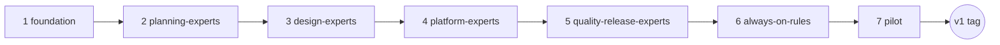

# SaaS AI Build System — Implementation Plan (Branches & Slices)

Executable roadmap for building the skill team defined in [saas-ai-build-system-blueprint.md](./saas-ai-build-system-blueprint.md) (§13).
We build the team the same way the team builds products: **one branch at a time, small slices inside each branch, a verification dry-run before every merge.**

- **Blueprint** = the constitution (what the system is).
- **This file** = the build order (how we create it, branch by branch).

---

## 1. Working agreement

1. **One branch at a time**, in the order below. No parallel branches.
2. **One slice = one commit** (or a tight commit group). Slice IDs (`S1.1`…) go in commit messages, e.g. `feat(ai-team): S1.4 saas-orchestrator skill`.
3. A branch merges to `main` only when its **merge gate** passes: every slice DoD checked **and** the branch's dry-run slice is green.
4. **No skill is "done" because the file exists.** Done = follows the Person Spec shape (blueprint §6.2) + passes its dry-run.
5. If a dry-run exposes a blueprint flaw, fix the blueprint in the same branch (it is a living constitution) and note the change in the commit.
6. Scope discipline: nothing outside the 13 skills, 5 rules, templates, and sync tooling. New ideas go to §9 (Later), not into the current branch.
7. **Ship = pushed, not just committed.** A slice's Ship sub-step is not done until its commit(s) are pushed to the GitHub remote. This applies to slices in *this* plan (push `ai-team/*` branch commits) and to the product-workflow Ship step the skills enforce on future projects (see devops-releaser, Branch 5). Local-only commits are "Build," not "Shipped."
8. **Global Setup before Slice 1, always.** Every product build gets one *one-time* infra bootstrap — frontend app, backend app, database, auth, payments, deploy targets, GitHub repo + first push — between backlog freeze and the first Slice Spec. Slices never improvise infrastructure; they build features on top of an already-wired skeleton. See Branch 1 (S1.4).
9. **Pre-Slice Setup on every slice.** Before any required expert writes their Spec section, they do a short **ultra-think + best-practice refresh** pass scoped to *that specific slice* (not a generic, once-ever check — this repeats every slice). This is stronger than the Person Spec's one-time "Research step" field; it's a per-slice ritual gate the orchestrator enforces. See Branch 1 (S1.5) and the updated slice-spec-template (S1.3).

---

## 2. Where the source lives (and why)

Skills are **version-controlled in this repo**, then synced to the editor's home directory. Home dirs aren't git repos — keeping source here is what makes branches, diffs, and rollback possible.

```text
tools/ai-team/
├── README.md                  # what this is, how to sync, how to start a new project
├── sync.mjs                   # copies skills/ + rules/ into home dirs (see S1.1)
├── skills/
│   ├── saas-orchestrator/SKILL.md
│   ├── requirements-analyst/SKILL.md
│   ├── product-planner/SKILL.md
│   ├── ux-flow-mapper/SKILL.md
│   ├── brand-designer/SKILL.md
│   ├── frontend-engineer/SKILL.md
│   ├── data-modeler/SKILL.md
│   ├── backend-engineer/SKILL.md
│   ├── security-engineer/SKILL.md
│   ├── payments-engineer/SKILL.md
│   ├── seo-engineer/SKILL.md
│   ├── qa-tester/SKILL.md
│   └── devops-releaser/SKILL.md
├── rules/
│   ├── frontend-standards.md
│   ├── backend-standards.md
│   ├── security-standards.md
│   ├── quality-standards.md
│   └── pack-gates.md
└── templates/
    ├── person-spec-template.md
    ├── pack/                  # requirements, mvp, user-flows, brand-and-style, erd-mvp, slice-backlog, global-setup
    └── slice-spec-template.md # includes Pre-Slice Setup ritual block + Ship = push-to-GitHub line
```

**Sync targets** (per blueprint §6.1, never `~/.cursor/skills-cursor/`):

| Source | Target | Purpose |
|--------|--------|---------|
| `tools/ai-team/skills/` | `~/.cursor/skills/` | Specialists + orchestrator, loaded on demand |
| `tools/ai-team/rules/` | `~/.cursor/rules/` | Thin always-on standards |
| `tools/ai-team/skills/` | `~/.claude/skills/` (optional mirror) | Same team usable from Claude Code |

---

## 3. Branch map



| # | Branch | Builds | Skills delivered |
|---|--------|--------|------------------|
| 1 | `ai-team/foundation` | Scaffold, sync, templates, Global Setup gate, orchestrator | saas-orchestrator |
| 2 | `ai-team/planning-experts` | Pack steps 1–3 | requirements-analyst, product-planner, ux-flow-mapper |
| 3 | `ai-team/design-experts` | Style loop (pack 4↔5) | brand-designer, frontend-engineer |
| 4 | `ai-team/platform-experts` | Pack 6–7 + build tracks | data-modeler, backend-engineer, security-engineer, payments-engineer |
| 5 | `ai-team/quality-release-experts` | Test + ship tracks | seo-engineer, qa-tester, devops-releaser |
| 6 | `ai-team/always-on-rules` | Thin always-on standards | — (5 rules files) |
| 7 | `ai-team/pilot` | Real pack + real slice + retro | — (fixes to all of the above) |

All 13 blueprint skills appear exactly once (branches 1–5); rules and pilot close the loop.

---

## 4. The branches

### Branch 1 — `ai-team/foundation`

**Goal:** the skeleton everything else plugs into. After this branch, the orchestrator exists, knows the rules of the game — including the Global Setup gate and the per-slice ultra-think ritual — even though it has no experts to call yet.

| ID | Slice | Produces | DoD |
|----|-------|----------|-----|
| S1.1 | Scaffold + sync | `tools/ai-team/` tree, `README.md`, `sync.mjs` (Node, no deps: copies skills→`~/.cursor/skills/`, rules→`~/.cursor/rules/`, `--claude` flag mirrors skills→`~/.claude/skills/`; `--dry-run` prints actions) | Running `node tools/ai-team/sync.mjs --dry-run` lists correct targets on Windows; README explains sync + new-project bootstrap |
| S1.2 | Person Spec template + SKILL.md convention | `templates/person-spec-template.md` with the 10 required fields (blueprint §6.2: Mission, Expert scope, Best-practice track, Research step, Pack work, Slice Spec work, Slice Build work, Dev vs Prod, DoD, Handoff) + frontmatter convention (`name`, `description` = *when to load this person*); clarifies that **Research step runs every slice**, not once | Template contains all 10 fields; a sample skill stub renders with valid frontmatter; Research step field text explicitly says "repeat per slice" |
| S1.3 | Pack + slice templates | `templates/pack/`: `requirements.md`, `mvp.md`, `user-flows.md`, `brand-and-style.md`, `erd-mvp.md`, `slice-backlog.md`, **`global-setup.md`** (one-time infra checklist, new — see S1.4) and `templates/slice-spec-template.md` (11 expert sections + Align plan + Status) — extracted verbatim-then-refined from blueprint §10, **plus two new blocks**: a **Pre-Slice Setup** checklist at the top (one "ultra-think + best-practice refresh done" box per required expert, must be checked before that expert's Spec section is filled) and a **Ship** line under DevOps requiring "committed **and pushed to GitHub**" | Every §10 template exists as a standalone copyable file; slice-spec has Pre-Slice Setup block above the expert sections and its Ship line names GitHub push explicitly; slice-backlog has one section per expert with `Spec done` / `Build done` boxes |
| S1.4 | Global Setup gate + checklist | `templates/pack/global-setup.md`: the **one-time** bootstrap run between backlog freeze and Slice 1 — GitHub repo created (or confirmed) + first push, Nx workspace + `apps/web` (Next.js) + `apps/api` (NestJS) scaffolded via Nx generators, shared `libs/*/ui`/`theme` placeholders, Prisma init + Neon project + `DATABASE_URL`/`DIRECT_URL` wired, Clerk app + dev keys + webhook stub, Stripe test keys (if MVP has payments), Vercel project linked (web) + Railway project linked (api), `.env.example` populated, base health endpoint live, base security skeleton (helmet, CORS, throttler) pre-wired so security-engineer's per-slice work is additive, not foundational. Also amends blueprint §4.3 flow (insert Global Setup between step 7 and the slice loop) and §7 Align (Align assumes Global Setup already happened) | Checklist file covers frontend + backend + data + auth + payments + deploy + GitHub, each with a concrete pass/fail line; blueprint §4.3/§7 updated in the same commit; orchestrator (S1.5) refuses to open Slice 1 spec until this checklist is checked off |
| S1.5 | `saas-orchestrator` skill | `skills/saas-orchestrator/SKILL.md`: pack order 1→7 with gates (MVP approval, **style freeze before ERD**, backlog freeze after all-expert sign-off) → **Global Setup gate** (S1.4 checklist must be green) → slice loop (**Pre-Slice Setup ritual** → Spec → freeze → Align → Build → tests → **Ship, which requires a confirmed `git push`**), Align checklist (blueprint §7), dev/prod mode table (§5), **first action on any repo = analyze structure and map to stack profile** (§3) | Person Spec complete; references template files by path; explicitly blocks: code before Slice Spec freeze, ERD before style freeze, Slice 1 before Global Setup checklist is green, a required expert's Spec section before their Pre-Slice ultra-think box is checked, Ship before QA green **and** before push is confirmed |
| S1.6 | Dry-run: cold start | Transcript note in the PR: in a scratch folder, invoke the orchestrator on a fake empty project and confirm it (a) analyzes structure first, (b) asks for pack step 1, (c) refuses to write feature code, (d) stops at the Global Setup gate before opening Slice 1, (e) refuses to let a simulated expert fill a Spec section before ticking the Pre-Slice ultra-think box, (f) refuses to mark a simulated Ship done without a (simulated) push confirmation | Orchestrator enforces all gates — pack, Global Setup, Pre-Slice ritual, push-before-Ship — with zero experts installed |

**Merge gate:** S1.1–S1.6 DoDs checked; `sync.mjs` really copies files (run once without `--dry-run` and diff); `global-setup.md` and the Pre-Slice/Ship additions to `slice-spec-template.md` exist and are referenced by the orchestrator by path.

---

### Branch 2 — `ai-team/planning-experts`

**Goal:** pack steps 1–3 become real. These three are the cheapest to build and validate — pure writing personas, no code output.

| ID | Slice | Produces | DoD |
|----|-------|----------|-----|
| S2.1 | `requirements-analyst` | SKILL.md: research 2–5 live SaaS in the space, must/should/later + non-goals with cited sources, writes `docs/pack/requirements.md`; slice-time job = drift check only | Person Spec complete; output template = `templates/pack/requirements.md` |
| S2.2 | `product-planner` | SKILL.md: MVP cut (one core loop, no feature zoo), founder-approval gate, owns `slice-backlog.md` ordering/status | Person Spec complete; encodes "backlog derived from pack docs + expert review only — never invented during coding" |
| S2.3 | `ux-flow-mapper` | SKILL.md: journeys, pages, **every button → intended API effect**, empty/error paths named; slice-time job = action matrix for that slice + review built UI against it | Person Spec complete; "no orphan buttons" is an explicit DoD line |
| S2.4 | Dry-run: pack 1–3 on toy app | Using a toy idea (e.g. "LinkTree-style bio pages for barbers"), produce `requirements.md`, `mvp.md`, `user-flows.md` in a scratch `docs/pack/` | Artifacts match templates; MVP names a one-sentence core loop; every flow action names an intended API effect; orchestrator gated the order 1→2→3 |

**Merge gate:** dry-run artifacts read like something you'd actually build from; no persona invented scope beyond its Expert scope.

---

### Branch 3 — `ai-team/design-experts`

**Goal:** the style feedback loop (pack 4↔5) — the blueprint's most novel gate — works end to end.

| ID | Slice | Produces | DoD |
|----|-------|----------|-----|
| S3.1 | `brand-designer` | SKILL.md: brand-first first viewport, expressive type, atmosphere, **no generic AI-default look**; writes `brand-and-style.md` *from* mock feedback (never before the first mock); slice-time = visual QA vs frozen style, reject one-off styles | Person Spec complete; feedback-log table required in output |
| S3.2 | `frontend-engineer` | SKILL.md: Next.js App Router + CSS Modules + shared UI/theme reuse, a11y, loading/empty/error/success states, **real API only — frontend data mocks forbidden**, prefer Nx web generators; pack-time = build `html-mocks/` for style visibility only | Person Spec complete; cites GameStore exemplars: [apps/web/src/app/layout.tsx](../apps/web/src/app/layout.tsx), `libs/shared/ui`, `libs/shared/theme` |
| S3.3 | Encode the loop protocol | Both skills + orchestrator carry the same loop: `user-flows → html-mocks → founder feedback → brand-and-style.md → refine mocks → repeat → STYLE FREEZE`; orchestrator blocks ERD until freeze | Loop text identical in all three files (single source: pack-gates rule stub, finalized in Branch 6); freeze is an explicit founder approval, never assumed |
| S3.4 | Dry-run: one loop round | For the toy app: 1 html-mock page (style only), simulate founder feedback, produce draft `brand-and-style.md`, refine mock once | Mock is static HTML/CSS (no app code); brand doc's decisions traceably come from the feedback; orchestrator refused a request to "start the ERD" mid-loop |

**Merge gate:** loop runs without the orchestrator or personas skipping the freeze; mock stays style-only.

---

### Branch 4 — `ai-team/platform-experts`

**Goal:** the heavy engineering personas. These four encode GameStore's proven patterns — each skill cites real files from this repo as its canonical implementations (§5 table below).

| ID | Slice | Produces | DoD |
|----|-------|----------|-----|
| S4.1 | `data-modeler` | SKILL.md: Neon Postgres (`DATABASE_URL` pooled + `DIRECT_URL` for migrations), Prisma migrations, indexes, **Clerk→Neon `User` sync** (clerkId, webhook upsert, role metadata), FK ownership fields, no orphan tables; writes `erd-mvp.md` | Person Spec complete; cites [libs/api/prisma/prisma/schema.prisma](../libs/api/prisma/prisma/schema.prisma) |
| S4.2 | `backend-engineer` | SKILL.md: NestJS modules, DTO contracts, consistent error shapes, no business logic in controllers, Nx Nest generators, **API stubs in final response shape** (dev mode) so frontend never changes when real logic lands | Person Spec complete; cites [apps/api/src/app/app.module.ts](../apps/api/src/app/app.module.ts) module layout + a feature module as exemplar |
| S4.3 | `security-engineer` | SKILL.md: the 7-rung ladder per slice (HTTPS/CORS → Clerk auth → roles → Neon ownership → sessions → rate limit → logging/audit), OWASP API refresh step, webhook verification, secrets never client-side; slice-time = ladder checklist for that slice's endpoints, **blocks Ship on gaps** | Person Spec complete; each ladder rung cites its GameStore implementation (see §5) |
| S4.4 | `payments-engineer` | SKILL.md: Stripe test vs live, raw-body webhook signature verification, idempotent handlers, never trust client for paid status; loaded only when a slice touches money | Person Spec complete; cites [apps/api/src/app/payments/payments-webhook.controller.ts](../apps/api/src/app/payments/payments-webhook.controller.ts) + `libs/api/stripe/` |
| S4.5 | Dry-run: pack 6–7 for toy app | `erd-mvp.md` (with Clerk sync + ownership fields), security review notes, then `slice-backlog.md` drafted and signed off by every expert built so far | ERD has ownership fields on every user-scoped entity; backlog checklist shows real sign-off lines; security-engineer flagged at least the auth/ownership boundaries per slice |

**Merge gate:** dry-run backlog is frozen per blueprint §6.4 order; no expert filled another expert's section.

---

### Branch 5 — `ai-team/quality-release-experts`

**Goal:** the personas that make "done" mean done — tests, discoverability, shipping.

| ID | Slice | Produces | DoD |
|----|-------|----------|-----|
| S5.1 | `seo-engineer` | SKILL.md: Next metadata APIs, sitemap/robots/canonicals, OG + JSON-LD where relevant, `noindex` in dev / indexable in prod, private routes always noindex | Person Spec complete; cites `libs/shared/seo` patterns |
| S5.2 | `qa-tester` | SKILL.md: test pyramid (unit/API → component → Playwright happy path), ownership/security cases mandatory, **no "test later" — blocks Ship until green**; slice-time = test plan in Spec, then write/run with implementers | Person Spec complete; cites [vitest.workspace.ts](../vitest.workspace.ts), `libs/testing/test-utils`, `apps/web-e2e` |
| S5.3 | `devops-releaser` | SKILL.md: env matrix dev/prod, migrate before/with API deploy, Vercel (web) + Railway (API), smoke health + slice path, rollback notes, verify Clerk→Neon webhook in target env; **pack-time owner of Global Setup execution** (repo creation + first GitHub push, Nx app scaffolds, Vercel/Railway project linking, Neon/Clerk/Stripe account wiring — runs the S1.4 checklist for real); **every slice's Ship step = migrate + deploy + smoke + confirmed `git push` to GitHub**, in that order | Person Spec complete; cites [railway.toml](../railway.toml), [vercel.json](../vercel.json), `scripts/deploy/` (verify-env, smoke-api, smoke-web); DoD explicitly names "pushed to GitHub" as a Ship precondition, not just "deployed" |
| S5.4 | Dry-run: one full Slice Spec | For toy-app slice #1, produce a complete `docs/slices/01-*.md` with **all 11 expert sections filled** (payments = N/A allowed), Align plan included | Every required section filled by its owner persona; Spec reaches "frozen" status; qa-tester's plan names concrete test files/levels |

**Merge gate:** the frozen Slice Spec would be genuinely buildable by a stranger; all 13 skills now exist and sync cleanly.

---

### Branch 6 — `ai-team/always-on-rules`

**Goal:** the thin always-on layer (blueprint §12). Rules are deliberately short — a page or less each — because the deep knowledge lives in the on-demand skills.

| ID | Slice | Produces | DoD |
|----|-------|----------|-----|
| S6.1 | `frontend-standards.md` | Match frozen style; reuse shared UI/theme; no frontend data mocks; preview states required | ≤ 1 page; no overlap with skill bodies |
| S6.2 | `backend-standards.md` | Nest/Prisma/Neon idioms; stubs match final contract; no logic in controllers | ≤ 1 page |
| S6.3 | `security-standards.md` | Ladder applies to every user-scoped endpoint; Clerk→Neon ownership; secrets server-side only | ≤ 1 page |
| S6.4 | `quality-standards.md` | No Ship without Slice Spec tests green; slice DoD is the only DoD | ≤ 1 page |
| S6.5 | `pack-gates.md` | No ERD before style freeze; no backlog freeze without expert sign-off; no code before Slice Spec freeze; prefer Nx generators | ≤ 1 page; wording is the single source the orchestrator + skills reference (fixes S3.3 duplication) |

**Merge gate:** `sync.mjs` places all 5 into `~/.cursor/rules/`; combined rules read in under 2 minutes; zero contradictions with any SKILL.md.

---

### Branch 7 — `ai-team/pilot`

**Goal:** prove the OS on something real, then fix what reality breaks. This is the branch where the system earns its v1 tag.

| ID | Slice | Produces | DoD |
|----|-------|----------|-----|
| S7.1 | Real Product Spec Pack + Global Setup | Full pack 1→7 on a real small app idea (a genuinely new micro-SaaS, or a self-contained GameStore feature treated as one) — including a real style feedback loop with you — then devops-releaser runs the **real Global Setup**: GitHub repo created and first-pushed, apps scaffolded, Neon/Clerk/Stripe/Vercel/Railway actually wired | All 7 pack artifacts exist; you approved MVP cut + style freeze + backlog freeze for real; Global Setup checklist is fully green with a real repo URL and a real first commit visible on GitHub before Slice 1 opens |
| S7.2 | Real slice end-to-end | Slice #1 from that backlog: **Pre-Slice Setup** (real ultra-think + best-practice refresh per expert) → Spec (all experts) → Align → Build (data → backend → security → frontend → SEO) → tests green → Ship (deploy + smoke + **push to GitHub confirmed**) to a real dev/preview environment | Working deployed slice; frontend called real endpoints only; security ladder checklist complete; QA blocked Ship at least once if tests weren't green (proof the gate works); the Ship commit is visible on the GitHub remote, not just local |
| S7.3 | Retro + v1 | Retro notes in `tools/ai-team/README.md` (what each persona got wrong, gate friction, prompt fixes); patch the SKILL.md files; update the blueprint if the constitution itself was wrong; tag `ai-team-v1` | Every retro finding is either fixed in a skill/rule or logged in §9 Later; tag pushed |

**Merge gate:** you would confidently start your next real project with `node tools/ai-team/sync.mjs` + the orchestrator. That's the definition of done for the whole plan.

---

## 5. Canonical pattern citations (GameStore → skills)

The skills' unfair advantage: they don't describe best practices abstractly — they point at proven code in this repo. Wire these citations in during branches 3–5:

| Skill | GameStore canonical files |
|-------|---------------------------|
| security-engineer | [libs/api/auth/src/lib/clerk-auth.guard.ts](../libs/api/auth/src/lib/clerk-auth.guard.ts), `roles.guard.ts` + `@Roles`/`@Public`, `ownership.policy.ts`, [apps/api/src/security/cors.config.ts](../apps/api/src/security/cors.config.ts), `throttle.config.ts` + `app-throttler.guard.ts`, `audit-log.service.ts`, `log-redaction.ts`, `security-audit.exception-filter.ts` |
| data-modeler | [libs/api/prisma/prisma/schema.prisma](../libs/api/prisma/prisma/schema.prisma) (User.clerkId, ownership FKs, migrations dir) |
| backend-engineer | [apps/api/src/app/app.module.ts](../apps/api/src/app/app.module.ts) + feature-module layout (`games/`, `orders/`, `admin/*`), [apps/api/src/main.ts](../apps/api/src/main.ts) (helmet, global prefix, rawBody) |
| payments-engineer | [apps/api/src/app/payments/payments-webhook.controller.ts](../apps/api/src/app/payments/payments-webhook.controller.ts), `payment-fulfillment.service.ts`, `libs/api/stripe/` |
| frontend-engineer | [apps/web/src/app/layout.tsx](../apps/web/src/app/layout.tsx), `libs/shared/ui`, `libs/shared/theme`, `libs/web/feature-*` structure, [apps/web/src/lib/clerk-appearance.ts](../apps/web/src/lib/clerk-appearance.ts) |
| seo-engineer | `libs/shared/seo` |
| qa-tester | [vitest.workspace.ts](../vitest.workspace.ts), `libs/testing/test-utils`, `apps/web-e2e`, `apps/api-e2e` |
| devops-releaser | [railway.toml](../railway.toml), [nixpacks.toml](../nixpacks.toml), [vercel.json](../vercel.json), `scripts/deploy/` (verify-env-cli, smoke-api-cli, smoke-web-cli), [.env.example](../.env.example) |

Citation rule inside skills: cite as **patterns to adapt** ("this is the shape of a correct CORS config"), never as files to copy verbatim into other repos.

---

## 6. Effort and order

| Branch | Est. sessions | Why this order |
|--------|--------------|----------------|
| 1 foundation | 1–2 | Everything depends on templates + orchestrator gates |
| 2 planning-experts | 1 | Cheapest personas; validates the Person Spec shape early |
| 3 design-experts | 1–2 | The style loop is the riskiest UX of the system — test it before heavy engineering personas |
| 4 platform-experts | 2 | Most content; leans on §5 citations |
| 5 quality-release-experts | 1 | Completes the roster; full Slice Spec dry-run |
| 6 always-on-rules | 0.5 | Mostly distillation of what branches 1–5 already wrote |
| 7 pilot | 2–4 | Real product work; expect skill patches |

Total: roughly **8–12 working sessions** to `ai-team-v1`.

---

## 7. Anti-patterns to watch during this build

(Subset of blueprint §14 that specifically bites while *building the system*, not using it.)

- Writing all 13 skills in one sitting without dry-runs — you'll discover the Person Spec shape is wrong after 13 files instead of after 3.
- Fat rules: moving skill knowledge into always-on rules "to be safe." Rules stay thin; depth lives on demand.
- Skills that describe best practices generically instead of citing §5 canonical files.
- Letting the toy-app dry-runs grow into a real product — they exist to test the *personas*, and they die after Branch 5 (the pilot in Branch 7 is the real one).
- Authoring directly in `~/.cursor/skills/` and losing history — source lives in `tools/ai-team/`, sync is one-way outward.
- Creating anything in `~/.cursor/skills-cursor/` (explicitly forbidden by the blueprint).
- Marking a slice "Shipped" on a local commit alone — no push to GitHub, no Ship.
- Improvising frontend/backend/database/deploy setup inside a feature slice instead of doing it once in Global Setup.
- Treating the Pre-Slice ultra-think + best-practice refresh as a formality — skipping straight to writing the Spec section defeats the point of the ritual.

---

## 8. Definition of v1 (whole plan done)

- [ ] All 7 branches merged; `ai-team-v1` tag exists
- [ ] 13 skills, 5 rules, all §10 templates + `global-setup.md` in `tools/ai-team/`, synced by `sync.mjs`
- [ ] Every skill passes the Person Spec 10-field check
- [ ] Global Setup gate exists, is enforced by the orchestrator, and was exercised for real in the Branch 7 pilot (real GitHub repo, real first push, real Neon/Clerk/Vercel/Railway wiring)
- [ ] Every slice marked "Shipped" in this build — and in the Branch 7 pilot — has a commit visible on the GitHub remote, not just a local commit
- [ ] Pre-Slice Setup ritual is visible in at least one real dry-run/pilot transcript, not just described in a template
- [ ] One real Product Spec Pack + one real shipped slice produced by the team (Branch 7)
- [ ] Retro applied; blueprint updated where reality disagreed with it

## 9. Later (explicitly out of scope for v1)

- analytics-engineer, support-bot, dedicated i18n specialist personas (blueprint §6.3 "optional later")
- CI workflow that lints skill frontmatter / template drift
- A `create-saas` bootstrap script that scaffolds a new Nx monorepo pre-wired for the stack profile
